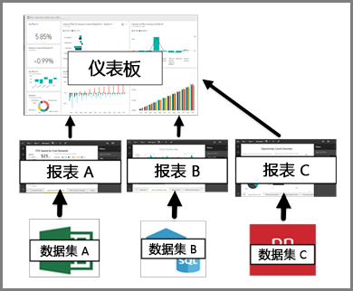

# 面向 Power BI 服务使用者的仪表板

Power BI ***仪表板***是单个页面，通常称为画布，使用可视化效果来讲述故事。 因为它被限制为一页，精心设计的仪表板仅包含该故事的最重要元素。

仪表板上显示的可视化效果称为“磁贴”，它们被报表设计师固定到仪表板上。 选择磁贴后，即可转到创建可视化效果的报表页。 如果不熟悉 Power BI，可以通过阅读 [Power BI 基本概念](end-user-basic-concepts.md)详细了解基础知识。

> [!NOTE]
> [可以在移动设备上查看和共享](mobile/mobile-apps-view-dashboard.md)仪表板。
>
> 若要查看与自己共享的仪表板，必须使用 Power BI Pro。
> 

仪表板上的可视化效果来自报表，并且每个报表基于一个数据集。 事实上，一种想到仪表板的方法就是进入基础报表和数据集。 选择一个可视化效果可将你转到用于创建仪表板的报表（和数据集）。

## 仪表板的优点
仪表板是监控你的业务、寻找答案以及查看所有最重要指标的绝佳方法。 仪表板上的可视化效果可能来自一个或许多个基础数据集，也可能来自一个或多个基础报表。 仪表板可以合并本地数据和云数据，同时提供合并视图（无论数据位于哪里）。

仪表板不仅仅是一张漂亮的图片；它具有高度互动性和高度可定制性，并且磁贴随着基础数据的更改而更新。

## 面向 Power BI 使用者的仪表板与报表对比
报表经常与仪表板混淆，因为它们也是填充可视化效果的画布。 但从 Power BI 使用者角度来看，存在一些主要区别。

| **功能** | **仪表板** | **报表** |
| --- | --- | --- |
| 页面 |一个页面 |一个或多个页面 |
| 数据源 |每个仪表板的一个或多个报表和一个或多个数据集 |每个报表的单个数据集 |
| 订阅 |可订阅仪表板电子邮件 |可订阅报表页电子邮件 |
| 筛选 |无法筛选或切片 |许多不同的方式来筛选、突出显示和切片 |
| 设置警报 |当满足某些条件时，可以创建警报以向你发送电子邮件 |否 |
| 特色 |可以将一个仪表板设置为“精选”仪表板 |无法创建精选报表 |
| 自然语言查询 |从仪表板可用 |从报表不可用 |
| 可以看到基础数据集表和字段 |不行。 可以导出数据，但看不到仪表板本身的表和字段。 |是的。 可以查看数据集表和字段以及值。 |

## 仪表板创建者和仪表板使用者
作为 Power BI 使用者，你会接收来自创建者的仪表板。 通过下面这些主题，继续学习仪表板的相关内容：

* [查看仪表板](end-user-dashboard-open.md)
* 了解[仪表板磁贴](end-user-tiles.md)，以及当你选择一个磁贴时将发生的情况。
* 想要跟踪单个仪表板磁贴并在该磁贴达到某个阈值时接收电子邮件？ [在磁贴上创建警报](end-user-alerts.md)。
* 随时询问你的仪表板相关问题。 了解如何使用 [Power BI 问答](end-user-q-and-a.md)询问有关你的数据的问题，并以可视化效果的形式获得答案。

> [!TIP]
> 如果在此处未找到你所查找的内容，请使用左侧的“目录”。
> 

## 后续步骤
[查看仪表板](end-user-dashboard-open.md) 