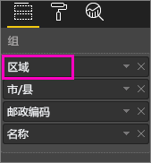
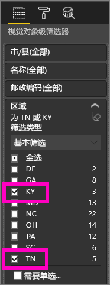
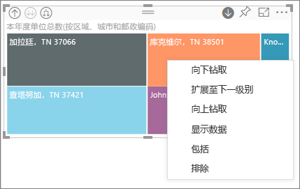
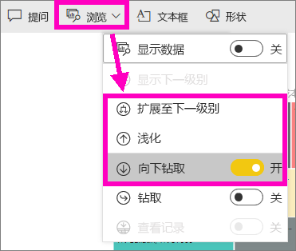
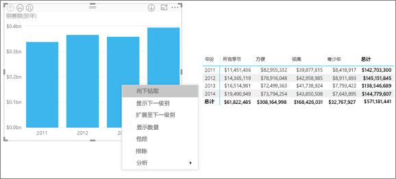
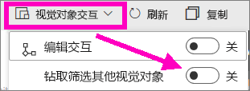
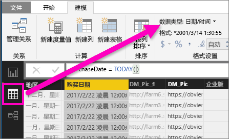

# Power BI 可视化效果中的钻取模式

## 需要具有层次结构才能进行钻取
视觉对象具有层次结构时，可以向下钻取以显示其他详细信息。 例如，你可能有一个可视化效果，该可视化效果按由运动、专业和事件组成的层次结构查看奥运会奖牌数。 默认情况下，可视化效果将按运动（体操、滑冰、水上项目等）显示奖牌数。 但是，因其具有层次结构，选择其中一个可视元素（如条形图、行或气泡图）将显示更多包含详细信息的图片。 选择“**水上运动**”元素可以查看游泳、潜水和水球的数据。  选择“**潜水**”元素可以查看跳板、跳台和双人跳水活动项目的详细信息。

可以向你拥有的报表添加层次结构，但不能向与你共享的报表添加层次结构。
不确定哪个 Power BI 可视化效果包含层次结构？  将鼠标悬停在可视化效果上，如果在顶部边角看到这些钻取控件，则你的可视化效果具有层次结构。

    
   

日期是层次结构的唯一类型。 向可视化效果添加日期字段时，Power BI 自动添加包含年、季度、月和天的时间层次结构。 有关详细信息，请参阅[视觉对象层次结构和向下钻取行为](../guided-learning/visualizations.yml?tutorial-step=18)或观看下面的视频。

  <iframe width="560" height="315" src="https://www.youtube.com/embed/MNAaHw4PxzE?list=PL1N57mwBHtN0JFoKSR0n-tBkUJHeMP2cP" frameborder="0" allowfullscreen></iframe>

> [!NOTE]
> 若要了解如何使用 Power BI Desktop 创建层次结构，请观看视频[如何创建和添加层次结构](https://youtu.be/q8WDUAiTGeU)
> 

## 先决条件

1. 在 Power BI 服务或 Power BI Desktop 中，智能对具有层次结构的可视化效果进行钻取。 
   
2. 要跟随操作，请[打开零售分析示例](../sample-datasets.md)并创建一个树状图，其中按“区域”、“城市”、“邮政编码”和“名称”（组）显示本年度总销量（值）。  该树状图具有一个层次结构，它由区域、城市、邮政编码和城市名称所组成。 每个区域均包含一个或多个城市，而每个城市均包含一个或多个邮政编码等。 默认情况下，可视化效果仅显示区域数据，因为在列表中首先显示“区域”。
   
   

2. 了解各种钻取图标如何协同工作可能很难，因此，请筛选树状图，使其仅显示其中 2 个较小的区域：KY 和 TN。 选择树状图，在“视觉对象级别筛选器”下展开“区域”，并选择“KY”和“TN”。

        

   现在，树状图中仅显示两个区域。

   

## 访问钻取功能的三种方式
其中包含多个选项，可访问针对有层次结构的可视化效果的向下钻取、向上钻取及展开功能。 本文介绍如何使用下面的第一个选项。 了解向下钻取和展开的基础知识后，这三种方法都可以完成相同的任务，分别试用它们并挑选你最喜欢的方法即可。

- 将鼠标悬停在可视化效果上，可查看并使用图标。  

    

- 右键单击可视化效果，可显示并使用菜单。
    
    

- 在 Power BI 菜单栏上，选择“浏览”按钮。

   

## 钻取路径
### 向下钻取
可通过多种方法来深入了解你的可视化效果。 向下钻取可转到层次结构中的下一个级别，因此如果正在查看“区域”级别，可以依次向下钻取到城市、邮政编码和名称级别。 在这一路径中每向前一步，都会显示出新的信息。

### 展开

***展开***可向当前视图添加一个额外的层次结构级别。 因此，如果正在查看“区域”级别，通过展开，可并向树状图添加城市、邮政编码和名称详细信息。 在这一路径中每向前一步，都会显示相同的信息并添加一级新的信息。

还可选择逐一向下钻取或展开字段，或者同时向下钻取或展开所有字段。 

## 同时向下钻取所有字段

1. 从显示 KY 和 TN 数据的树状图顶层开始。 选择某个句柄并向右拖动，以扩大树状图。 

     。

2. 要一次性向下钻取所有字段，请选择可视化效果左上角的双箭头。 该树状图现在显示了肯塔基州和田纳西州的城市数据。 

    
   
5. 再次向下钻取，到达层次结构的邮政编码级别。

    

3. 要向上钻取，请选择可视化效果左上角的向上箭头 。

## 逐一向下钻取字段
此方法使用向下钻取图标，该图标显示在可视化效果本身的右上角。 

1. 选择向下钻取图标，将其打开。 现在，可以逐一向下钻取字段。 
   
   

   如果不打开钻取，则选择视觉对象元素（如条形图、气泡图或叶节点）时，不会向下钻取，而将交叉筛选报表页上的其他图表。

2. 选择“TN”对应的叶节点。 树状图现在将显示田纳西州有商店的所有城市。 

    

2. 此时，可继续向下钻取田纳西州，或者向下钻取田纳西州的特定城市，或者改为展开（请参阅下面的“同时展开所有字段”）。 让我们继续逐一向下钻取字段。  选择“诺克斯维尔，TN”。 树状图现在将显示诺克斯维尔市商店的邮政编码。 

   

    请注意，标题随向下钻取和再次向上钻取而进行更改。  

## 全部展开和逐一展开
拥有仅显示邮政编码的数据图，并不能得到很多信息。  因此，让我们展开层次结构中的下一级别。  

1. 当树状图处于活动状态时，选择“向下展开”图标 。 树状图现在将显示层次结构的 2 个级别：邮政编码和商店名称。 

    

2. 若要查看田纳西州全部 4 级层次结构的数据，请选择向上钻取箭头，直到达到树状图的第二个级别，即“本年度总销量(按区域和城市)”。 

    

3. 请确保向下钻取仍处于打开状态 ，然后选择“向下展开”图标 。 树状图现在将显示一些额外的详细信息：不是仅显示州和城市，现在还显示了邮政编码。 

    

4. 再次选择“向下展开”图标，在树状图上显示田纳西州全部 4 级层次结构的详细信息。 将鼠标悬停在叶节点上，可查看更多详细信息。

   

## 钻取筛选其他视觉对象
在钻取模式下工作时，需要决定向下钻取和扩展如何影响页面上的其他可视化效果。 

默认情况下，钻取不会筛选报表中的其他视觉对象。 但可在 Power BI Desktop 和 Power BI 服务中启用此功能。 

1. 在 Desktop 中，选择“格式”选项卡，并选择“钻取筛选其他视觉对象”复选框。

    

2. 现在，在具有层次结构的视觉对象中向下钻取（或向上钻取，或展开）时，该操作将筛选页面上的其他视觉对象。 

    

    

> [!NOTE]
> 若要在 Power BI 服务中启用此功能，请从顶部菜单栏选择“视觉对象交互”>“钻取筛选其他视觉对象”。
>
> 

## 了解层次结构轴和层次结构组
可以将层次结构轴和层次结构组视为可以用来增加和减少要查看的数据的粒度的机制。 任何可以按类别和子类别组织的数据都具有层次结构。 这当然包括日期和时间。

可以在 Power BI 中创建具有层次结构的可视化效果，方法是选择一个或多个要添加到“轴”井或“组”井以及想要作为“值”井中的数据字段检查的数据。 如果钻取模式图标显示在可视化效果的左上角和右上角，就可以知道数据是否分层。 

实际上，考虑这两种类型分层数据会很方便：
- 日期和时间数据 - 如果具有日期/时间数据类型的数据字段，则已经具有分层数据。 Power BI 自动为任何数据字段创建一个层次结构，这些数据字段的值可以解析为[日期/时间](https://msdn.microsoft.com/library/system.datetime.aspx)结构。 仅需将一个“日期/时间”字段添加到“轴”或“组”井。
- 分类数据 - 如果数据派生自包含子集合的集合，或者具有多行共享公用值的数据，则具有分层数据。

Power BI 使你可通过一个或所有子集扩展。 可以通向下钻取过数据以查看每个级别的单个子集，或同时查看每个级别的所有子集。 例如，可以向下钻取特定年份，或沿着层次结构查看每年的所有结果。 相反，可以用相同方式向上钻取。

以下各节介绍从最高视图、中间视图和最低视图向下钻取。

### 分层数据和时间数据
在此示例中，请按照[零售分析示例](../sample-datasets.md)操作并创建堆积柱形图可视化效果，按总销售额（值）显示月份（轴）。  

即使轴数据字段为“月份”，它仍在“轴”井中创建“年份”。 这是因为 Power BI 为它读取的所有值提供完整的日期/时间结构。 层次结构的顶部显示年份的数据。

启用向下钻取模式后，单击图表中的条形图以转到层次结构的下一级别。 随即显示三个可用的季度数据条形图。 然后从左上角图标选择“将层次结构的下一级别全部展开”。 然后再执行一次该操作，以达到层次结构的最低级别，其中显示每月的结果。

除了可视化效果，我们还可以看到每个报表呈现的数据中反映的层次结构。 下表显示从单个月份或所有月份向下钻取的报表中“显示数据”的结果。 

请注意，季度和年度报表的数据相同，但向下钻取到为“值”指定的详细级别后，你就会明白单个报表如何变得更为具体，“所有月份”报表如何包含更多数据。

|展开模式|年份|季度|月份|日|
| ---|:---:|:---:|:---:|---|
|单向|||||
|全部|||||

### 分层类别数据
从集合和子集合建模的数据是分层的。 位置数据就是一个很好的例子。 请考虑其列是“国家/地区”、“省/自治区/直辖市”、“城市”和“邮政编码”的数据源中的表。 共享相同的“国家/地区”、“省/自治区/直辖市”、“城市”的数据是分层的。

在此示例中，请按照[零售分析示例](../sample-datasets.md)操作。 创建堆积柱形图可视化效果，按“区域”、“城市”、“邮政编码”和“名称”（组）显示“本年度总销量”（值）。  

启用向下钻取模式后，从左上角图标选择三次“将层次结构的下一级别全部展开”。
你应该处于层次结构的最低级别，该级别显示“区域”、“城市”、“邮政编码”的结果。

除了可视化效果，我们还可以看到每个报表呈现的数据中反映的层次结构。 下表显示向下钻取单个区域或所有区域的报告中“显示数据”的结果。 向下钻取时，你就会明白单个报表如何变得更为具体，“所有区域”如何包含更多数据。

| 展开模式|区域|市/县|邮政|名称|
| ---|:---:|:---:|:---:|---|
|单向|||||
|全部|||||

## 注意事项和限制
* 如果向可视化效果添加日期字段不会创建层次结构，则可能是因为“日期”字段实际上并未另存为日期。 如果拥有数据集，则在 Power BI Desktop 中的“数据”视图下打开，选择包含日期的列，然后在“建模”选项卡中将“数据类型”更改为“日期”或“日期/时间”。 如果已与你共享该报表，则与所有者联系以请求更改。  
  
  

## 后续步骤
[Power BI 报表中的可视化效果](../visuals/power-bi-report-visualizations.md)

[Power BI 报表](end-user-reports.md)

[Power BI - 基本概念](end-user-basic-concepts.md)

更多问题？ [尝试参与 Power BI 社区](http://community.powerbi.com/)

