# 更改报表页的大小
在[上一篇文章和视频](../power-bi-report-display-settings.md)中，你学习了在 Power BI 报表中控制页面显示的两种方法：“视图”和“页面大小”。 Power BI 服务和 Power BI Desktop 中都有页面“视图”和“页面大小”，而且外观和功能几乎完全相同。尽管如此，本教程将使用 Power BI 服务。

### 先决条件
- Power BI 服务   
- [“零售分析示例”报表](../sample-retail-analysis.md)

## 首先，让我们更改页面的“视图”设置

1. 在阅读视图或编辑视图中打开报表，并选择“新商店”的报表选项卡。 默认情况下，此报表页在显示时使用“调整到页面大小”设置。  在这种情况下，“适应页面”将显示不带滚动条的报表，但是其中的一些详细信息和标题因太小而无法阅读。

   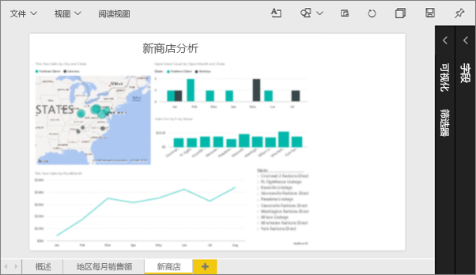
2. 请确保在画布上未选择可视化效果。 选择“视图”并查看显示选项。

   * 在“阅读”视图中，你可以看到此项。

     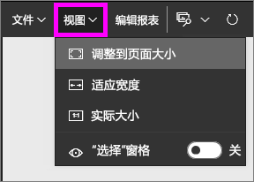
   * 在“编辑”视图中，你可以看到此项。

     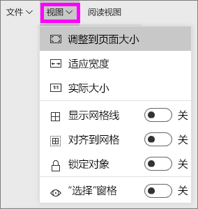

3. 让我们看看使用“实际大小”设置后页面看起来怎么样。

   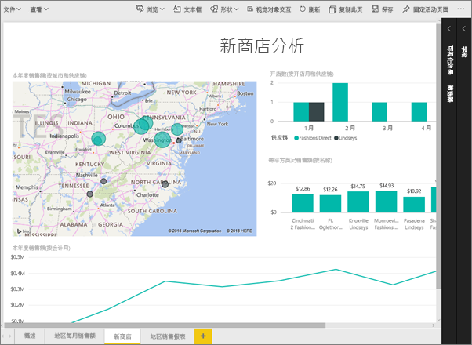

   不好，仪表板现有两个滚动条。
4. 切换到“适应宽度”。

   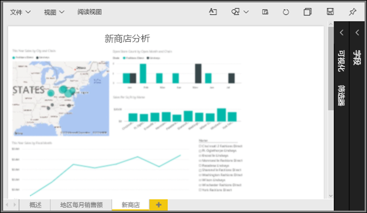

   看起来好一些了，仍有一个滚动条，但是可以更轻松地阅读详细信息。

## 更改报表页的默认视图
若为报表创建者，可以更改报表页的默认视图。 与其他人共享报表时，报表页使用已设置的视图打开。 报表使用者可以更改视图，但无法在退出报表后立即保存所做的更改。

1. 在报表的“新店铺”页上，切换回“实际大小”视图。

   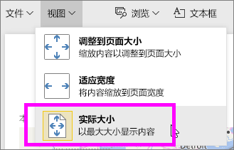

2. 在“地区每月销售额”报表页上，将“视图”设置为“适应宽度”。

3. 在“概述”报表页上，保留默认“视图”设置。

4. 现在，依次选择“文件”>“保存”，保存此报表。 下次打开此报表时，报表页将使用新的“视图”设置显示。 请看演示。

   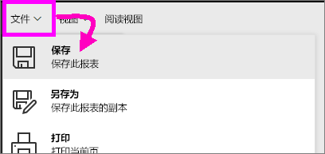
3. 从顶部导航栏中选择当前工作区的名称，以返回到该工作区。  

   
4. 依次选择“报表”选项卡和同一报表（“零售分析示例”）。

    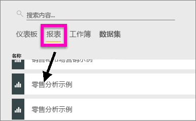
5. 打开报表的每个页面，以查看新设置。

   

## 现在，让我们浏览页面大小设置
由于页面大小设置仅适用于[编辑视图](../service-interact-with-a-report-in-editing-view.md)，因此必须拥有对报表的编辑（创建者）权限，才能更改页面大小设置。 如果已连接到任意[示例](../sample-datasets.md)，即拥有对这些报表的创建者权限。

1. 在“编辑视图”中打开[零售分析示例](../sample-retail-analysis.md)的“地区每月销售额”页。
2. 请确保在画布上未选择可视化效果。  在“**可视化效果**”窗格中，选择滚动油漆刷图标 。
3. 选择“页面大小”&gt;“类型”，以显示页面大小选项。

   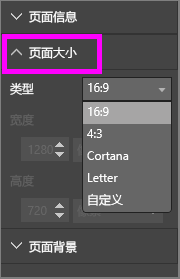
4. 选择“字母”。  在画布上，只有适应 816 x 1056 像素（字母大小）以内的内容才可以保留在画布的空白区域。

   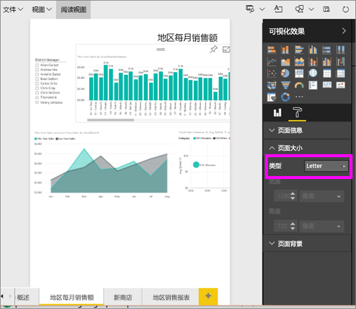
5. 选择“页面大小”“16:9”。

   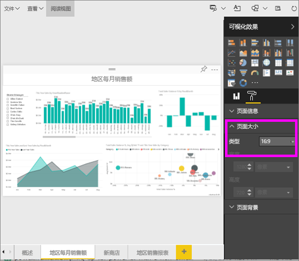

   使用 16:9 的宽高比显示报表页。 若要查看使用的实际像素大小，请查看灰色的宽度和高度字段 (1280 x 720)。 报表画布周围有很多空白部分，这是因为我们之前将“视图”设置为“适应宽度”。
7. 继续探讨“页面大小”选项。

## 结合使用页面“视图”和“页面大小”
结合使用页面“视图”和“页面大小”，可以创建在与同事共享或嵌入另一应用程序时外观最佳的报表。

在本练习中，你将创建一个报表页，它将显示于可容纳宽 500 像素、高 750 像素的应用程序中。

记得在上一步中，报表页当前显示为宽 1280 像素、高 720 像素。 因此我们知道，如果希望所有视觉对象都适应页面，需要进行大量的大小调整和重新排列。

1. 调整并移动视觉对象，使其可放入当前画布区域一半大小以下的空间。

    
2. 选择“页面大小”&gt;“自定义”。
3. 将宽度设置为 500，高度设置为 750。

    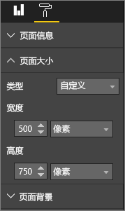
4. 调整报表页以使其达到最佳显示效果。 在“视图”>“实际大小”和“视图”>“调整到页面大小”之间切换以便调整。

    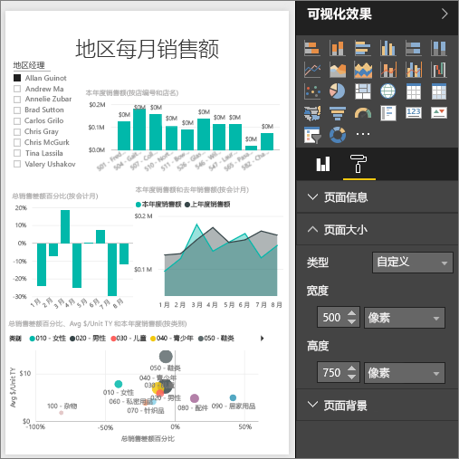

## 后续步骤
[为 Cortana 创建报表](../service-cortana-answer-cards.md)

返回到 [Power BI 报表中的页面显示设置](../power-bi-report-display-settings.md)

更多问题？ [尝试参与 Power BI 社区](http://community.powerbi.com/)
