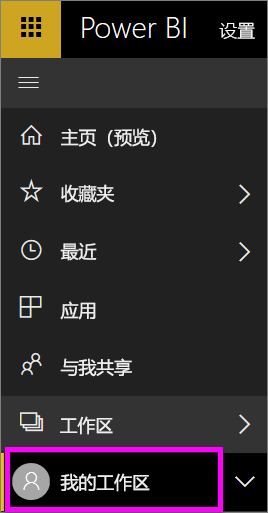
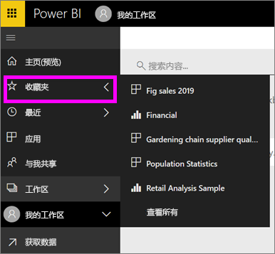

# 导航：在 Power BI 服务中搜索、查找和排序内容
可通过多种方法在 Power BI 服务中导航内容。 工作区中的内容已按类型进行组织：仪表板、报表、工作簿和数据集。  此外，内容已按使用情况进行组织：收藏夹、最近、应用、与我共享和特色。 为实现一站式导航，主页将全部内容组织在同一页面上。 通过这些不同的内容浏览途径可以在 Power BI 服务中快速找到所需的内容。  

## 在工作区中导航

Power BI *使用者*通常只有一个工作区：“我的工作区”。 仅当下载了 Microsoft 示例、创建或下载了自己的内容时，“我的工作区”中才会包含内容。  

在我的工作区中，Power BI 服务按类型区分内容：仪表板、报表、工作簿和数据集。 选择工作区时，可以看到这种组织形式。 在此示例中，“我的工作区”包含一个仪表板、两个报表、两个数据集，不包含工作簿。

________________________________________

## 使用左侧导航栏导航
左侧导航栏对内容进行分类，方便你快捷地找到所需的内容。  

- “与我共享”中显示与你共享的内容。
- “最近”中显示最近访问的内容。 
- 选择“应用”可查找应用。
- “主页”是单页视图，显示最重要的内容和推荐的内容及学习资源。

此外，你可以标记作为内容[收藏](end-user-favorite.md)和[特色](end-user-featured.md)。 选取一个你希望经常查看的仪表板，并将其设置为特色仪表板。 每次打开 Power BI 服务时，会首先显示特色仪表板。 你是否有大量经常访问的仪表板和应用？ 通过将它们设置为收藏项，可以始终通过左侧导航栏进行访问。

。

## 注意事项和疑难解答
* 对于数据集，所有者无法使用排序依据。

## 后续步骤
[Power BI - 基本概念](end-user-basic-concepts.md)

更多问题？ [尝试参与 Power BI 社区](http://community.powerbi.com/)