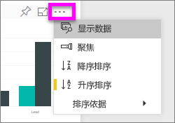
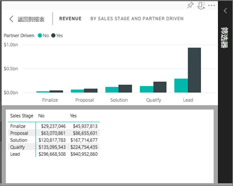
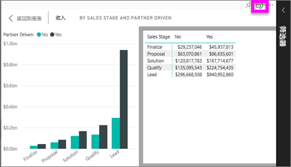

# 显示用于创建可视化效果的数据
## 显示数据
Power BI 可视化效果是使用基础数据集中的数据创建的。 如果你对幕后感兴趣，可以使用 Power BI *显示* 用于创建视觉对象的数据。 在用户选择“显示数据”后，Power BI 在可视化效果下方（或旁边）显示数据。

## 使用 Power BI 服务中的“显示数据”功能
1. 在 Power BI 服务中，打开报表并选择视觉对象。  
2. 若要显示视觉对象背后的数据，请依次选择省略号 (...) 和“显示数据”。
   
   
3. 默认情况下，该数据将显示以下视觉对象。
   
   

4. 若要更改方向，可从可视化效果的右上角选择垂直布局 。
   
   

### 后续步骤
[Power BI 报表中的可视化效果](../visuals/power-bi-report-visualizations.md)    
[Power BI 报表](end-user-reports.md)    
