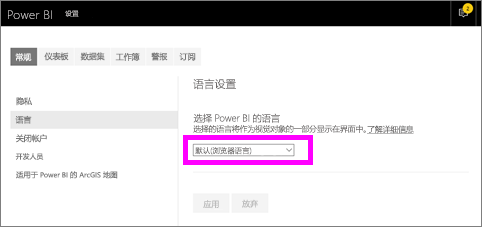
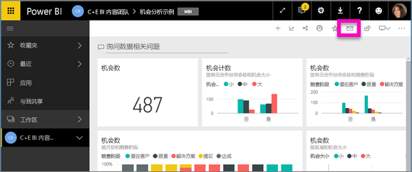
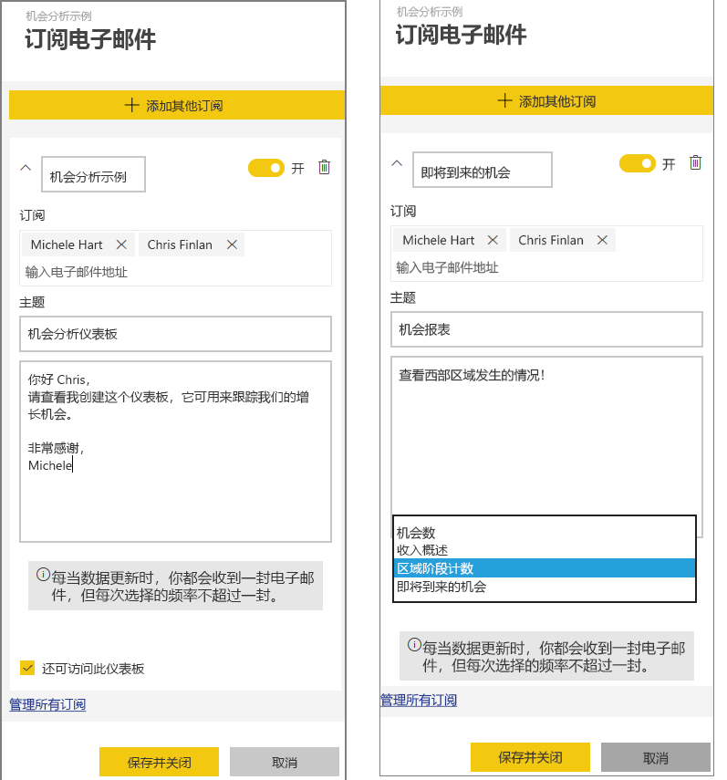
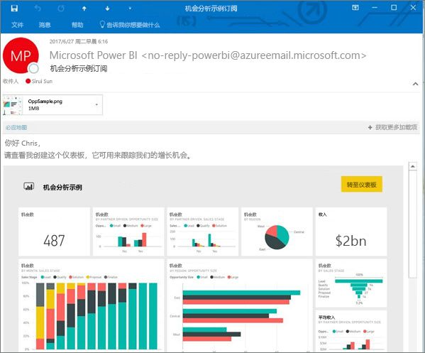
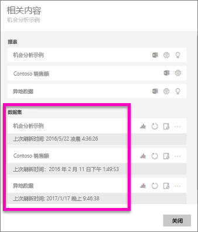
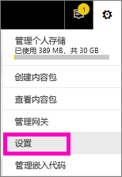
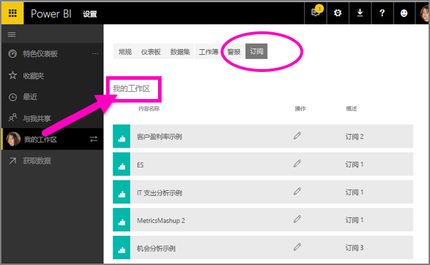

# 在 Power BI 服务 (app.powerbi.com) 中订阅报表或仪表板
现在，及时更新最重要的仪表板和报表，比以前更加轻松。 为自己和同事订阅最重要的报表页和仪表板，Power BI 将通过电子邮件将快照发送到收件箱。 告知 Power BI 所需的电子邮件接收频率：从每天一次到每周一次。 

电子邮件和快照将使用在 Power BI 设置中设置的语言（请参阅 [Power BI 的支持语言和国家/地区](../supported-languages-countries-regions.md)）。 如果未定义任何语言，Power BI 会根据当前浏览器中的区域设置使用语言。 要查看或设置语言首选项，请选择齿轮图标  > “设置”>“常规”>“语言”。 

只能在 Power BI 服务中创建订阅。 收到的电子邮件中包含“转到报表或仪表板”链接。 在安装了 Power BI 应用的移动设备上，选择此链接将启动应用（而不是执行在 Power BI 网站上打开报表或仪表板这样的默认操作）。

## 要求
- 创建订阅是一项 Power BI Pro 功能，必须拥有编辑内容（仪表板或报表）的权限才能创建该订阅。 
- 由于仅当更新或刷新数据集时才能发送订阅电子邮件，因此未更新或刷新的数据集上不支持订阅。

## 订阅仪表板或报表页
无论是订阅仪表板还是报表页，订阅过程非常类似。 使用同一按钮，即可为自己（和其他人）订阅 Power BI 服务仪表板和报表。
 
。

1. 打开仪表板或报表。
2. 在顶部菜单栏中，选择“订阅”或信封图标 。
   
   

3. 使用黄色滑块可启用和禁用订阅。  将滑块设置为“关”不会删除订阅。 若要删除订阅，请选择垃圾桶图标。

4. 填写电子邮件详细信息。 已预填充电子邮件但还可将其他人添加到订阅。 仅可添加位于同一域的电子邮件地址（请参阅下文的注意事项和疑难解答，了解详细信息）。 如果报表或仪表板托管在[高级容量](../service-premium.md)中，则可使用个人电子邮件地址和组别名为其他人订阅。 如果报表或仪表板未托管在高级容量中，仍可使用其他人的个人电子邮件地址为其订阅，但他们也必须拥有 Power BI Pro 许可证。

    在以下屏幕截图中，请注意订阅报表实际上订阅的是报表页。  要订阅报表中的多个页，请选择“添加其他订阅”并选择另一页。 
      
   

5. 选择“**保存并关闭**”，保存订阅。 每次任意基础数据集发生更改时，这些订阅都会收到电子邮件和仪表板或报表页的快照。 如果仪表板或报表一天刷新多次，只会在首次刷新后发送电子邮件。  
   
   
   
   > [!TIP]
   > 想立即查看电子邮件？ 刷新一个与仪表板或报表相关联的数据集，从而触发电子邮件。 （如果你没有对数据集的编辑权限，则只能请具有这些权限的人员为你执行此操作。）要确定使用了哪些数据集，请选择“查看相关内容”图标  打开相关内容，然后选择刷新图标 。 
   > 
   > 
   
   

## 如何确定电子邮件计划
下表介绍了你将接收电子邮件的频率。 这完全取决于仪表板或报表依据的数据集的连接方法（DirectQuery、实时连接、导入 Power BI，或 OneDrive/SharePoint Online 中的 Excel 文件），以及可用和已选择的订阅选项（“每日一次”、“每周一次”或“无”）。

|  | **DirectQuery** | **实时连接** | **计划的刷新（导入）** | **OneDrive/SharePoint Online 中的 Excel 文件** |
| --- | --- | --- | --- | --- |
| **报表/仪表板多久刷新一次？** |每 15 分钟 |Power BI 每 15 分钟检查一次，如果数据集已更改，则会刷新报表。 |用户可以选择无、每日或每周。 每日可以一天多达 8 次。 每周实际上是一个每周计划，用户可以创建和设置刷新，少至一周一次，多至每天一次。 |每小时一次 |
| **用户对订阅电子邮件计划有多少控制权？** |选项为：每日或每周 |无选项：如果报表刷新，则向用户发送电子邮件，但每天最多一次。 |如果刷新计划为每日一次，选项为“每日一次”和“每周一次”。  如果刷新计划为每周一次，选项仅为“每周一次”。 |无选项：每当数据集更新时向用户发送电子邮件，但每天最多一次。 |

## 管理订阅
仅订阅创建者可管理该订阅。  订阅管理屏幕的路径有 2 个。  第一个是选择“订阅电子邮件”对话框中的“管理所有订阅”（请参阅上述第 4 步下方的屏幕快照）。 第二个是选择顶部菜单栏中的 Power BI 齿轮图标 ，然后选择“设置”。

具体显示哪些订阅视当前处于活动状态的工作区而定。  若要一次性查看所有工作区的全部订阅，请确保“**我的工作区**”处于活动状态。 若要了解工作区，请参阅 [Power BI 中的工作区](end-user-create-apps.md)。

如果 Pro 许可证到期、所有者删除仪表板或报表，或用于创建订阅的用户帐户被删除，那么订阅将结束。

## 注意事项和疑难解答
* 对于仪表板电子邮件说明，如果任何磁贴应用了行级别安全性 (RLS)，则不会显示这些磁贴。  对于报表电子邮件说明，如果数据集使用 RLS，则无法创建订阅。
* 报表页订阅与报表页面的名称是相关联的。 如果你订阅一个报表页，而后将其重命名，则必须重新创建订阅
* 为其他用户订阅时，当前不支持使用实时连接数据集的报表和仪表板的电子邮件订阅。
* 对于实时连接数据集上的电子邮件订阅，你只会在数据更改时收到电子邮件。 因此，如果发生刷新但没有数据更改，Power BI 不会向你发送电子邮件。
* 电子邮件订阅不支持大多数[自定义视觉对象](../power-bi-custom-visuals.md)。  已经过[认证](../power-bi-custom-visuals-certified.md)的自定义视觉对象除外。  
* 目前电子邮件订阅不支持 R 驱动的自定义视觉对象。  
* 如果任何仪表板磁贴应用了行级别安全性 (RLS)，则不会显示这些磁贴。
* 如果报表应用了行级别安全性 (RLS)，则无法为其他用户创建订阅。
* 电子邮件订阅与报表的默认筛选器和切片器状态一起发送。 在订阅后对默认设置所做的任何更改都不会显示在电子邮件中。    
* 由 Power BI Desktop 创建的实时连接到服务功能的报表页尚不支持电子邮件订阅。    
* 对于仪表板订阅，具体来说，尚不支持某些类型的磁贴。  其中包括流磁贴、视频磁贴、自定义 Web 内容磁贴。     
* 如果与租户外的同事共享仪表板，则无法为该同事也创建订阅。 因此，如果你是 aaron@xyz.com，则可以与 anyone@ABC.com 共享，但目前无法为 anyone@ABC.com 订阅并且他们也无法订阅共享内容。      
* 由于电子邮件大小限制，可能无法订阅包含极大图像的仪表板或报表。    
* 如果超过 2 个月一直没有人访问仪表板和报表，那么 Power BI 会自动暂停刷新与它们关联的数据集。  不过，如果添加对仪表板或报表的订阅，即使无人访问，也不会暂停刷新。    
* 如果未收到订阅电子邮件，请确保用户主体名称 (UPN) 能够接收电子邮件。 [Power BI 团队正在努力放宽此要求](https://community.powerbi.com/t5/Issues/No-Mail-from-Cloud-Service/idc-p/205918#M10163)，敬请关注。 
* 如果你的仪表板或报表位于高级容量中，则可使用组电子邮件别名进行订阅，而不用一次使用一个电子邮件地址为同事订阅。 根据当前的 Active Directory 确定别名。 

## 后续步骤
* 更多问题？ [尝试咨询 Power BI 社区](http://community.powerbi.com/)    
* [阅读博客文章](https://powerbi.microsoft.com/blog/introducing-dashboard-email-subscriptions-a-360-degree-view-of-your-business-in-your-inbox-every-day/)

