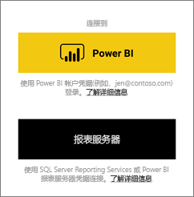
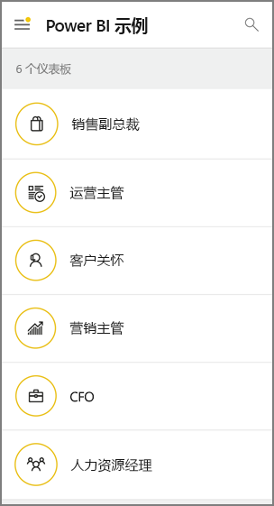
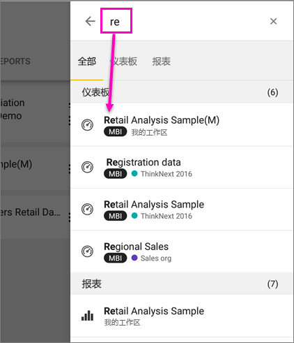
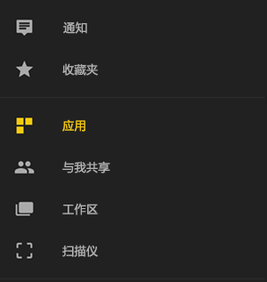
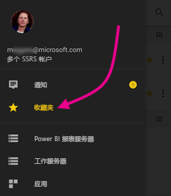
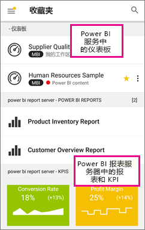

# Android 设备上的 Power BI 移动应用入门
Android 版 Microsoft Power BI 移动应用提供了 Power BI、Power BI 报表服务器和 Reporting Services 的移动 BI 体验。 通过触控移动设备实现的实时访问，可以随时随地查看本地和云中的公司仪表板，并与之进行交互。 然后，可以浏览仪表板中的数据，并通过电子邮件或短信的方式将数据与同事共享。 

可以在 Power BI Desktop 中创建 Power BI 报表，然后发布报表：

* [将报表发布到 Power BI 服务中](../../power-bi-overview.md)，并创建仪表板。
* [在本地将报表发布到 Power BI 报表服务器中](../../report-server/quickstart-create-powerbi-report.md)。

然后，即可在 Android 版 Power BI 应用中与仪表板和报表进行交互，无论它们是在本地还是在云端。

查找 [Power BI 移动应用中的新功能](../../mobile-whats-new-in-the-mobile-apps.md)。

## 先决条件

### 获取应用

从 Google Play [下载 Android 版 Power BI 应用](http://go.microsoft.com/fwlink/?LinkID=544867)。
  
Power BI 可以在多个运行 Android 5.0 操作系统或更高版本的不同 Android 设备上运行。 若要检查设备，请转到“设置” > “关于设备” > “Android 版本”。 

**打开应用时启动**    
即使没有注册或登录，打开该应用后，也可以浏览登录页面，获取有关对 Android 设备上的 Power BI 应用执行的操作的概述。 点击“跳过”以查看和浏览示例，并获取该应用的亲自实践体验。 无论何时需要，你都可以从仪表板主页[返回到示例](mobile-android-app-get-started.md#try-the-power-bi-and-reporting-services-samples)。

查看 [Power Bi 移动应用中的新功能](../../mobile-whats-new-in-the-mobile-apps.md)。

## 在 Web 上注册 Power BI 服务
如果尚未登录，请转到 [Power BI 服务 (http://powerbi.com/)](http://powerbi.com/) 登录你自己的帐户，以创建和存储仪表板和报表，并将数据合并在一起。 然后，从 Android 设备登录 Power BI，可从任何位置查看你自己的仪表板。

1. 在 Power BI 服务中点击[注册](http://go.microsoft.com/fwlink/?LinkID=513879)创建 Power BI 帐户。
2. 开始[创建自己的仪表板和报表](../../service-get-started.md)。

## 在设备上开始使用 Power BI 应用
1. 在 Android 设备上，从开始屏幕打开 Android 版 Power BI 应用。
   
   
2. 若要查看 Power BI 仪表板和报表，请点击“Power BI”。  
   
   如果你收到 Power BI 无法登录的消息，请参阅[“无法进行身份验证，因为你的企业 SSL 证书不受信任”](mobile-android-app-error-corporate-ssl-account-is-untrusted.md)，了解有关如何解决该问题的详细信息。

   若要查看 Power BI 报表服务器/Reporting Services 报表和 KPI，请点击“报表服务器”。
   
   

## 体验 Power BI 和 Reporting Services 示例
即使没有注册，也可以使用 Power BI 和 Reporting Services 示例。 下载应用后，你可以查看或启用这些示例。 无论何时需要，你都可以从仪表板“开始”页返回到示例。

### Power BI 示例
可以查看 Power BI 仪表板示例并与之交互，但有一些事项不能对其执行操作。 无法打开仪表板背后的报表、与他人共享示例，或将其加入收藏夹。

1. 点击左上角的  全局导航按钮。
2. 点击“设置” > “发现示例”，然后选择一个角色，并浏览该角色的示例仪表板。  
   
   

### Reporting Services 移动报表示例
1. 点击左上角的  全局导航按钮。
2. 点击“Reporting Services 示例”，然后打开零售报表或销售报表文件夹以浏览 KPI 和移动报表。
   
   

## 搜索仪表板或报表
* 点击右上角的放大镜 ，然后键入要查找的术语。
  
    
  
    默认情况下它将搜索所有仪表板和报表，但你可以仅搜索一个或另一个。

## 在 Power BI 移动应用中查找内容
仪表板和报表将存储在 Power BI 移动应用的不同位置，具体取决要于它们原来所在的位置。 了解如何[在移动应用中查找内容](../../mobile-apps-quickstart-view-dashboard-report.md)。 此外，可以始终在 Power BI 移动应用中搜索你所拥有的内容。 

## 查看你收藏的仪表板、KPI 和报表
移动应用中的“收藏夹”页上显示了你收藏的所有 Power BI 仪表板，以及 Power BI 报表服务器/Reporting Services KPI 和报表。 在 Power BI 移动应用中收藏某个仪表板后，可以从所有设备（包括浏览器中的 Power BI 服务）中访问该仪表板。 

* 点击**收藏夹**。
  
   
  
   Power BI 收藏夹以及 Power BI 报表服务器/Reporting Services Web 门户中的收藏夹全都显示在此页上。
  
   

阅读有关 [Power BI 移动应用中的收藏夹](mobile-apps-favorites.md) 的更多信息。

## Power BI 移动应用的企业支持
组织可以使用 Microsoft Intune 管理设备和应用程序，包括适用于 Android 和 iOS 的 Power BI 移动应用。

使用 Microsoft Intune，组织可以控制各项事务，如要求提供访问 PIN、控制应用程序处理数据的方式，甚至是在未使用应用时加密应用程序数据。

> [!NOTE]
> 如果你在 Android 设备上使用 Power BI 移动应用，并且组织已配置 Microsoft Intune MAM，则会关闭后台数据刷新。 在你下次进入应用时，Power BI 会刷新 Power BI 服务 Web 数据。
> 
> 

详细了解[如何使用 Microsoft Intune 配置适用于 Android 的 Power BI 移动应用](../../service-admin-mobile-intune.md)。 

## 后续步骤
下面是可使用 Power BI 中的仪表板和报表在 Android 设备版 Power BI 应用中执行的一些其他操作，以及 Power BI 报表服务器或 Reporting Services Web 门户中的报表和 KPI。

### Power BI 仪表板和报表
* 查看[你的应用](../../service-create-distribute-apps.md)。
* 查看你的[仪表板](../../mobile-apps-view-dashboard.md)。
* 浏览[仪表板上的磁贴](../../mobile-tiles-in-the-mobile-apps.md)。
* 打开 [Power BI 报表](../../mobile-reports-in-the-mobile-apps.md)。
* 查看[你的应用](../../service-create-distribute-apps.md)。
* [对磁贴进行批注并共享磁贴](mobile-annotate-and-share-a-tile-from-the-mobile-apps.md)。
* 共享[仪表板](../../mobile-share-dashboard-from-the-mobile-apps.md)。
* 使用 Android 手机[扫描 Power BI QR 代码](../../mobile-apps-qr-code.md)以打开相关仪表板磁贴或报表。 
* 查看[有关 Power BI 帐户更新的通知](../../mobile-apps-notification-center.md)，如同事与你共享的仪表板。

### Power BI 报表服务器/Reporting Services Web 门户中的报表和 KPI
* 在 Android 设备版 Power BI 移动应用中[查看 Web 门户中的报表和 KPI](mobile-app-ssrs-kpis-mobile-on-premises-reports.md)。
* [在 Web 门户中创建 KPI](https://docs.microsoft.com/sql/reporting-services/working-with-kpis-in-reporting-services)。
* [在 Power BI Desktop 中创建报表，然后将报表发布到 Power BI 报表服务器 Web 门户中](../../report-server/quickstart-create-powerbi-report.md)

### 另请参阅
* 从 Android 应用商店[下载 Android 应用](http://go.microsoft.com/fwlink/?LinkID=544867)
* [什么是 Power BI？](../../power-bi-overview.md)
* 是否有任何问题？ [尝试咨询 Power BI 社区](http://community.powerbi.com/)

