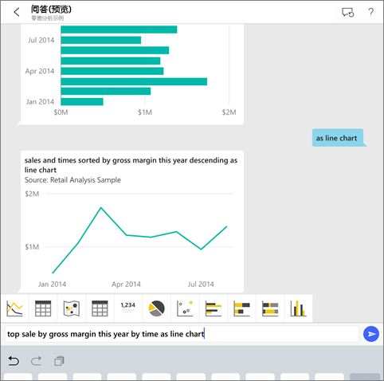
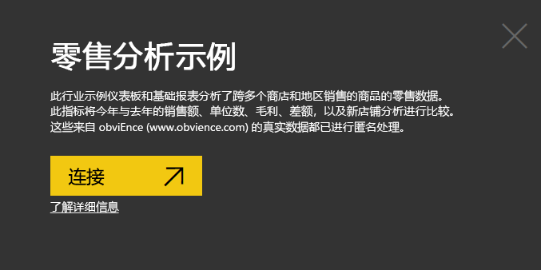
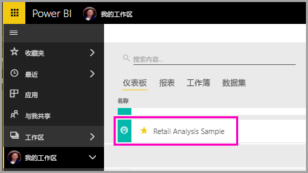
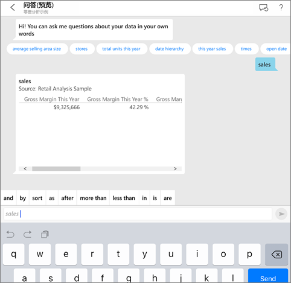
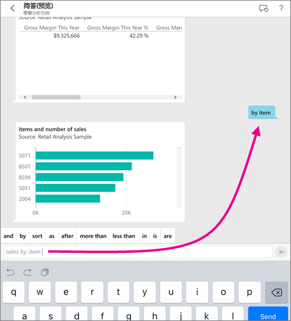
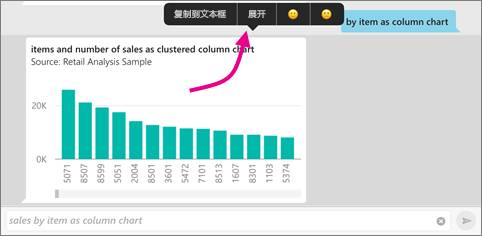
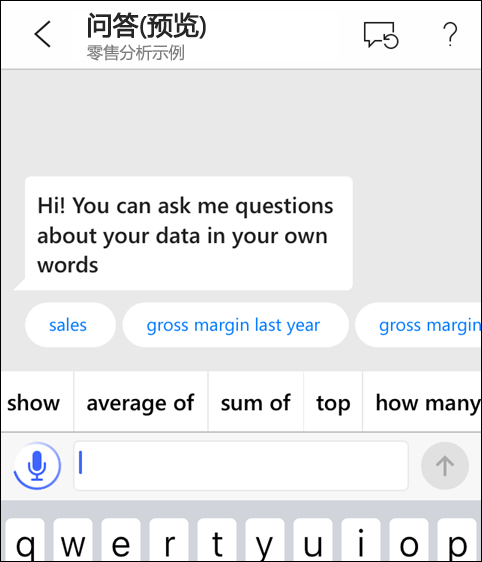
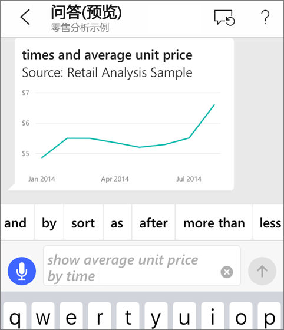
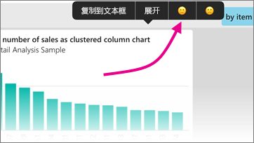

# iOS 应用中的问答虚拟分析师 - Power BI

了解数据的最简单方式是用自己的话咨询有关数据的问题。 在本文中，在 iPad、iPhone 和 iPod Touch 上使用 Microsoft Power BI 移动应用中的问答虚拟分析师询问有关示例数据的问题并查看特别推荐的见解。 

适用于：

|  |  |
|:--- |:--- |
| iPhone |iPad |

常见问题虚拟分析师是可在 Power BI 服务 [(https://powerbi.com)](https://powerbi.com) 中访问基础常见问题数据的对话 BI 体验。 它会提供数据见解建议，你可以键入或说出自己的问题。

如果未注册 Power BI，请[免费注册](https://app.powerbi.com/signupredirect?pbi_source=web)后再进行操作。

## 先决条件

### 安装 iOS 版 Power BI 应用
[下载 iOS 应用](http://go.microsoft.com/fwlink/?LinkId=522062 "从 Apple App Store 下载 iPhone 应用") 到你的 iPad、iPhone 或 iPod Touch 中。

以下版本支持 iOS 版 Power BI 应用：
- 操作系统为 iOS 10 或更高版本的 iPad。
- 操作系统为 iOS 10 或更高版本的 iPhone 5 及更高版本。 
- 操作系统为 iOS 10 或更高版本的 iPod Touch。

### 下载示例
第一个步骤是在 Power BI 服务中下载零售分析示例和机会分析示例。

**获取零售分析示例**

1. 打开 Power BI 服务 (app.powerbi.com) 并登录。

2. 在左侧的导航窗格中，选择“工作区”>“我的工作区”。

3. 在左下角，选择“获取数据”。
   
    

3. 在“获取数据”页上选择“示例”图标。
   
   

4. 选择“零售分析示例”。
 
    
 
8. 选择“连接”。  
  
   
   
5. Power BI 导入内容包，并将新的仪表板、报表和数据集添加到当前工作区。
   
   

**获取机会分析示例**

- 完成为零售分析示例执行的相同步骤，但在步骤 4 中，选择“机会分析示例”。

    
  
好了，你已准备好在 iOS 设备上查看这些示例。

## 尝试在 iPhone 或 iPad 上提问
1. 在你的 iPhone 或 iPad 上，点击全局导航按钮 > “工作区” > “我的工作区”，然后打开零售分析示例仪表板。

2. 点击页面底部（如果是 iPad，则位于页面顶部）操作菜单中的“问答虚拟分析师”图标。
     问答虚拟分析师推荐了一些可快速上手的见解。
3. 键入“显示”，点击建议列表中的“销售”，再点击“发送”。

    
4. 点击关键字中的“**by**”，然后依次点击建议列表中的“**item**”和“**发送**”。

    
5. 点击关键字中的“**as**”，然后依次点击柱状图图标  和“**发送**”。
6. 长按生成的图表，然后点击“**展开**”。

    

    此图表以焦点模式在应用中打开。

    
7. 点击左上角的箭头，可返回到问答虚拟分析师聊天窗口。
8. 点击文本框右侧的 X 即可删除文本并重新开始。
9. 尝试提出新问题：点击关键字中的“**top**”，然后依次点击“**sale by avg $/unit ly**” > “**发送**”。

    
10. 选择关键字中的“**by**”，然后依次点击顶部建议列表中的“**time**”和“**发送**”。

     
11. 键入“**as**”，从建议列表中选择折线图图标 ，然后点击“**发送**”。

    

## 尝试说出你的问题
在 Power BI 移动应用中就你的数据提问时，现在可以说出你的问题，而不用键入问题。

1. 点击问答虚拟分析师图标  。
2. 点击麦克风图标 。

    

1. 当麦克风图标处于活动状态时，开始说出你的问题。 例如，请说“按时间显示平均单价”，然后点击“发送”。

    

### 对使用语音转文本时的隐私有疑问？
请参阅 Apple iOS 开发者指南中 [iOS 新增功能](https://go.microsoft.com/fwlink/?linkid=845624)的“语音识别”部分。

## 帮助和反馈
* 需要帮助？ 只需说“你好”或“帮助”，即可获得有关如何提出新问题的帮助。
* 想提供对结果的反馈吗？ 请长按图表或其他结果，然后点击笑脸或哭脸。

    

    反馈是匿名的，可有助于我们改进问题解答。

## 改进问答虚拟分析师结果
通过提问更具针对性的问题或改进数据集，可以改进你或客户对数据集使用问答虚拟分析师时获得的结果。

### 如何提问
* 在 iOS 移动应用的 Power BI 服务或问答虚拟分析师中，按照[在问答中提问的提示](../end-user-q-and-a-tips.md)进行操作。

### 如何改进数据集
* 改进 Power BI Desktop 或 Power BI 服务中的数据集，从而[让你的数据与问答和问答虚拟分析师很好地协作](../../service-prepare-data-for-q-and-a.md)。

## 后续步骤
* [Power BI 服务中的问答](../end-user-q-and-a.md)
* 是否有任何问题？ 查看 [Power BI 社区中的“移动应用”部分](https://go.microsoft.com/fwlink/?linkid=839277)
