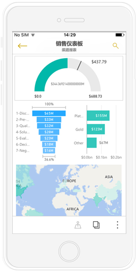
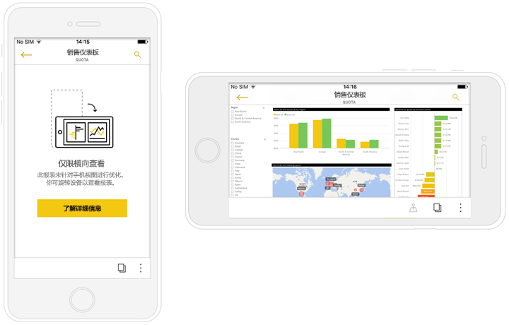
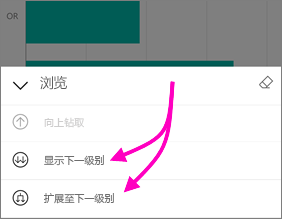
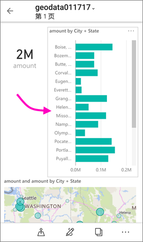

# 查看针对你的手机进行优化的 Power BI 报表

适用于：

|  |  |
|:--- |:--- |
| iPhone |Android 手机 |

在 Power BI Desktop 中创建 Power BI 报表时，你还可以为手机上的 Power BI 应用[创建适用于查看的优化版本](../../desktop-create-phone-report.md)。

然后，如果在手机上打开 Power BI 报表，Power BI 会检测报表是否更适合在手机上查看，并自动以纵向视图打开优化后的报表。

如果不存在优化的手机报表，则报表仍将打开，但以非优化的横向视图显示。 即使是更适合在手机上查看的报表，如果翻转手机，报表也会按照原始报表布局，在未优化的视图中打开。 如果只优化了某些页，则你将在纵向视图中看到消息，指示该报表提供横向视图。

Power BI 报表的所有其他功能对更适合在手机上查看的报表仍有效。 阅读可在以下机型中执行的操作的详细信息：

* [iPhone 上的报表](mobile-reports-in-the-mobile-apps.md)。 
* [Android 手机上的报表](mobile-reports-in-the-mobile-apps.md)。

## 筛选手机上的报表页
如果针对手机优化的报表已定义筛选器，则在手机上查看报表时可以使用这些筛选器。 在手机上打开的报表已筛选出网页版报表中筛选的值，并通过消息提示报表页上有活动筛选器。 可以在手机上更改筛选器。

1. 点击筛选器图标  手机筛选器图标。 
2. 使用基本筛选或高级筛选查看你感兴趣的结果。
   
    

## 交叉突出显示视觉对象
在手机报表、Power BI 服务和手机上的横向视图报表中，交叉突出显示视觉对象的工作方式一样：在一个视觉对象中选择数据时，它会在该页面上的其他视觉对象中突出显示相关数据。

阅读有关 [Power BI 中的筛选和突出显示](../../power-bi-reports-filters-and-highlighting.md)的详细信息。

## 选择视觉对象
在手机报表中选择视觉对象时，手机报表突出显示并专注于该视觉对象，以抵消画布笔势。

利用所选的视觉对象，可执行诸如在该视觉对象中滚动的操作。 要取消选择视觉对象，触摸视觉对象区域之外的任意位置即可。

## 在焦点模式下打开视觉对象
手机报表也提供焦点模式，因此，可以放大一个视觉对象的视图，并浏览此视觉对象和报表。

* 在手机报表中，点击视觉对象右上角的省略号 (**...**) >“**扩展至焦点模式**”。
  
    

在焦点模式下所执行的操作将传递到报表画布，反之亦然，从而为用户提供无缝的浏览体验。 例如，如果突出显示视觉对象中的一个值，然后返回到整个报表，则该报表将作为一个整体筛选出你在视觉对象中突出显示的值。

由于屏幕大小的限制，一些操作仅在焦点模式下可用：

* **向下钻取**视觉对象中显示的信息。 阅读以下有关手机报表中[向下钻取和向上钻取](mobile-apps-view-phone-report.md#drill-down-in-a-visual)的详细信息。
* 对视觉对象中的值进行**排序**。
* **还原**：清除针对视觉对象所采取的浏览步骤，并还原为报表创建时的定义集。
  
    若要清除视觉对象中的所有浏览，请点击省略号 (**...**) >“**还原**”。
  
    
  
    可在报表级别或在视觉对象级别进行还原，前者将从所有视觉对象清除所有操作，后者将从所选的特定视觉对象清除所有操作。   

## 在视觉对象中向下钻取
如果在视觉对象中定义了层次结构级别，则可以向下钻取视觉对象中显示的详细信息，然后备份。 在 Power BI 服务或 Power BI Desktop 中，[向视觉对象添加向下钻取功能](../../power-bi-visualization-drill-down.md)。 只有在手机上查看更适合在手机上显示的 Power BI 报表时，才能使用向下钻取功能。 

1. 在手机报表中，点击右上角的省略号 (**...**) >“**扩展至焦点模式**”。
   
    
   
    在本示例中，柱线显示状态的值。
2. 点击左下角的“浏览”图标   。
   
    
3. 点击“**显示下一个级别**”或“**扩展至下一级别**”。
   
    
   
    现在，柱线显示城市的值。
   
    
4. 如果点击左上角的箭头，则返回到值仍扩展至较低级别的手机报表。
   
    
5. 若要向上返回到原始级别，请再次点击省略号 (**...**) >“**还原**”。
   
    

## 后续步骤
* [创建针对 Power BI 手机应用的优化报表](../../desktop-create-phone-report.md)
* [在 Power BI 中创建仪表板电话视图](../../service-create-dashboard-mobile-phone-view.md)
* [创建优化为适应任意大小的响应式视觉对象](../../visuals/desktop-create-responsive-visuals.md)
* 更多问题？ [尝试咨询 Power BI 社区](http://community.powerbi.com/)

