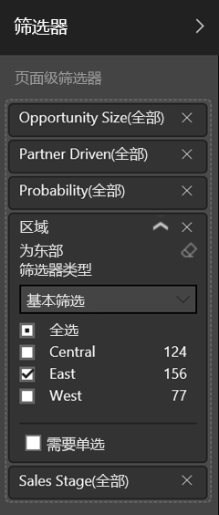
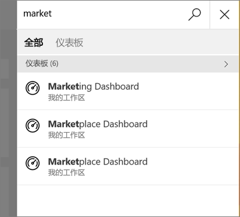
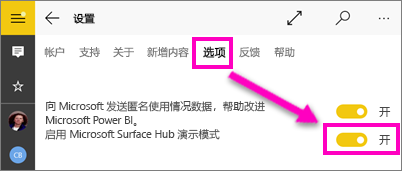

# 在 Windows 10 Surface Hub 上使用演示模式查看报表 - Power BI
可以在 Surface Hub 上以演示模式显示报表，并在 Windows 10 设备上的全屏模式下显示仪表板、报表和磁贴。 

对于在会议中或在办公室内专用投影仪上显示 Power BI，甚至仅将小屏幕上的空间最大化，演示模式和全屏模式都很有用。 

在 Power BI 移动应用的全屏模式下，将删除页面选项卡和报表中的筛选窗格以外的所有“镶边”（如导航栏和菜单栏）。

在 Surface Hub 上以演示模式显示报表时，可使用各色墨迹在页面上绘图，并可在报表各页面间导航。

还可在 Web 上[从 Power BI 服务中以全屏模式显示仪表板和报表](../../service-fullscreen-mode.md)。

> [!NOTE]
> 演示模式不同于[磁贴的焦点模式](mobile-tiles-in-the-mobile-apps.md)。
> 
> 

## 以全屏模式显示仪表板、报表和磁贴
1. 在仪表板、报表或磁贴上的 Power BI 移动应用中，点击“全屏”图标 转到全屏模式。
2. 在演示模式下，可以筛选报表，也可以搜索其他仪表板和报表。
   
    展开“筛选器”窗格设置或删除筛选器。
   
    
   
     点击搜索图标  查找其他仪表板。
   
    
3. 要退出全屏模式，请点击带有两个相对箭头的图标  在工具栏上或从顶部向下轻扫并点击两个相对箭头 。

## 打开 Surface Hub 的演示模式
Surface Hub 默认启用演示模式，但如果此模式已禁用，可重新启用。

1. 点击左侧导航栏底部的“设置”图标  。
2. 点击“选项”，然后将“启用 Microsoft Surface Hub 演示模式”滑动到“打开”。
   
    

## 在 Surface Hub 上显示报表并在其上绘图
1. 在报表中，点击“全屏”图标  转到 Surface Hub 演示模式。
   
    屏幕两侧显示可折叠操作栏。 
   
   * 向内轻扫或点击图柄可打开它。
   * 向外轻扫或点击顶部的 X 可关闭它。
2. 在支持用笔书写的设备上，可立即开始书写。 
3. 若要更改墨迹颜色，请点击左侧或右侧操作栏中的画笔。
   
    
4. 点击橡皮擦或撤消箭头可删除部分或所有墨迹。
5. 点击环形箭头可刷新报表内容。
6. 点击横向箭头可转到报表中其他页面。
   
    
7. 若要退出全屏模式，请从顶部向下轻扫并点击两个相对箭头 。

## 后续步骤
* [在 Power BI 服务中的全屏模式下显示仪表板和报表](../../service-fullscreen-mode.md)
* 是否有任何问题？ [尝试咨询 Power BI 社区](http://community.powerbi.com/)

