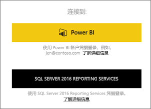
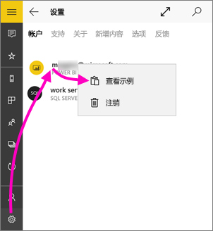
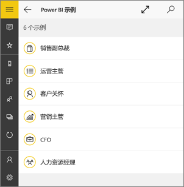
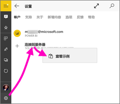
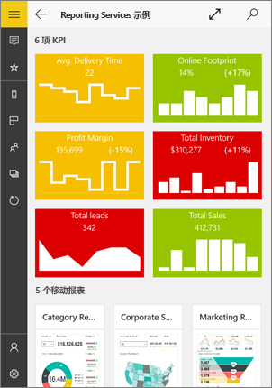
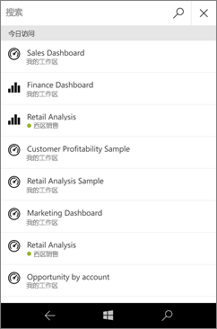
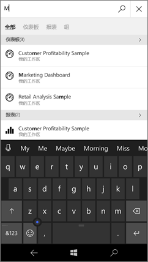
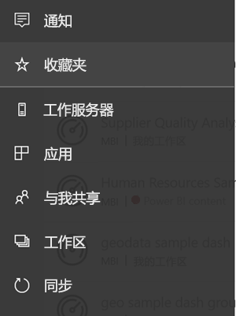
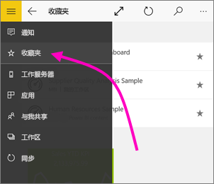
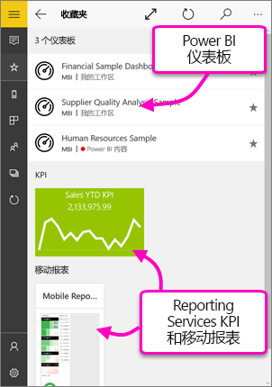

# 适用于 Windows 10 的 Power BI 移动应用入门
适用于 Windows 10 的 Power BI 移动应用让你可以在平板电脑或手机上使用 Power BI，可提供对业务信息的最新的、可触控移动式访问。 在任何地方查看公司仪表板并与之进行交互&#151;就在 [Windows 开始屏幕](mobile-pin-dashboard-start-screen-windows-10-phone-app.md)上查看。

你可以使用数据[在 Power BI 服务中创建仪表板和报表](../../service-get-started.md)。 

然后与仪表板和报表进行交互、浏览数据、并将其共享，所有这些操作都可以通过适用于 Windows 10 的 Power BI 移动应用完成。

## 要做的第一件事
* 从 Windows 应用商店中[**获取适用于 Windows 10 的 Power BI 移动应用**](http://go.microsoft.com/fwlink/?LinkID=526478)
  
  设备需要运行 Windows 10。 该应用可在至少具有 3 GB RAM 和 8 GB 内部存储的设备上运行。
   
* 查找 [Power BI 移动应用中的新功能](mobile-whats-new-in-the-mobile-apps.md)。

## 在 Web 上注册 Power BI 服务
如果你还未注册，请转到 [Power BI 服务](http://powerbi.com/)注册自己的帐户，以便创建和存储仪表板和报表，并将你的数据集合在一起。 然后可从你的 Windows 10 设备登录到 Power BI，在任何地方都可以查看你自己的仪表板。

1. 在 Power BI 服务中点击[注册](http://go.microsoft.com/fwlink/?LinkID=513879)创建 Power BI 帐户。
2. 开始[创建自己的仪表板和报表](../../service-get-started.md)。

## Power BI 应用入门
1. 在 Windows 10 设备的开始屏幕上，打开 Power BI 应用。
   
   
2. 若要查看 Power BI 仪表板和报表，请点击“Power BI”。 使用与 Web 上的 Power BI 帐户相同的凭据登录。 
   
   若要查看 Reporting Services 移动报表和 KPI，请点击“SQL Server 2016 Reporting Services”。 使用你的 SQL Server Reporting Services 凭据登录。
   
   
3. 点击**开始浏览**以查看自己的仪表板。

## 体验 Power BI 和 Reporting Services 示例
即使没有注册，也可以使用 Power BI 和 Reporting Services 示例。 下载应用后，你可以查看或启用这些示例。 无论何时需要，你都可以从仪表板“开始”页返回到示例。

### Power BI 示例
可以查看 Power BI 仪表板示例并与之交互，但有一些事项不能对其执行操作。 无法打开仪表板背后的报表、与他人共享示例，或将其加入收藏夹。

1. 点击左上角的  全局导航按钮。
2. 依次点击“设置”图标 ，你的名字，然后点击“查看示例”。
   
   
3. 选择一个角色，并浏览该角色的示例仪表板。  
   
   

### Reporting Services 移动报表示例
1. 点击左上角的  全局导航按钮。
2. 点击“设置”图标 ，右键单击或点击并按住“连接到服务器”，再点击“查看示例”。
   
   
3. 打开零售报表或销售报表文件夹，浏览 KPI 和移动报表。
   
   

## 搜索仪表板、报表和应用
通过在始终位于应用顶部的搜索框中键入内容来快速查找你的仪表板、报表和应用。

1. 点击右上角的搜索图标。
   
   
   
   Power BI 将显示最新的仪表板、报表和应用。
   
   
2. 当你开始键入时，Power BI 显示所有相关的结果。
   
   

## 在 Power BI 移动应用中查找内容
仪表板和报表将存储在 Power BI 移动应用的不同位置，具体取决要于它们原来所在的位置。 了解如何[在移动应用中查找内容](mobile-apps-quickstart-view-dashboard-report.md)。 此外，可以始终在 Power BI 移动应用中搜索你所拥有的内容。 

## 查看你收藏的仪表板、KPI 和报表
可以在移动应用的“收藏夹”页上查看所有最喜爱的 Power BI 仪表板及 Reporting Services KPI 和移动报表。 在 Power BI 移动应用中*收藏*某个仪表板后，可以从所有设备（包括浏览器中的 Power BI 服务）中访问该仪表板。 

* 点击**收藏夹**。
  
   
  
   Power BI 收藏夹以及你在 Reporting Services Web 门户中的收藏夹全都显示在此页上。
  
   

阅读有关 [Power BI 移动应用中的收藏夹](mobile-apps-favorites.md) 的更多信息。

## 后续步骤
下面介绍了还可以在适用于 Windows 10 设备的 Power BI 应用中对 Power BI 中的仪表板和报表，以及 Reporting Services Web 门户中的 Reporting Services 移动报表和 KPI 执行哪些操作

### Power BI 仪表板和报表
* 查看[你的应用](../../service-create-distribute-apps.md)。
* 查看你的[仪表板](mobile-apps-view-dashboard.md)。
* [将 Power BI 磁贴和仪表板作为动态磁贴固定到设备的开始屏幕](mobile-pin-dashboard-start-screen-windows-10-phone-app.md)。
* [共享磁贴](mobile-windows-10-phone-app-get-started.md)。
* 共享[仪表板](mobile-share-dashboard-from-the-mobile-apps.md)。

### Reporting Services 移动报表和 KPI
* 在适用于 Windows 10 设备的 Power BI 应用中[查看 Reporting Services 移动报表和 KPI](mobile-app-windows-10-ssrs-kpis-mobile-reports.md)
* 创建 [KPIs on the Reporting Services Web portal](https://msdn.microsoft.com/library/mt683632.aspx)（在 Reporting Services Web 门户上创建 KPI）。
* [借助 SQL Server 移动报表发布服务器创建自己的移动报表](https://msdn.microsoft.com/library/mt652547.aspx)，并将其发布到 Reporting Services Web 门户。

## 后续步骤
* 从 Windows 应用商店[下载 Power BI 应用](http://go.microsoft.com/fwlink/?LinkID=526478)。  
* [什么是 Power BI？](../../power-bi-overview.md)
* 是否有任何问题？ [尝试咨询 Power BI 社区](http://community.powerbi.com/)

