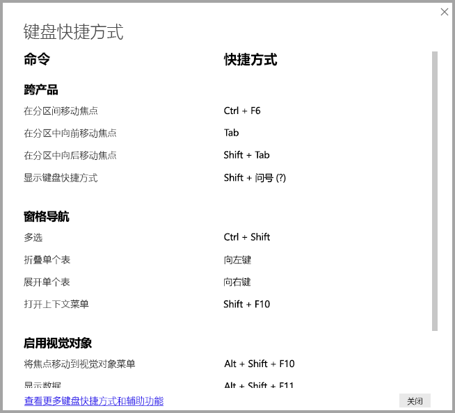
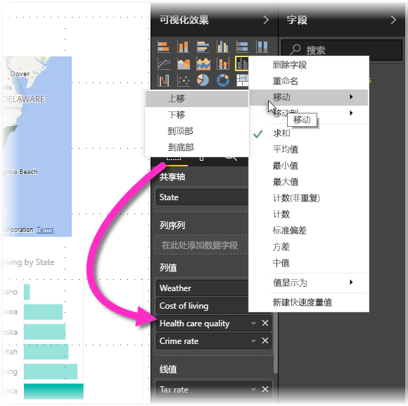

# Power BI Desktop 报表中的辅助功能
Power BI 具有使残疾人士能够更轻松地使用 Power BI 报表并与之进行交互的功能。 这些功能包括通过键盘或屏幕阅读器使用报表、通过按 Tab 键将焦点移动到页面中的各个对象以及在可视化效果中方便地使用标记。

> [!NOTE]
> 这些辅助功能在 2017 年 6 月 Power BI Desktop 和更高版本中可用。 我们也为将来的版本规划了其他辅助功能。
> 
> 

## 通过键盘或屏幕阅读器使用 Power BI Desktop 报表
从 2017 年 9 月发行版 Power BI Desktop 开始，可以按 ? 键显示一个窗口，其中介绍了中可在 Power BI Desktop 中使用的辅助功能键盘快捷方式。

借助辅助功能的增强功能，可以使用以下方法通过键盘或屏幕阅读器使用 Power BI 报表：

可以使用 Ctrl+F6 在报表页选项卡或在给定的报表页中的对象之间切换焦点。

* 当焦点位于报表页选项卡上时，使用 Tab 或箭头键将焦点从一个报表页移到下一个报表页。 无论当前是否被选中，屏幕阅读器都会读出报表页的标题。 若要加载当前焦点所在的报表页，使用 Enter 或空格键。
* 当焦点位于已加载的报表页上时，使用 Tab 键将焦点转移到页面上的每个对象，其中包括所有文本框、图像、形状和图表。 屏幕阅读器可读取对象类型、对象标题（如果有）和对象说明（如果报表作者已提供）。 

在视觉对象之间导航时，如果要与其进一步交互，可按 Alt+Shift+F10 将焦点移到该视觉对象标头，其中包括排序、导出图表背后的数据和焦点模式等多种选项。 

按 Alt+Shift+F11 可以访问“显示数据”窗口。 这使用户能够使用通常在屏幕阅读器中使用的相同键盘快捷方式来了解 HTML 表中的视觉对象中使用的数据。 

> [!NOTE]
> 仅可在屏幕阅读器中通过此键盘快捷方式访问“显示数据”功能。 如果通过视觉对象标头中的选项打开“显示数据”，屏幕阅读器将无法访问此功能。

自 2018 年 7 月发布“Power BI Desktop”以来，切片器还具有内置的辅助功能。 选择切片器时，若要调整切片器的值，使用 CTRL+向右键（控制键加向右键）可移动切片器内的各种控件。 例如，最初按 CTRL+向右键时，焦点位于橡皮擦上，按下空格键等同于单击橡皮擦按钮，这样便可擦除切片器上的所有值。 

可以通过按 TAB 键移动切片器中的控件。 位于橡皮擦上时，按 TAB 键移动到下拉按钮，按另一个 TAB 则移动到第一个切片器值（如果切片器有多个值，如一个范围）。 

这些附加辅助功能的创建目的是使用户能够通过屏幕阅读器和键盘导航充分利用 Power BI 报表。

## 创建可访问报表的提示
以下提示可帮助你创建更易于访问的 Power BI Desktop 报表。

### 有关可访问的报表的一般提示

* 对于“行”、“区域”、“组合图”、“散点图”和“气泡”视觉对象，请启用标记，并对每行使用不同的标记形状。
  
  * 若要启用“标记”，可在“可视化效果”窗格中选择“格式”部分，展开“形状”部分，然后向下滚动查找“标记”切换，并将其切换为“开”。
  * 然后，从“形状”部分中的下拉列表框中选择每行（如果使用区域图表，则为区域）的名称。 在下拉列表下方，可以调整用于所选行的标记的许多方面，包括其形状、颜色和大小。
  
  
  
  * 对每行使用不同的标记形状可使报表使用者更容易区分行（或区域）。
* 作为上一个项目符号的后续内容，不要依赖颜色传达信息。 除了在折线图和散点图上使用形状外，不要依赖条件格式在表和矩阵中提供见解。 
* 为报表上的每个视觉对象选择有意图的排序顺序。 当屏幕阅读器用户在图表背后的数据中导航时，它会选取与该视觉对象相同的排序顺序。
* 从主题库中选择一个高对比度、适合色盲人士的主题，然后使用[**主题**预览功能](desktop-report-themes.md)将其导入。
* 为报表上的每个对象提供替换文字。 这可确保报表使用者了解你想通过视觉对象表达的内容，即使他们看不见视觉对象、图像、形状或文本框。 在“可视化效果”窗格中选中对象（例如视觉对象、形状等），选择“格式”部分，展开“常规”，然后滚动到底部并填写“替换文字”文本框，可为 Power BI Desktop 报表上的任何对象提供“替换文字”。
  
  
* 请确保报表在文本和任意背景颜色之间有足够的对比度。 可以使用 [Colour Contrast Analyser](https://developer.paciellogroup.com/resources/contrastanalyser/)（颜色对比度分析程序）等多种工具检查报表颜色。 
* 使用易于阅读的文本大小和字体。 文本太小或难以阅读的字体对辅助功能没有任何帮助。
* 包括所有视觉对象中的标题、轴标签和数据标签。
* 为所有报表页使用有意义的标题。
* 尽可能避免报表中出现装饰形状和图像，因为它们将包含在报表的 Tab 键顺序中。 如果需要在报表中添加修饰对象，请更新对象的替换文字，以便屏幕阅读器用户知道它只用于修饰。

### 排列“字段”存储桶中的项
从 Power BI Desktop 的 2018 年 10 月版本开始，“字段”也可以使用键盘导航和与屏幕阅读器进行交互。 

要改进使用屏幕阅读器创建报表的过程，可使用上下文菜单，在“字段”列表的井中向上或向下移动字段，或将字段移动到其他井中（如“图例”、“值”或其他）。

## 报表的高对比度支持

使用 Windows 中的高对比度模式时，所选设置和调色板也会应用到 Power BI Desktop 的报表中。 

Power BI Desktop 自动检测 Windows 中使用的高对比度主题，并将这些设置应用到报表。 报表发布到 Power BI 服务或其他位置时，这些高对比度颜色也会跟随报表。

Power BI 服务还尝试检测 Windows 选择的高对比度设置，但该检测的有效性和准确性取决于用于 Power BI 服务的浏览器。 如果要在 Power BI 服务中手动设置主题，可选择“视图”>“高对比度颜色”，然后选择要应用于报表的主题。

请注意：在 Power BI Desktop 中，“可视化效果”和“字段”字段等区域不反映 Windows 高对比度配色方案的选择。

## 注意事项和限制
辅助功能存在一些已知问题和限制，如以下列表所述：

* 通过 Power BI Desktop 使用屏幕阅读器时，如果在 Power BI Desktop 中打开任何文件前打开所选屏幕阅读器，则将获得最佳体验。
* 如果使用讲述人，以 HTML 表形式导航“显示数据”有一些相关限制。

## 后续步骤
* [在 Power BI Desktop 中使用报表主题（预览版）](desktop-report-themes.md)

