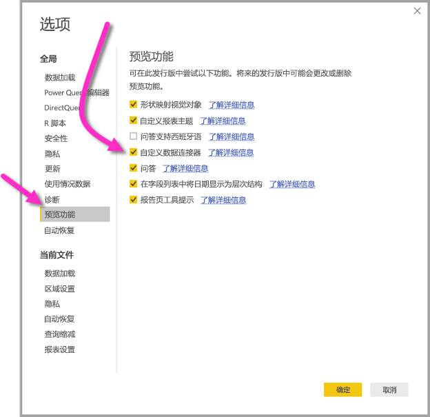

# 在 Power BI Desktop 中连接到 Power BI 数据流创建的数据（预览）
在 Power BI Desktop 中，可以连接到 Power BI 数据流创建的数据，就像在 Power BI Desktop 中连接任何其他数据源一样。

通过 Power BI 数据流（预览版）连接器，可以连接到 Power BI 服务中的数据流所创建的实体。 由于数据流处于预览阶段，必须执行几个步骤，才能在系统上使用数据流连接器。 

## 下载并启用 Power BI 数据流连接器（预览版）

必须下载 Power BI 数据流连接器的副本，然后将其复制到计算机上的特定位置。 在即将推出的 Power BI Desktop 每月更新中，连接器将自动包含在数据连接器列表中，届时将不再需要这些步骤。

可在下述位置下载 Power BI 数据流连接器：[Power BI 数据流连接器](https://visuals.azureedge.net/cds-analytics/PublicPreview/CDSA.mez)

执行以下步骤，实现在计算机上使用 Power BI 数据流连接器（预览版）：

1. 下载 MEZ 文件（数据连接器文件）副本。 个人预览版客户将直接从 Microsoft 收到 .MEZ 文件的下载信息。

2. 将下载的数据连接器文件放入计算机上的下述文件夹中：“文档”>“Power BI Desktop”>“自定义连接器”文件夹

3. 在 Power BI Desktop 中，选择“文件”>“选项和设置”>“选项”，然后选择左侧窗格中的“预览功能”。

    

4. 请选中“自定义数据连接器”框（如未选择）。 

5. 重启 Power BI Desktop，从而显示该连接器。

## 使用 Power BI 数据流连接器（预览版）
重启 Power BI Desktop 后，连接器将显示为可用数据源。 若要连接到数据池，选择“获取数据”>“联机服务”>“Power BI 数据流(beta 版)”，如下图中所示：

## 注意事项和限制

若要使用此预览版 Power BI 数据流连接器，必须运行最新版本的 Power BI Desktop。 可随时[下载 Power BI Desktop](desktop-get-the-desktop.md) 并将其安装到计算机上，以确保使用最新版本。  

注意：即将推出的 Power BI Desktop 每月更新中包含 Power BI 数据流连接器后，必须从“文档”>“Power BI Desktop”>“自定义连接器”中删除下载的 .MEZ 文件，避免发生冲突。 

## 后续步骤
以下内容介绍了使用 Power BI 数据连接可执行的各种有趣操作，并提供了有关 Power BI Desktop 的实用文章：

* [Power BI Desktop 中的数据源](desktop-data-sources.md)
* [使用 Power BI Desktop 调整和合并数据](desktop-shape-and-combine-data.md)
* [直接将数据输入到 Power BI Desktop 中](desktop-enter-data-directly-into-desktop.md)   

