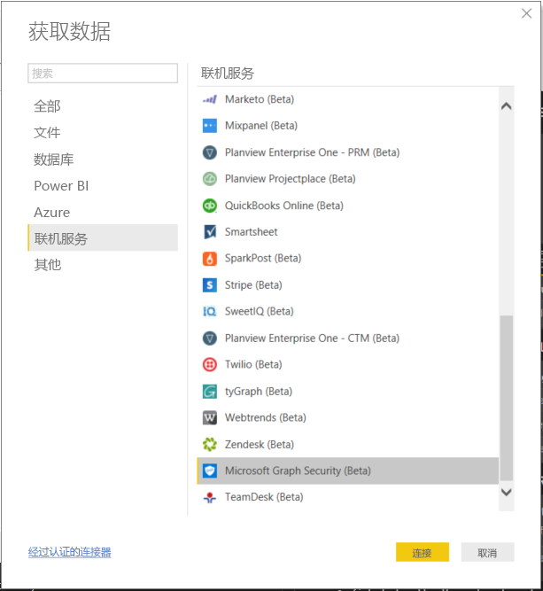
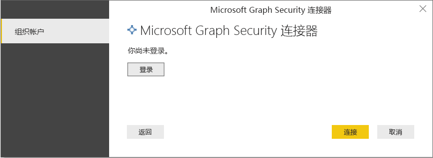
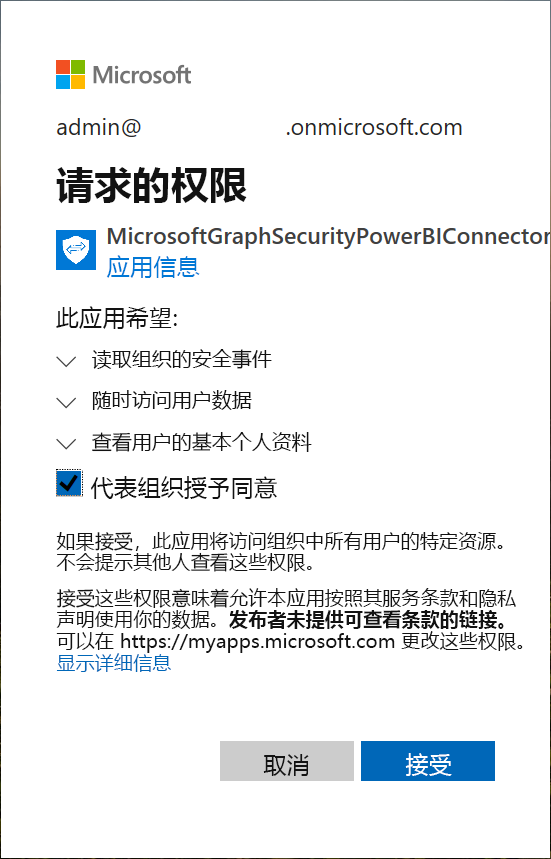
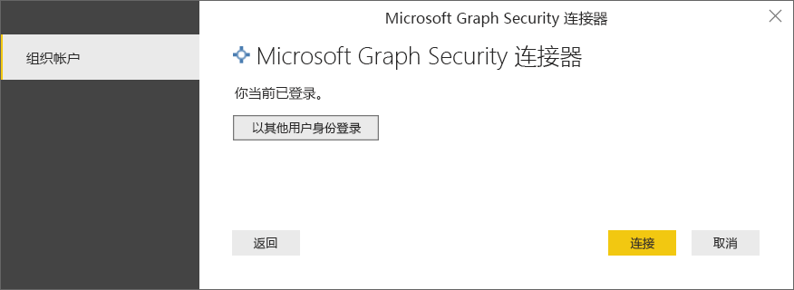
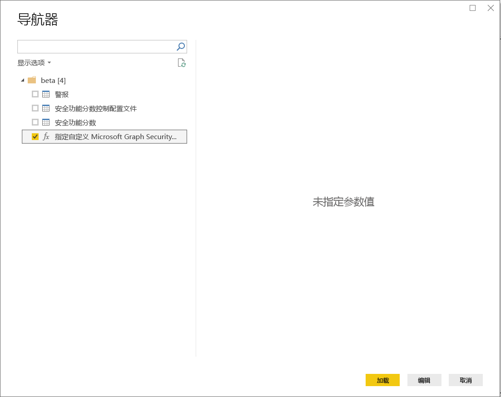
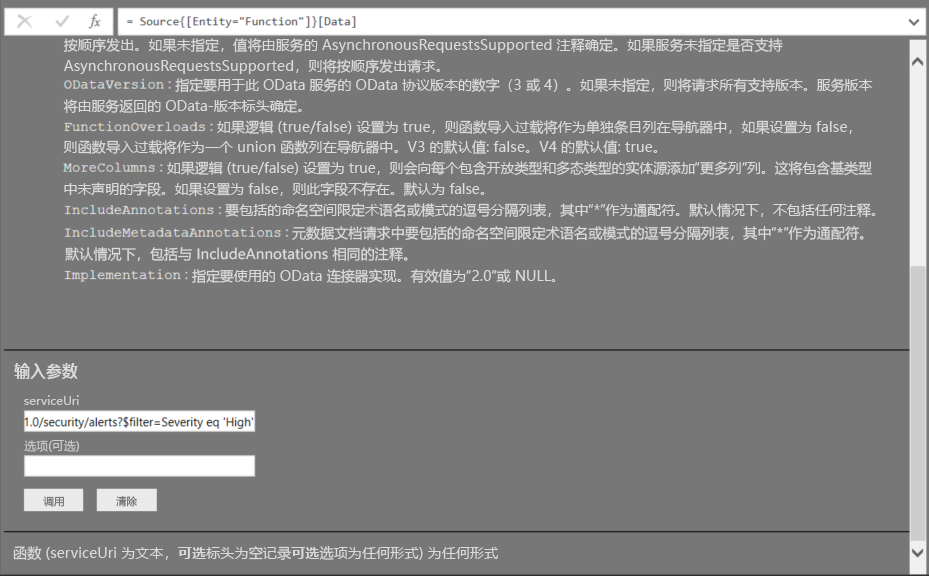
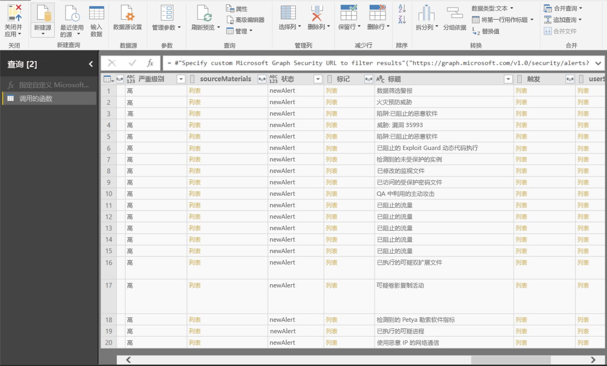

# 连接到 Power BI Desktop 中的 Microsoft Graph Security

可以通过 Microsoft Graph Security Power BI 连接器，使用 Power BI Desktop 与 Microsoft Graph Security API 进行连接。 这样便可生成仪表板和报表，从而可深入了解与安全相关的[警报](https://docs.microsoft.com/graph/api/resources/alert?view=graph-rest-1.0)和[安全功能分数](https://docs.microsoft.com/graph/api/resources/securescores?view=graph-rest-beta)。 [Microsoft Graph Security API](https://aka.ms/graphsecuritydocs) 连接来自 Microsoft 和生态系统合作伙伴的[多个安全解决方案](https://aka.ms/graphsecurityalerts)，以实现更为简单的警报相关性，提供对丰富上下文信息的访问权，并对自动化进行简化。 这使组织能够快速了解并针对其安全产品采取行动，同时降低生成和维护多个集成的成本和复杂性。

## 与 Microsoft Graph Security 连接器进行连接的先决条件

* 若要使用 Microsoft Graph Security 连接器，必须已明确授予 Azure Active Directory (AD) 租户管理员同意，这是 [Microsoft Graph Security 身份验证要求](https://aka.ms/graphsecurityauth)的一部分。 此项同意需要 Microsoft Graph Security Power BI 连接器的应用程序 ID 和名称，这些信息也可在 [Azure 门户](https://portal.azure.com)中查找：

   | 属性 | 值 |
   |----------|-------|
   | **应用程序名称** | `MicrosoftGraphSecurityPowerBIConnector` |
   | **应用程序 ID** | `cab163b7-247d-4cb9-be32-39b6056d4189` |
   |||

   若要授予连接器同意，Azure AD 租户管理员可以执行以下任一步骤：

   * [为 Azure AD 应用程序授予租户管理员同意](https://docs.microsoft.com/azure/active-directory/develop/v2-permissions-and-consent)。

   * 在逻辑应用的第一次运行期间，应用可以通过[应用程序许可体验](https://docs.microsoft.com/azure/active-directory/develop/application-consent-experience)请求 Azure AD 租户管理员同意。
   
* 用于登录以连接 Microsoft Graph Security Power BI 连接器的用户帐户必须是 Azure AD 中安全读者受限管理员角色（安全读者或安全管理员）的成员。 执行[向用户分配 Azure AD 角色](https://docs.microsoft.com/graph/security-authorization#assign-azure-ad-roles-to-users)一节中的步骤。 

## 使用 Microsoft Graph Security 连接器

按照以下步骤使用 Microsoft Graph Security 连接器：

1. 从 Power BI Desktop 的“主页”功能区中 选择“获取数据”->“更多...”。
2. 从左侧的类别中选择“联机服务”，
3. 单击“Microsoft Graph Security (Beta 版)”。

    
    
4. 在显示的 Microsoft Graph Security 窗口中，选择要查询的 Microsoft Graph API 版本。 选项为 v1.0 版和 beta 版。

    
    
5. 出现提示时，请登录到 Azure Active Directory 帐户。 此帐户需要具有上面先决条件部分中所述的“安全读者”角色。

    
    
6. 如果是租户管理员，且还未根据先决条件授予 Microsoft Graph Security Power BI 连接器（应用程序）同意，则将出现以下对话框。 请务必选择“代表组织授予同意”。

    
    
7. 登录后，将看到以下窗口，表示已经过身份验证。 选择“连接”。

    
    
8. 成功连接后，会出现如下所示的“导航器”窗口，该窗口显示 [Microsoft Graph 安全性 API](https://aka.ms/graphsecuritydocs) 中提供的用于前面步骤中所选版本的警报等实体。 选择要在 Power BI Desktop 中导入和使用的一个或多个实体。 单击“加载”，获取步骤 10 中概述的结果视图。

   
    
9. 如果想对 Microsoft Graph 安全 API 进行高级查询，选择“指定自定义 Microsoft Graph 安全性 URL 以筛选结果”功能。 这样便可以使用访问 API 所需的权限对 Microsoft Graph Security API 进行 [OData.Feed](https://docs.microsoft.com/power-bi/desktop-connect-odata) 查询。

   > [!NOTE]
   > 下面使用的示例 serviceUri 为 `https://graph.microsoft.com/v1.0/security/alerts?$filter=Severity eq 'High'`。 请参阅[支持 Graph 的 ODATA 查询参数](https://docs.microsoft.com/graph/query-parameters)来生成查询，以便对最近的大多数结果进行筛选、排序或检索。

   
    
   选择“调用”时，OData.Feed 函数会调用可打开查询编辑器的 API，这样就可以筛选和细化要使用的数据集，然后将细化的数据集加载到 Power BI Desktop。

10. 下图显示了所查询 Microsoft Graph Security 实体的结果窗口。

   
    

你现在已准备好在 Power BI Desktop 中使用从 Microsoft Graph 安全性连接器导入的数据来创建视觉对象、报表或与你可能想要连接和导入的其他数据（如 Excel 工作簿、数据库或任何其他数据源）进行交互。

## 后续步骤
* 在 [Microsoft Graph 安全性 GitHub Power BI 示例存储库](https://aka.ms/graphsecuritypowerbiconnectorsamples)查看使用此连接器的 Power BI 示例和模板。

* 在 [Microsoft Graph 安全性 Power BI 连接器博客文章](https://aka.ms/graphsecuritypowerbiconnectorblogpost)上查看一些用户方案和其他信息。

* 你可以使用 Power BI Desktop 连接到各种数据。 有关数据源的详细信息，请参阅下列资源：

    * [什么是 Power BI Desktop？](desktop-what-is-desktop.md)
    * [Power BI Desktop 中的数据源](desktop-data-sources.md)
    * [使用 Power BI Desktop 调整和合并数据](desktop-shape-and-combine-data.md)
    * [通过 Power BI Desktop 连接到 Excel 工作簿](desktop-connect-excel.md)
    * [直接将数据输入到 Power BI Desktop 中](desktop-enter-data-directly-into-desktop.md)
