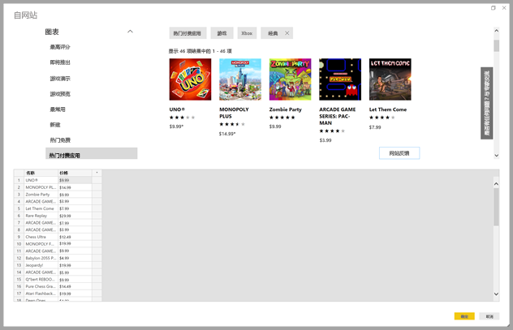
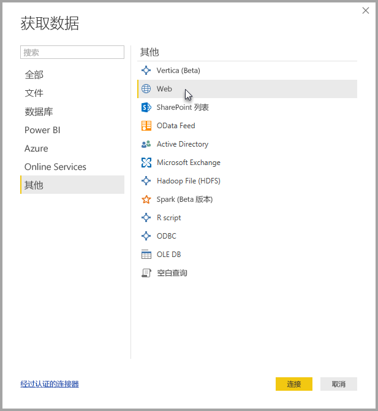
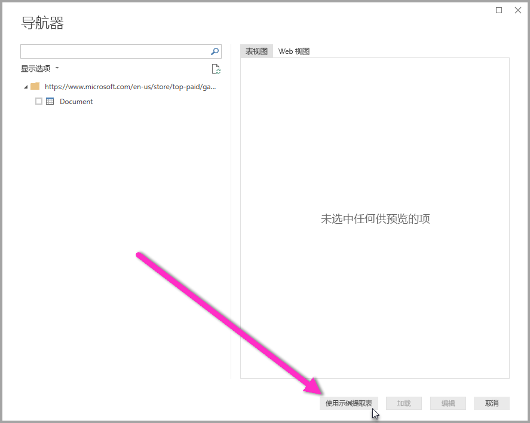
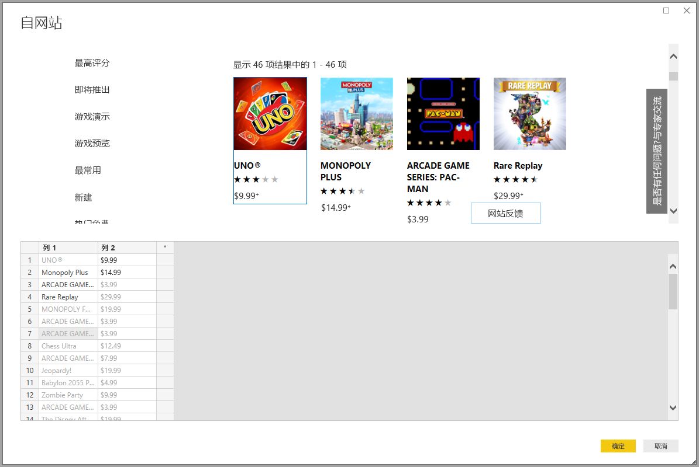
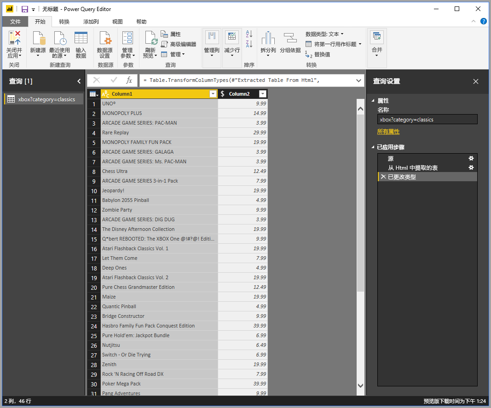

# 通过提供示例从网页获取数据

从网页获取数据使用户可以轻松地从网页中提取数据并将该数据导入 Power BI Desktop。 但是，网页上的数据通常不在整齐的、易于提取的表中，因此，从此类页面获取数据具有挑战性（即使它已结构化且具有一致性）。 

有一种解决方案。 使用“通过示例从 Web 获取数据”功能，你可以通过在连接器对话框中提供一个或多个示例，实质显示你要从中提取数据的 Power BI Desktop，它将在与示例匹配的页面上收集其他数据。 使用此解决方案，可以从网页提取所有类型的数据，包括在表中找到的数据和其他非表数据。 

## 使用通过示例从 Web 获取数据

若要使用“通过示例从 Web 获取数据”，请从“主页”功能区菜单选择“获取数据”。 在显示的窗口中，从左窗格中的类别中选择“其他”，然后选择“Web”。

在这里，输入想要从中提取数据的网页的 URL。 在本文中，将使用 Microsoft Store 网页，并演示此连接器如何工作。 

如果想要按照说明操作，可以使用本文中所用的 [Microsoft Store URL](https://www.microsoft.com/store/top-paid/games/xbox?category=classics)：

    https://www.microsoft.com/store/top-paid/games/xbox?category=classics

当选择“确定”时，你将会转到“导航器”对话框，其中显示任何来自网页的自动检测的表。 在下图所示的案例中，未找到任何表，但页面底部有一个按钮“使用示例提取表”，用来提供示例。

选择**使用示例提取表**将显示一个交互式窗口，可以在其中预览网页的内容以及输入想要提取的数据示例值。 

在此示例中，我们将提取页面上每个游戏的“名称”和“价格”。 我们可以通过从每个列的页面指定几个示例来执行该操作，如下图所示。 键入这些示例后，Power Query（这是从网页提取数据的基础技术）能够使用智能数据提取算法提取适合示例条目模式的数据。

> 注意：建议的值仅含长度小于或等于 128 个字符的值。

对从网页提取的数据感到满意后，选择“确定”转到查询编辑器，其中可以应用更多转换或修整数据，例如将此数据与其他数据源进行合并。

在这里，可以在创建 Power BI Desktop 报表时创建视觉对象或者使用网页数据。

## 后续步骤
你可以使用 Power BI Desktop 连接到各种数据。 有关数据源的详细信息，请参阅下列资源：

* [通过示例添加列](desktop-add-column-from-example.md)
* [连接到网页](desktop-connect-to-web.md)
* [Power BI Desktop 中的数据源](desktop-data-sources.md)
* [使用 Power BI Desktop 调整和合并数据](desktop-shape-and-combine-data.md)
* [通过 Power BI Desktop 连接到 Excel 工作簿](desktop-connect-excel.md)   
* [通过 Power BI Desktop 连接到 CSV 文件](desktop-connect-csv.md)   
* [直接将数据输入到 Power BI Desktop 中](desktop-enter-data-directly-into-desktop.md)   

