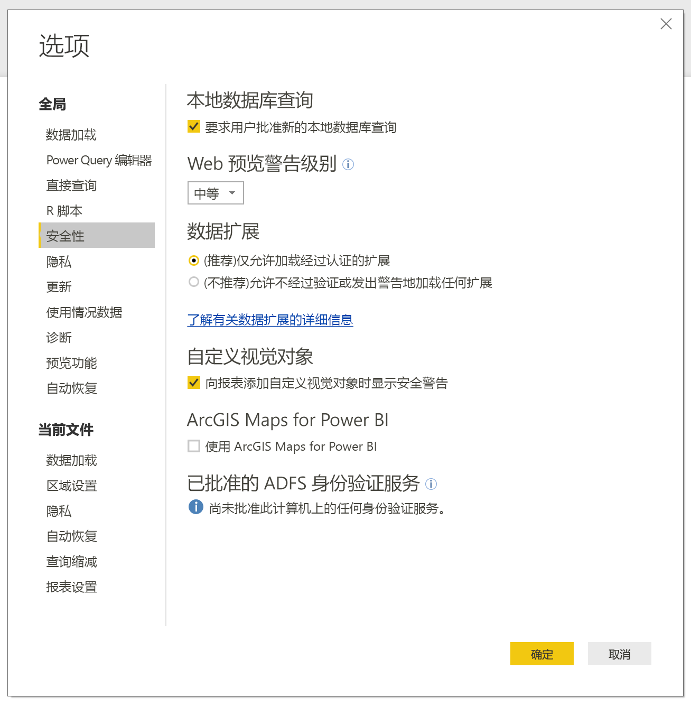
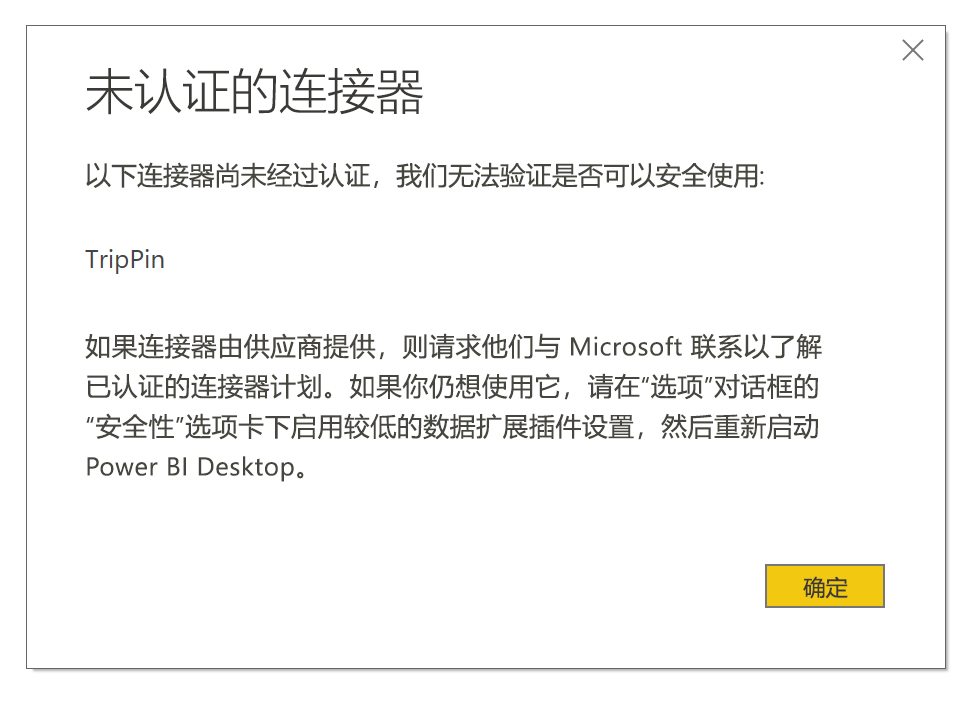

# Power BI 中的连接器扩展性

在 Power BI 中，客户和开发人员可以通过多种方式扩展其能够连接到的数据源，例如使用现有连接器和通用数据源（如 ODBC、OData、Oledb、Web、CSV、XML、JSON）。 除这些数据源外，开发人员还可以创建称为**自定义连接器**的数据扩展插件，并对连接器进行认证，使其成为**经过认证的连接器**。

目前，使用功能开关启用了使用“自定义连接器”的功能。 在我们将此功能从 beta 版本迁移到正式发布版本之前，已添加了一个菜单，可安全地控制想要允许在系统上运行的自定义代码级别：所有自定义连接器，或仅限 Microsoft 在“获取数据”对话框中认证和分发的连接器。

## 自定义连接器

**自定义连接器**能够容纳各种可能性，包括对业务至关重要的小型 API，以及 Microsoft 尚未发布连接器的大型行业特定服务。 许多连接器将由供应商自行分发，如果需要特定的数据连接器，则应联系供应商。

若要使用**自定义连接器**，请将它们放在 *\[Documents]\\Power BI Desktop\\Custom Connectors* 文件夹中，并按照以下部分所述调整安全设置。

无需调整安全设置即可使用“经认证的连接器”。

## 数据扩展插件安全性

若要更改数据扩展插件安全设置，请在 **Power BI Desktop** 中依次选择“文件”>“选项和设置”>“选项”>“安全”。

在“数据扩展插件”下，可从两个安全级别中进行选择：

* （推荐）仅允许加载经过认证的扩展
* （不推荐）允许加载任何插件而不发出警告

如果计划使用“自定义连接器”或者自行或第三方开发并分发的连接器，则必须选择“(不推荐)允许加载任何扩展而不发出警告”。 除非绝对信任自定义连接器，否则不建议使用安全设置，因为其中的代码可以处理凭据（包括通过 HTTP 发送的凭据）并忽略隐私级别。

使用“(推荐)”安全设置时，如果系统中存在自定义连接器，则会显示错误，说明由于安全原因而无法加载连接器。

若要解决该错误并使用这些连接器，必须将安全设置更改为之前所述的“(不推荐)”设置，然后重启 Power BI Desktop。

## 经过认证的连接器

数量有限的数据扩展插件子集会被视为“经认证”，此类经认证的连接器可通过“获取数据”对话框获得，但负责维护和支持的仍然是创建连接器的第三方开发人员。 虽然 Microsoft 会分发这些连接器，但我们不对其性能或持续正常工作负责。

如果想要认证自定义连接器，请让供应商联系 dataconnectors@microsoft.com。
