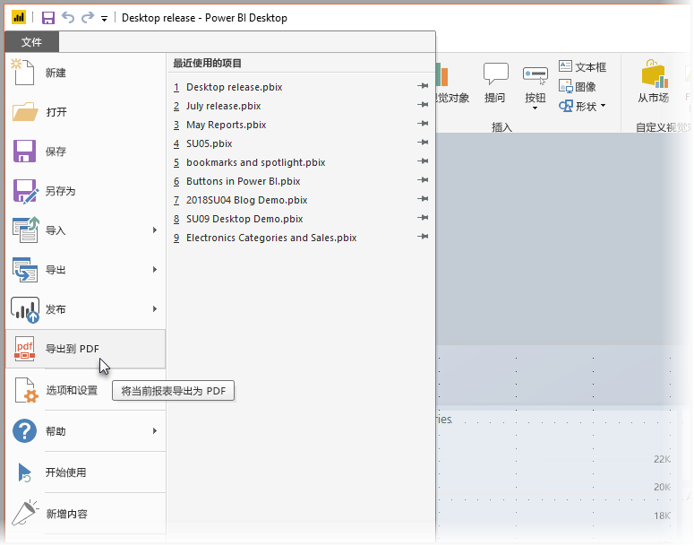
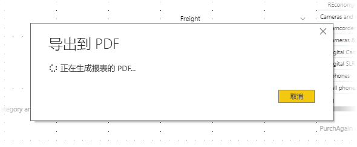

# 从 Power BI Desktop 中将报表导出到 PDF
在 Power BI Desktop 或 Power BI 服务中，可将报表导出到 PDF 文件，从而从该 PDF 中轻松共享或打印报表。

从 Power BI Desktop 中将报表导出到 PDF，以便能够打印或与他人共享该 PDF 文档的过程非常简单。 只需在 Power BI Deskop 中选择“文件”>“导出到 PDF”即可。

“导出到 PDF”过程将导出报表中的所有可见页，并且每个报表页将导出到 PDF 的单个页中。 当前不可见的报表页（例如任何工具提示或隐藏页）不会导出到 PDF 文件中。 

选择“文件”>“导出到 PDF”即可启动导出，并且将出现一个对话框，显示导出过程正在进行。 导出过程完成之前，该对话框始终显示在屏幕上。 导出过程中，将禁用与正在导出的版本的所有交互。 与报表交互的唯一方法是等待导出过程完成或取消导出。 

导出完成后，PDF 文件加载到计算机上的默认 PDF 查看器。 

## 注意事项和限制
对于“导出到 PDF”功能，需要牢记以下注意事项：

* 该功能可导出自定义视觉对象，但不可导出可能已应用于报表的任何墙纸。

由于墙纸不可导出到 PDF 文件，因此应特别注意使用深色墙纸的报表。 如果报表中的文本为浅色或白色，以使其在深色墙纸中突出显示，那么由于墙纸不会与报表的其余部分一起导出，因此在导出到 PDF 的过程中难以阅读或无法阅读这些文本。 

## 后续步骤
Power BI Desktop 中提供各种有趣的视觉对象元素和功能。 有关详细信息，请参阅以下资源：

* [使用视觉对象元素增强 Power BI 报表](desktop-visual-elements-for-reports.md)
* [什么是 Power BI Desktop？](desktop-what-is-desktop.md)

