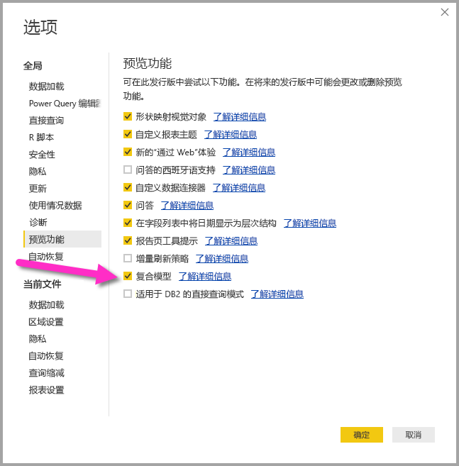

# Power BI Desktop 中的多对多关系（预览版）

借助 Power BI Desktop 中的多对多关系功能，可以联接使用“多对多”基数的表。 此外，还能更轻松、更直观地创建包含两个或多个数据源的数据模型。 多对多关系功能属于 Power BI Desktop 中更大的复合模型功能。

Power BI Desktop 中的多对多关系功能是以下三个相关功能之一：

* **复合模型**：允许报表有任意组合的两个或多个数据连接，包括 DirectQuery 连接或“导入”。 有关详细信息，请参阅 [Power BI Desktop 中的复合模型（预览版）](desktop-composite-models.md)。

* **多对多关系**：借助复合模型，可以在表之间建立多对多关系。 这种方法删除了对表中唯一值的要求。 它还删除了旧解决办法，如为建立关系而仅引入新表。 本文进一步介绍了此功能。

* **存储模式**：现在可以指定哪些视觉对象需要查询后端数据源。 导入的是不需要查询的视觉对象，即使基于 DirectQuery，也不例外。 此功能有助于提升性能，并减少后端负载。 以前，即使是切片器等简单视觉对象，也会启动发送至后端源的查询。 有关详细信息，请参阅 [Power BI Desktop 中的存储模式（预览版）](desktop-storage-mode.md)。

## 启用多对多关系预览功能

必须在 Power BI Desktop 中启用多对多关系功能。 若要启用复合模型，请依次选择“文件” > “选项和设置” > “选项” > “预览功能”，再选中“复合模型”复选框。

必须重启 Power BI Desktop，才能启用此功能。

## 多对多关系功能解决的问题

在多对多关系功能推出前，两个表之间的关系是在 Power BI 中进行定义。 关系中涉及的至少一个表列必须包含唯一值。 不过，通常没有列包含唯一值。 

例如，两个表有一个标记为“Country”的列，但两个表中的“Country”值都不唯一。 必须创建解决办法，才能联接此类表。 其中一种解决办法是，在模型中引入包含必要唯一值的附加表。 借助多对多关系功能，可使用基数为“多对多”的关系直接联接此类表。  

## 使用多对多关系功能

在 Power BI 中定义两个表之间的关系时，必须定义关系基数。 例如，ProductSales 和 Product 之间的关系（使用列 ProductSales[ProductCode] 和 Product[ProductCode]）定义为“多对一”。 之所以这样定义关系是因为，每个产品都会有很多销售额，而且 “Product”表中的 (ProductCode) 列是唯一的。 当你将关系基数定义为“多对一”、“一对多”或“1 对 1”后，Power BI 会验证基数，以便确保选定基数与实际数据匹配。

例如，请查看下图中的简单模型：

现在，假设“Product”表只显示两行，如下所示：

此外，还假设“Sales”表只有四行，其中产品 C 占一行。由于出现了引用完整性错误，因此“Product”表中没有产品 C 对应的行。

“ProductName”和“Price”（来自“Product”表），以及每个产品的总“Qty”（来自“ProductSales”表）如下图所示： 

如上图所示，有与产品 C 的销售额关联的空白“ProductName”行。此空行导致以下问题发生：

* “ProductSales”表中的任何行在“Product”表中都没有对应的行。 存在引用完整性问题，就像此示例中的产品 C 一样。

* “ProductSales”表中所有行的外键列都为空。 

因此，在这两种情况下，空白行是导致未知 ProductName 和 Price 对应的销售额出问题的原因所在。

有时，表是通过两个列联接起来，但这两个列都不是唯一的。 例如下面的两个表：

* “Sales”表按“State”显示销售额数据，其中每一行都包含相应州采用的销售类型对应的销售额。 州包括“CA”、“WA”和“TX”。 

    

* “CityData”表显示城市数据，包括人口和州（包括“CA”、“WA”和“New York”）。

    

尽管两个表中都有“State”列，并且按州和各州的总人口报告总销售额是合理需求，但存在一个问题，即“State”列在这两个表中都不是唯一的。 

## 旧解决办法

在低于 2018 年 7 月版的 Power BI Desktop 中，用户无法在这些表之间建立直接关系。 常见解决办法如下：

* 创建仅包含唯一州 ID 的第三个表。 此表可为以下任意或所有表：
  * 计算表（使用数据分析表达式 [DAX] 定义）。
  * 基于查询编辑器中定义的查询的表，可显示从表之一中提取的唯一 ID。
  * 组合的完整集。

* 使用常见的多对一关系，将这两个原始表关联到此新表。

可以让解决办法表一直处于可见状态，也可以隐藏它，这样它就不会出现在“字段”列表中了。 如果隐藏此表，多对一关系通常会设置为在两个方向上进行筛选，并且两个表中的“State”字段都可以使用。 随后的交叉筛选会传播到另一个表。 这种方法如下图所示：

显示“State”（来自“CityData”表）以及总“Population”和总“Sales”的视觉对象如下所示：

> [!NOTE]
> 因为此解决办法使用了“CityData”表中的州，所以只会列出这个表中的州（也就不包括“TX”）。 此外，与多对一关系不同，虽然总计行包含所有销售额（包括 TX 的销售额），但详细信息中并没有涉及此类不匹配行的空白行。 同样，也没有空白行涉及值为空的州的销售额。

如果还向此视觉对象添加了“City”，尽管每个城市的人口是已知的，但针对“City”显示的“Sales”只会重复相应“State”的“Sales”。 如果列中的分组与某聚合度量值无关，通常就会发生这种情况，如下图所示：

如果将新的“Sales”表定义为此解决办法中所有“States”的组合，并且让它在“字段”列表中一直可见，相同的视觉对象就会同时显示“State”（在新表上）、总“Population”和总“Sales”，如下图所示：

可以看到，表中“TX”的“Sales”数据已知，但“Population”数据未知，而“New York”的“Population”数据已知，但“Sales”数据未知。 这种解决办法并不是最佳的，也存在很多问题。 通过创建多对多关系，可以解决产生的这些问题，如下一部分所述。

## 使用多对多关系功能取代解决办法

自 Power BI Desktop 2018 年 7 月版起，可以直接关联表（如之前介绍的表），再也不用无奈地采用类似解决办法了。 现在可以将关系基数设置为“多对多”。 此设置表明，两个表都不包含唯一值。 对于这种关系，仍可以控制哪个表筛选另一个表，也能应用双向筛选（即每个表都进行相互筛选）。  

> [!NOTE]
> 多对多关系功能处于预览阶段。 在处于预览阶段期间，无法向使用多对多关系的 Power BI 服务模型发布数据。 

在 Power BI Desktop 中，默认基数为“多对多”，用于确定两个表都不包含关系中列的唯一值。 在这种情况下，系统会显示一条警告消息，以确认关系设置为预期行为，不是由数据问题导致的非预期效应。 

例如，如果你直接在“CityData”和“Sales”之间建立关系（其中筛选器应从“CityData”流向“Sales”），Power BI Desktop 显示“编辑关系”窗口，如下图所示：

随即生成的“关系”视图显示两个表之间的直接多对多关系。 表在“字段”列表中可见，表在视觉对象创建时的后续行为与应用解决办法时的行为相似。 在解决办法中，显示唯一“State”数据的额外表不可见。 例如，如上一部分所述，显示“State”、“Population”和“Sales”数据的视觉对象如下所示：

多对多关系与更典型的多对一关系的主要区别如下：

* 显示的值不包括导致另一个表中出现不匹配行的空白行。 也不包括导致另一个表中关系使用的列为空的行。
* 无法使用 `RELATED()` 函数，因为可以关联多行。
* 对一个表使用 `ALL()` 函数不会删除通过多对多关系应用于其他相关表的筛选器。 在前面的示例中，下面脚本中定义的度量值不会删除对相关“CityData”表中列应用的筛选器：

    

    显示“State”、“Sales”和“Sales total”数据的视觉对象如下所示：

    

在注意到上述差异的同时，请确保使用 `ALL(\<Table>)` 的计算（如在总计中所占的百分比）返回的结果符合预期。 

## 限制和注意事项

这一版的多对多关系和复合模型有一些限制。

以下 Live Connect（多维）源无法用于复合模型：

* SAP HANA
* SAP Business Warehouse
* SQL Server Analysis Services
* Power BI 数据集
* Azure Analysis Services

使用 DirectQuery 连接到这些多维数据源时，既无法同时连接到另一个 DirectQuery 源，也无法将它与导入数据相结合。

使用多对多关系时，仍要遵守现有的 DirectQuery 使用限制。 现在每个表都要遵循其中许多限制，具体视表的存储模式而定。 例如，导入表中的计算列可以引用其他表，但 DirectQuery 表中的计算列仍只能引用同一表中的列。 如果模型中的任意表是 DirectQuery，其他限制适用于整个模型。 例如，如果模型中任意表的存储模式为“DirectQuery”，QuickInsights 和问答功能对模型不可用。 

## 后续步骤

若要详细了解复合模型和 DirectQuery，请参阅以下文章：
* [Power BI Desktop 中的复合模型（预览版）](desktop-composite-models.md)
* [Power BI Desktop 中的存储模式（预览版）](desktop-storage-mode.md)
* [在 Power BI Desktop 中使用 DirectQuery](desktop-directquery-about.md)
* [Power BI Desktop 中 DirectQuery 支持的数据源](desktop-directquery-data-sources.md)
