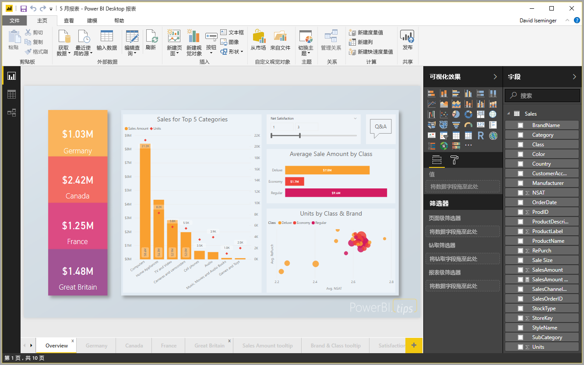

# 快速入门：连接到 Power BI Desktop 中的数据

在本快速入门教程中，使用 Power BI Desktop 连接到数据，这是生成数据模型和创建报表的第一步。

如果未注册 Power BI，请[免费注册](https://app.powerbi.com/signupredirect?pbi_source=web)后再进行操作。

## 先决条件

若要完成本文中的步骤，需要做以下准备：
* 下载并安装 Power BI Desktop，这是一个在本地计算机上运行的免费应用程序。 可以直接[下载 Power BI Desktop](https://powerbi.microsoft.com/desktop)，也可以从 [Microsoft Store](http://aka.ms/pbidesktopstore) 获取该应用。
* [下载此示例 Excel 工作簿](http://go.microsoft.com/fwlink/?LinkID=521962)，并创建一个名为“C:\PBID-qs”的文件夹，可以在其中存储 Excel 文件。 本快速入门中的后续步骤假设这是已下载的 Excel 工作簿的文件位置。

## 启动 Power BI Desktop

安装 Power BI Desktop 后，启动应用程序，以便它在本地计算机上运行。 将看到空白画布，你将在其中通过连接的数据创建视觉对象和报表。 

## 连接到数据

使用 **Power BI Desktop** 可以连接到许多不同类型的数据。 可以连接到诸如 Microsoft Excel 文件的基本数据源，也可以连接到包含各类数据的联机服务，例如 Salesforce、Microsoft Dynamics、Azure Blob 存储等。 

若要连接到数据，请在“主页”功能区中选择“获取数据”。

“获取数据”窗口随即出现，可在其中从 Power BI Desktop 可以连接到的众多不同数据源中进行选择。 在本快速入门教程，我们使用已下载的 Excel 工作簿，如本文开头的“先决条件”部分所述。 

由于这是 Excel 文件，我们从“获取数据”窗口中选择“Excel”，然后选择“连接”按钮。

我们将提示你提供我们想要连接的 Excel 文件的位置。 下载文件名为“财务示例”，因此我们会选择该文件，然后选择“打开”。

之后，**Power BI Desktop** 会加载工作簿并读取其内容，然后在“导航器”窗口显示文件中的可用数据，你可以在其中选择要将哪些数据加载到 Power BI Desktop 当中。 通过标记每个想要导入的表旁边的复选框来选择该表。 在本例中，我们将导入这两个可用的表。

一旦作出选择，请选择“加载”将数据导入到 Power BI Desktop 当中。

## 在“字段”窗格中查看数据

表加载完成后，“字段”窗格将显示导入数据。 可以通过选择其名称旁边的三角形展开每个表。 在下图中，“财务”表已展开并显示其中每个字段。 

就是这么简单！ 你已使用 Power BI Desktop 连接到数据源并加载该数据，现在可以看到这些表中的所有可用字段。

## 后续步骤
一旦连接到数据，便可以通过 Power BI Desktop 执行各类操作，如创建视觉对象和报表。 请参阅以下资源继续：

* [Power BI Desktop 入门指南](desktop-getting-started.md)

