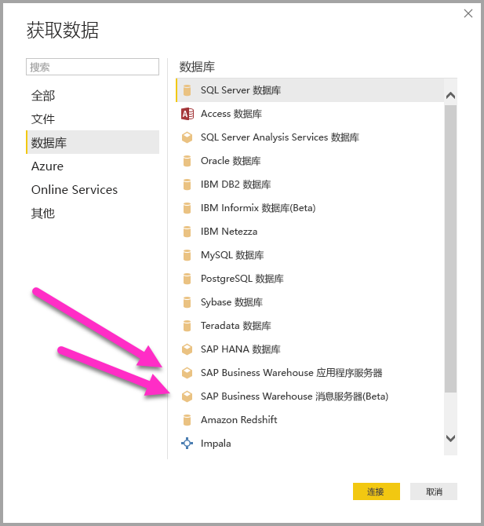
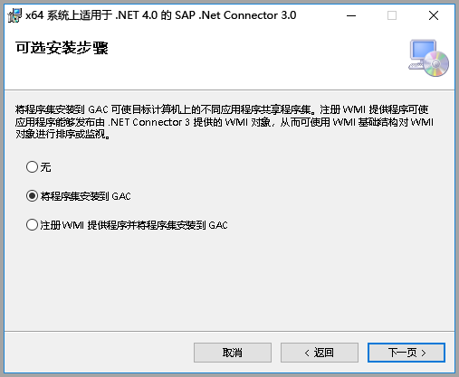
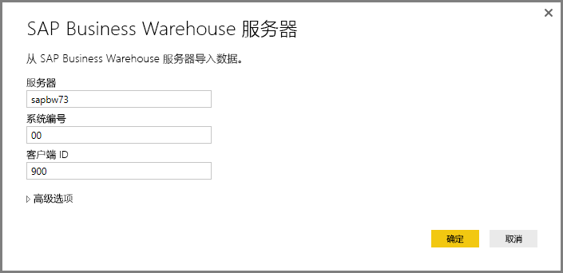
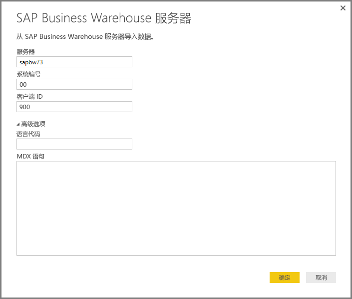
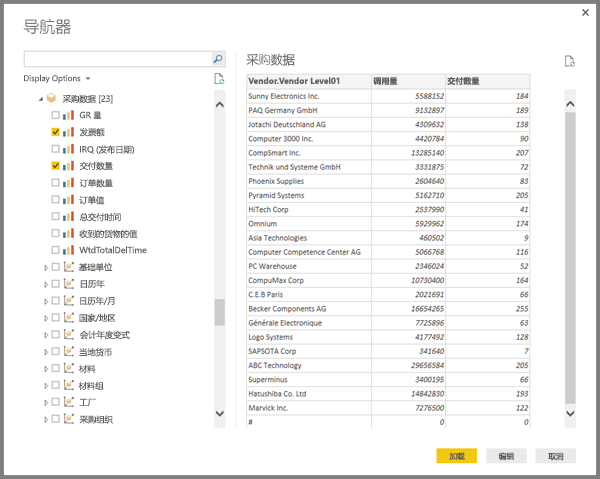
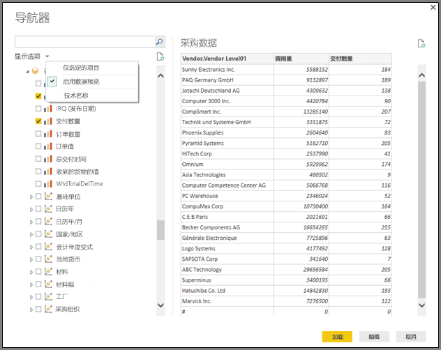
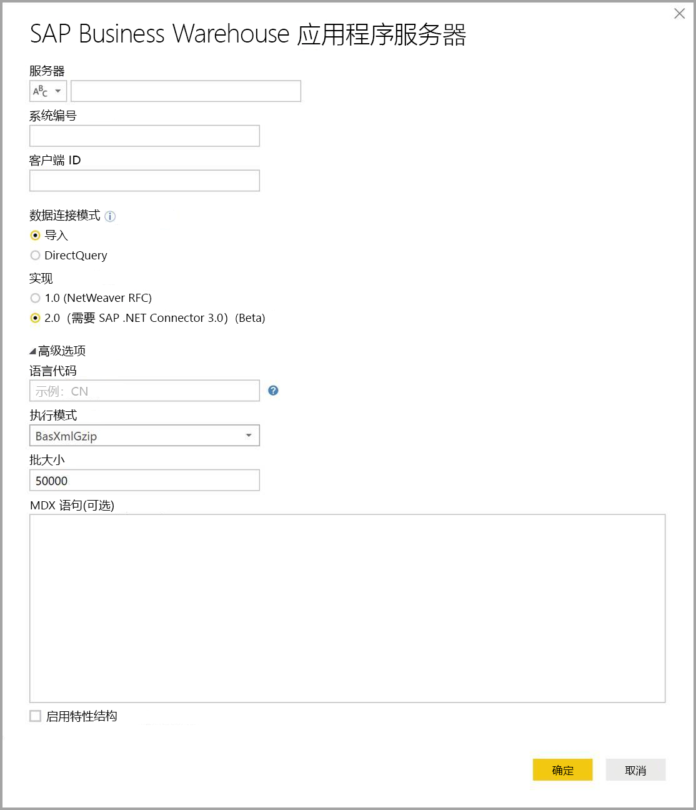
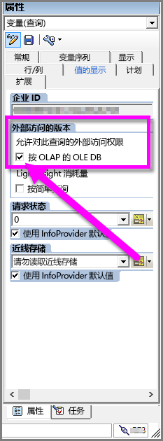

# 在 Power BI Desktop 中使用 SAP BW 连接器
使用 Power BI Desktop 可以访问 SAP BusinessWarehouse (BW) 数据。

有关 SAP 客户如何在连接 Power BI 和现有 SAP Business Warehouse (BW) 系统的过程中受益的信息，请参阅 [Power BI and SAP BW 白皮书](https://aka.ms/powerbiandsapbw)。 有关将 DirectQuery 与 SAP BW 结合使用的详细信息，请参阅 [DirectQuery 和 SAP Business Warehouse (BW)](desktop-directquery-sap-bw.md) 一文。

从 Power BI Desktop 的 2018 年 6 月版本（包括已正式发布的 2018 年 10 月版）开始，SAP BW 连接器将包含一个具有重大性能和功能改进的实现。 SAP BW 连接器的此更新版本由 Microsoft 开发，称为 Implementation 2.0。 可选择 SAP BW 连接器版本 1 (v1) 或 Implementation 2.0 SAP 连接器。 以下部分依次介绍每个版本的安装。 从 Power BI Desktop 连接到 SAP BW 时，可选择其中一个连接器。

建议尽可能使用 Implementation 2.0 SAP 连接器。

## 安装 SAP BW 连接器版本 1
建议尽可能使用 Implementation 2.0 SAP 连接器（请参阅下一节中的说明）。 此节介绍 SAP BW 连接器版本 1 的安装，安装步骤如下：

1. 在本地计算机上安装 **SAP NetWeaver** 库。 你可以从 SAP 管理员处获取 **SAP Netweaver** 库，也可以直接从 [SAP 软件下载中心](https://support.sap.com/swdc)下载。 由于 **SAP 软件下载中心**的结构经常发生变化，因此没有有关站点导航的更多具体指导。 **SAP NetWeaver** 库通常还包括在 SAP 客户端工具安装中。
   
   可以搜索 SAP 注释 #1025361，获取最新版本的下载位置。 请确保 **SAP NetWeaver** 库（32 位或 64 位）的体系结构匹配 **Power BI Desktop** 安装，然后按照 SAP Note 安装 **SAP NetWeaver RFC SDK** 中包含的所有文件。
2. “获取数据”对话框的“数据库”类别中包含“SAP Business Warehouse 应用程序服务器”和“SAP Business Warehouse 消息服务器”相关条目。
   
   

## Implementation 2.0 SAP 连接器的安装

SAP 连接器的 Implementation 2.0 需要使用 SAP .NET 连接器 3.0。 可使用以下链接，从 SAP 的网站[下载 SAP .NET 连接器 3.0](https://support.sap.com/en/product/connectors/msnet.html)：

* [SAP .NET 连接器 3.0](https://support.sap.com/en/product/connectors/msnet.html)

只有有效的 S 用户才能访问下载。 建议客户联系其 SAP 基础团队，获取 SAP .NET 连接器 3.0。 

连接器有 32 位和 64 位版本，用户必须选择与其 Power BI Desktop 安装匹配的版本。 撰写本文时，网站列出两个版本（针对 .NET 4.0 framework）：

* 适用于 Windows 32 位 (x86) 的 Microsoft .NET 3.0.20.0 的 SAP 连接器，zip 文件 (6.896 KB)，2018年 1 月 16 日发布
* 适用于 Windows 64 位 (x64) 的 Microsoft .NET 3.0.20.0 的 SAP 连接器，zip 文件 (7.180 KB)，2018年 1 月 16 日发布

安装时，请确保在“可选安装步骤”窗口中选择“将程序集安装到 GAC”选项，如下图所示。

> [!NOTE]
> SAP BW 实现版本 1 需要使用 Netweaver DLL；如果使用 SAP 连接器的 Implementation 2.0 而不使用版本 1，则无需使用 Netweaver DLL。

## SAP BW 连接器版本 1 的功能
通过 Power BI Desktop 中的 SAP BW 连接器版本 1，可从 SAP Business Warehouse 服务器多维数据集导入数据，或者可使用 DirectQuery。 

若要深入了解 SAP BW 连接器以及如何将其与 DirectQuery 一起使用，请参阅 [DirectQuery 和 SAP Business Warehouse (BW)](desktop-directquery-sap-bw.md)。

连接时，必须指定“服务器”、“系统编号”和“客户端 ID”才能建立连接。

还可以指定两个其他高级选项：语言代码以及针对指定服务器运行的自定义 MDX 语句。

如果未指定任何 MDX 语句，则向你显示“导航器”窗口，其中将显示服务器上可用的多维数据集的列表，同时提供向下钻取以及从可用多维数据集中选择项的选项，包括维度和度量值。 Power BI 显示由 [BW 开放分析接口 OLAP BAPI](https://help.sap.com/saphelp_nw70/helpdata/en/d9/ed8c3c59021315e10000000a114084/content.htm) 公开的查询和多维数据集。

当从服务器中选择一个或多个项时，将基于它们的选择创建输出表的预览。

**导航器**窗口也提供了一些**显示选项**，允许你执行以下操作：

* **显示“仅选定的项”与显示“所有项”（默认视图）**：此选项可用于验证最终选定的一组项。 查看此类容的另一种方法是选择预览区域中的列名称。
* **启用数据预览（默认行为）：** 还可以控制是否应在此对话框中显示数据预览。 禁用数据预览会减少服务器调用的数量，因其将不再请求数据以进行预览。
* **技术名称：** 对于多维数据集中的对象，SAP BW 支持技术名称的概念。 技术名称允许多维数据集所有者公开多维数据集对象的用户友好名称，而不是仅公开多维数据集中的那些对象的物理名称。

在**导航器**中选择所有必须的对象后，你可以通过选择**导航器**窗口底部的下列按钮之一，决定要执行的下一步操作。

* 选择**加载**将会触发将输出表的整个行集加载到 Power BI Desktop 数据模型中，然后将你带到**报表**视图，在此你可以使用**数据**或**关系**视图来开始对这些数据进行视觉化处理或进行进一步的修改。
* 选择**编辑**将打开**查询编辑器**，在整个列集引入到 Power BI Desktop 数据模型之前，你可以在其中执行其他数据转换和筛选步骤。

除了从 **SAP BW** 多维数据集导入数据之外，请记住，你还可以从 Power BI Desktop 中的很多其他数据源导入数据，然后将它们合并到单一报表中。 这将在 **SAP BW** 数据顶部将演示各种有趣的报表和分析方案。

## 使用 Implementation 2.0 SAP BW 连接器

必须创建新连接，才能使用 SAP BW 连接器的 Implementation 2.0。 要创建新连接，请执行以下步骤。

1. 从“获取数据”窗口，选择 SAP Business Warehouse 应用程序服务器或 SAP Business Warehouse 消息服务器。

2. 会出现“新建连接”对话框，在此对话框中可选择该实现。 选择 Implementation 2.0（如下图所示）会启用“执行模式”、“批大小”和“启用特征结构”选项。

    

3. 选择“确认”，“导航器”体验与之前 SAP BW 连接器版本 1 一节中所述相同。 

### Implementation 2.0 的新选项 

Implementation 2.0 支持以下选项：

1. ExecutionMode - 指定用于执行服务器查询的 MDX 接口。 有效的选项如下所示：

        a. SapBusinessWarehouseExecutionMode.BasXml
        b. SapBusinessWarehouseExecutionMode.BasXmlGzip
        c. SapBusinessWarehouseExecutionMode.DataStream

    此选项的默认值是 SapBusinessWarehouseExecutionMode.BasXmlGzip。

    使用 SapBusinessWarehouseExecutionMode.BasXmlGzip 可在大数据集出现高延迟的情况下提高性能。

2. BatchSize - 指定执行 MDX 语句时一次检索的行最大数目。 检索大数据集时，少量的行会转换为较多的服务器调用。 大量的行可能会提高性能，但可能导致 SAP BW 服务器的内存问题。 默认值为 50000 行。

3. EnableStructures - 指定是否识别出特征结构的逻辑值。 此选项的默认值为 false。 影响可选择的对象列表。 本机查询模式下不支持。

此实现已弃用 ScaleMeasures 选项。 现在，此行为与设置 ScaleMeasures = false 相同，始终显示不成比例的值。

### Implementation 2.0 的其他改进 

以下项目符号列表介绍了新实现的一些其他改进：

* 性能提高
* 可检索几百万行数据，通过批大小参数微调。
* 可切换执行模式。
* 支持压缩模式。 对高延迟连接或大型数据集特别有用。
* 日期变量检测改进
* [实验性] 将日期（ABAP 类型 DATS）和时间（ABAP 类型 TIMS）维度分别公开为日期和时间，而不是文本值。
* 更好的异常处理。 现在，显示 BAPI 调用中发生的错误。
* BasXml 和 BasXmlGzip 模式下的列折叠。 例如，如果生成的 MDX 查询检索 40 列，但当前选择仅需要 10 列，此请求将传递到服务器，以检索较小的数据集。

### 更改现有报表以使用 Implementation 2.0 

仅在“导入”模式下，才能更改现有报表以使用 Implementation 2.0，且需要手动执行以下步骤。

1. 打开现有报表，选择功能区中的“编辑查询”，然后选择要更新的 SAP Business Warehouse 查询。

2. 右键单击查询，选择“高级编辑器”。

3. 在“高级编辑器”中，对 SapBusinessWarehouse.Cubes 调用进行以下更改： 

    a. 确定查询是否已包含选项记录，例如以下示例中所示：

    

    b. 如果是，添加 Implementation 2.0 选项，删除 ScaleMeasures 选项（如果存在），如下所示：

    

    c. 如果查询不包含选项记录，请添加。 例如，如果它具有以下：

    

    d. 只需将其更改为：

    

4. 我们已尽最大努力使 SAP BW 连接器的 Implementation 2.0 与 SAP BW 连接器版本 1 兼容。 但是，由于使用的 SAP BW MDX 执行模式不同，因此可能不一致。 若要解决任何不一致问题，请尝试在不同执行模式之间切换。

## 故障排除
本部分提供有关使用 SAP BW 连接器的故障排除情景（和解决方案）。

1. 来自 **SAP BW** 的数值数据返回小数点，而不是逗号。 例如，1,000,000 的返回形式为 1.000.000。
   
   **SAP BW** 返回以 ,（逗号）或 . （句点）作为十进制分隔符的十进制数据。 为指定哪些 **SAP BW** 可用于十进制分隔符，**Power BI Desktop** 使用的驱动程序会调用 BAPI_USER_GET_DETAIL。 该调用返回一个名为 **DEFAULTS** 的结构，它包含一个名为 DCPFM 的字段，用于存储十进制格式表示法。 它采用以下三个值之一：
   
       ‘ ‘ (space) = Decimal point is comma: N.NNN,NN
       'X' = Decimal point is period: N,NNN.NN
       'Y' = Decimal point is N NNN NNN,NN
   
   报告此问题的客户发现，对于特定用户（显示不正确的数据的用户），对 *BAPI_USER_GET_DETAIL* 的调用失败，并显示类似于以下内容的错误消息：
   
       You are not authorized to display users in group TI:
           <item>
               <TYPE>E</TYPE>
               <ID>01</ID>
               <NUMBER>512</NUMBER>
               <MESSAGE>You are not authorized to display users in group TI</MESSAGE>
               <LOG_NO/>
               <LOG_MSG_NO>000000</LOG_MSG_NO>
               <MESSAGE_V1>TI</MESSAGE_V1>
               <MESSAGE_V2/>
               <MESSAGE_V3/>
               <MESSAGE_V4/>
               <PARAMETER/>
               <ROW>0</ROW>
               <FIELD>BNAME</FIELD>
               <SYSTEM>CLNTPW1400</SYSTEM>
           </item>
   
   为了修复此错误，用户必须要求他们的 SAP 管理员授予在 Power BI 中使用的 SAPBW 用户执行 *BAPI_USER_GET_DETAIL* 的权限。 需要确定的另一点是，用户是否具有必需的 *DCPFM* 值，如本故障排除解决方案前面的内容所述。
   
2. **SAP BEx 查询的连接**
   
   你可以通过启用特定属性执行 Power BI Desktop 中的“BEx”查询，如下图所示：
   
   
   
3. “导航器”窗口不显示数据预览，而是提供“对象引用未设置为对象实例”的错误消息。
   
   SAP 用户需要访问特定 BAPI 功能模块才能获取元数据，并从 SAP BW 的 InfoProviders 中检索数据。 其中包括：
   * BAPI_MDPROVIDER_GET_CATALOGS
   * BAPI_MDPROVIDER_GET_CUBES
   * BAPI_MDPROVIDER_GET_DIMENSIONS
   * BAPI_MDPROVIDER_GET_HIERARCHYS
   * BAPI_MDPROVIDER_GET_LEVELS
   * BAPI_MDPROVIDER_GET_MEASURES
   * BAPI_MDPROVIDER_GET_MEMBERS
   * BAPI_MDPROVIDER_GET_VARIABLES
   * BAPI_IOBJ_GETDETAIL

   要解决此问题，请验证用户是否有权访问各种 MDPROVIDER 模块以及 BAPI_IOBJ_GETDETAIL。 要进一步解决此问题或类似问题，请在 Power BI Desktop“选项”的“诊断”窗口中选择“启用跟踪”。 在跟踪处于活动状态时尝试从 SAP BW 检索数据，并检查跟踪文件以获取更多详细信息。

## 后续步骤
有关 SAP 和 DirectQuery 的详细信息，请查看以下资源：

* [DirectQuery 和 SAP HANA](desktop-directquery-sap-hana.md)
* [DirectQuery 和 SAP Business Warehouse (BW)](desktop-directquery-sap-bw.md)
* [Power BI 中的 DirectQuery](desktop-directquery-about.md)
* [DirectQuery 支持的数据源](desktop-directquery-data-sources.md)
* [Power BI 和 SAP BW 白皮书](https://aka.ms/powerbiandsapbw)
