# <a name="tutorial-embed-a-power-bi-report-dashboard-or-tile-into-an-application-for-your-customers"></a>教程：为客户将 Power BI 报表、仪表板或磁贴嵌入应用程序中

使用“Azure 中的 Power BI Embedded”，可以借助“应用拥有数据”将报表、仪表板或磁贴嵌入到应用程序中。 **应用拥有数据**是指将使用 Power BI 的应用程序作为其嵌入式分析平台。 使用“应用拥有数据”通常是一种“ISV 开发人员”方案。 ISV 开发者可以创建 Power BI 内容以便在完全集成并交互的应用程序中显示报表、仪表板或磁贴，应用程序的用户无需 Power BI 许可证。 本教程演示当针对使用“应用拥有数据”的客户使用“Azure 中的 Power BI Embedded”时，如何使用 Power BI .NET SDK 以及 Power BI JavaScript API 将报表集成到应用程序中。

在本教程中，了解如何：
>[!div class="checklist"]
>* 在 Azure 中注册应用程序。
>* 将 Power BI 报表嵌入到应用程序。

## <a name="prerequisites"></a>先决条件

要开始使用，需要一个 Power BI Pro 帐户（作为主帐户）和 Microsoft Azure 订阅。

* 如果未注册 Power BI Pro，请在开始之前[注册以获得免费试用](https://powerbi.microsoft.com/en-us/pricing/)。
* 如果没有 Azure 订阅，请在开始之前先创建一个[免费帐户](https://azure.microsoft.com/free/?WT.mc_id=A261C142F)。
* 你需要具有自己的 [Azure Active Directory 租户](create-an-azure-active-directory-tenant.md)安装程序。
* 你需要安装 [Visual Studio](https://www.visualstudio.com/)（2013 版或更高版本）。

## <a name="set-up-your-embedded-analytics-development-environment"></a>设置嵌入式分析开发环境

在开始将报表、仪表板和磁贴嵌入到应用程序中之前，需要确保环境已设置为允许嵌入。 在设置过程中，需要执行以下操作。

你可通过完成[嵌入安装工具](https://aka.ms/embedsetup/AppOwnsData)，快速开始并下载可帮助你逐步创建环境和嵌入报表的示例应用程序。

但是，如果选择手动设置环境，则可以继续进行下面的操作。

### <a name="register-an-application-in-azure-active-directory-azure-ad"></a>在 Azure Active Directory (Azure AD) 中注册应用程序

向 Azure Active Directory 注册应用程序，以允许应用程序访问 Power BI REST API。 此操作能够为应用程序建立标识，并指定对 Power BI REST 资源的权限。

1. 接受 [Microsoft Power BI API 条款](https://powerbi.microsoft.com/api-terms)。

2. 登录到 [Azure 门户](https://portal.azure.com)。

    

3. 在左侧导航窗格中，依次选择“所有服务”、“应用注册”和“新应用程序注册”。

    </br>
    

4. 按照提示进行操作，并创建新的应用程序。 对于“应用拥有数据”，需要使用“本机”作为应用程序类型。 你还需要提供“重定向 URI”，Azure AD 用其返回令牌响应。 输入特定于应用程序的值，例如 `http://localhost:13526/Redirect`。

    

### <a name="apply-permissions-to-your-application-within-azure-active-directory"></a>在 Azure Active Directory 中向应用授予权限

除了应用注册页中提供的权限之外，还需要对应用程序启用其他权限。 你需要使用用于嵌入的主帐户来登录（嵌入需要全局管理帐户）。

### <a name="use-the-azure-active-directory-portal"></a>使用 Azure Active Directory 门户

1. 在 Azure 门户中，转到[应用注册](https://portal.azure.com/#blade/Microsoft_AAD_IAM/ApplicationsListBlade)，再选择要用于嵌入内容的应用。

    

2. 选择“设置”，然后在“API 访问权限”下选择“所需权限”。

    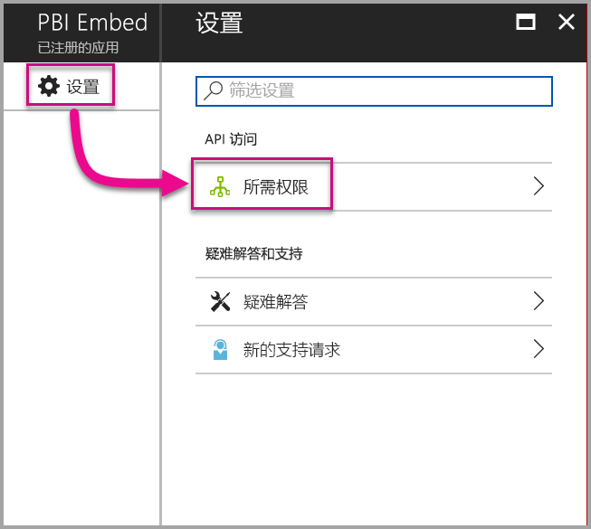

3. 选择“Windows Azure Active Directory”并请务必选中“以登录用户身份访问目录”。 选择**保存**。

    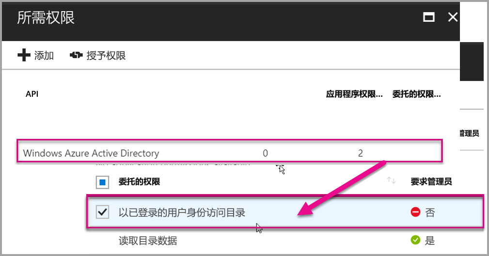

4. 选择**添加**。

    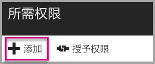

5. 选择“选择 API”。

    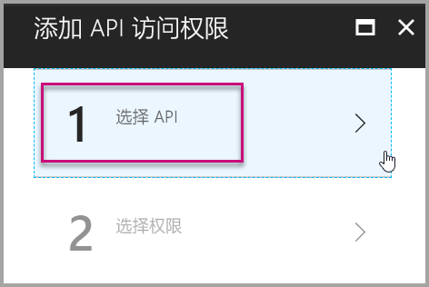

6. 选择“Power BI 服务”，然后选择“选择”。

    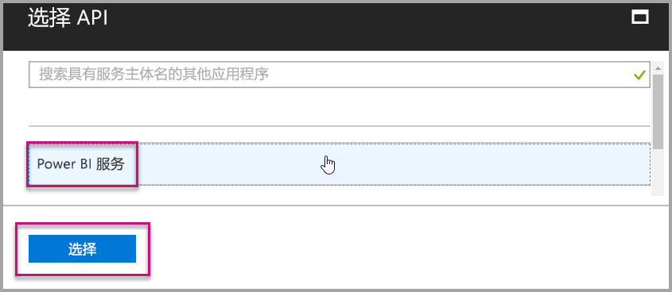

7. 选择“委派权限”下的所有权限。 需要逐一选中这些选项才能保存所做的选择。 完成时选择“保存”。

    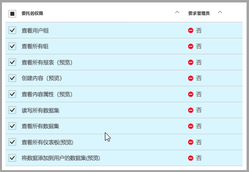

8. 在“所需权限”中，选择“授予权限”。

    需要为“主帐户”调用“授予权限”操作，以免 Azure AD 提示提供内容。 如果执行此操作的帐户是全局管理员，则需要向组织内此应用的所有用户授予权限。 如果执行此操作的帐户是主帐户，而不是全局管理员，则只需向此应用的主帐户授予权限。

    

## <a name="set-up-your-power-bi-environment"></a>设置 Power BI 环境

### <a name="create-an-app-workspace"></a>创建应用工作区

如果为客户嵌入报表、仪表板或磁贴，则必须将内容放在应用工作区中。 主帐户必须是应用工作区的管理员。

1. 首先，创建工作区。 选择“工作区” > “创建应用工作区”。 这将是放置应用程序需要访问的内容的地方。

    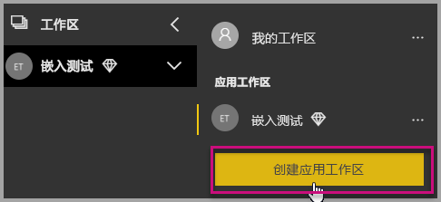

2. 为工作区命名。 如果对应的“工作区 ID”不可用，则进行编辑以给定一个唯一的 ID。 这也是应用的名称。

    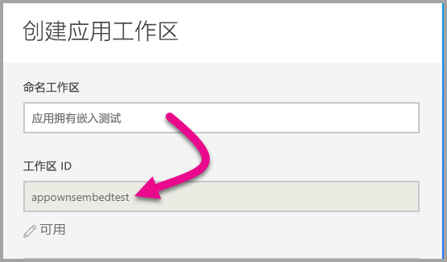

3. 需要设置几个选项。 如果你选择“公开”，则组织中的任何人都可以看到工作区内容。 而如果选择“专用”，则意味着只有工作区的成员可以查看其内容。

    

    创建组后，将不能更改公共/私有设置。

4. 还可以选择成员是可以“编辑”还是具有“仅查看”访问权限。

    

5. 添加你要允许其访问工作区的用户的电子邮件地址，然后选择“添加”。 无法添加组别名，只能添加单个用户别名。

6. 确定每个人员的身份是成员还是管理员。管理员可以编辑工作区本身，包括添加其他成员。 成员可以编辑工作区中的内容，除非他们只具有“仅查看”访问权限。 管理员和成员均可以发布应用。

    现在，可以查看新工作区。 Power BI 创建工作区并将其打开。 它显示在你作为成员的工作区的列表中。 作为管理员，你可以选择省略号(…) 返回并进行更改，添加新成员或更改其权限。

    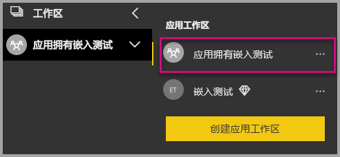

### <a name="create-and-publish-your-reports"></a>创建并发布报表

可使用 Power BI Desktop 创建报表和数据集，然后将这些报表发布到应用工作区。 发布报表的最终用户需要拥有 Power BI Pro 许可证才可发布到应用工作区。

1. 从 GitHub 下载示例[博客演示](https://github.com/Microsoft/powerbi-desktop-samples)。

    

2. 在 Power BI Desktop 中打开示例 PBIX 报表

   

3. 发布到应用工作区

   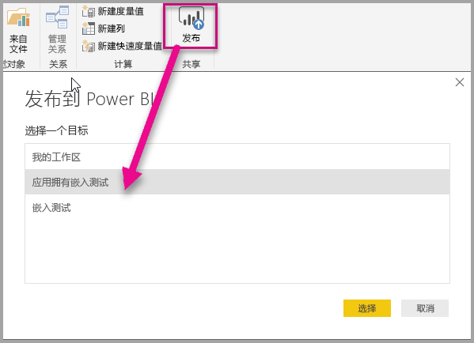

    现在即可在 Power BI 服务在线版中查看报表。

   

## <a name="embed-your-content-using-the-sample-application"></a>嵌入使用示例应用程序的内容

请按照这些步骤，使用示例应用程序开始嵌入内容。

1. 从 GitHub 下载[应用拥有数据示例](https://github.com/Microsoft/PowerBI-Developer-Samples)。

    

2. 在示例应用程序中打开 Web.config 文件。 需要填写 5 个字段才能成功运行该应用程序。 “clientId”、“groupId”、“reportId”、“pbiUsername”和“pbiPassword”。

    

    使用 Azure 中的“应用程序 ID”填写“clientId”信息。 应用程序使用“clientId”向你从其请求权限的用户标识其自身。 若要获取“clientId”，请执行下列步骤：

    登录到 [Azure 门户](https://portal.azure.com)。

    

    在左侧导航窗格中，依次选择“所有服务”和“应用注册”。

    

    选择要为其获取“clientId”的应用程序。

    

    你应该会看到列为 GUID 的“应用程序 ID”。 使用此“应用程序 ID”作为应用程序的“clientId”。

    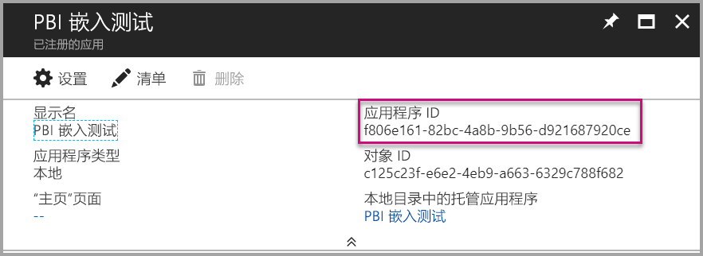

    使用 Power BI 中的“应用工作区 GUID”填写“groupId”信息。

    

    使用 Power BI 中的“报表 GUID”填写“reportId”信息。

    

    * 使用 Power BI 主用户帐户填写“pbiUsername”。
    * 使用 Power BI 主用户帐户的密码填写“pbiPassword”。

3. 运行应用程序！

    首先在 Visual Studio 中选择“运行”。

    

    然后，选择“嵌入报表”。 根据你选择测试使用的内容（报表、仪表板或磁贴），在应用程序中选择该选项。

    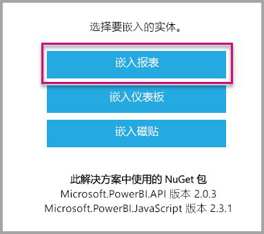

    现在，可以在示例应用程序查看报表。

    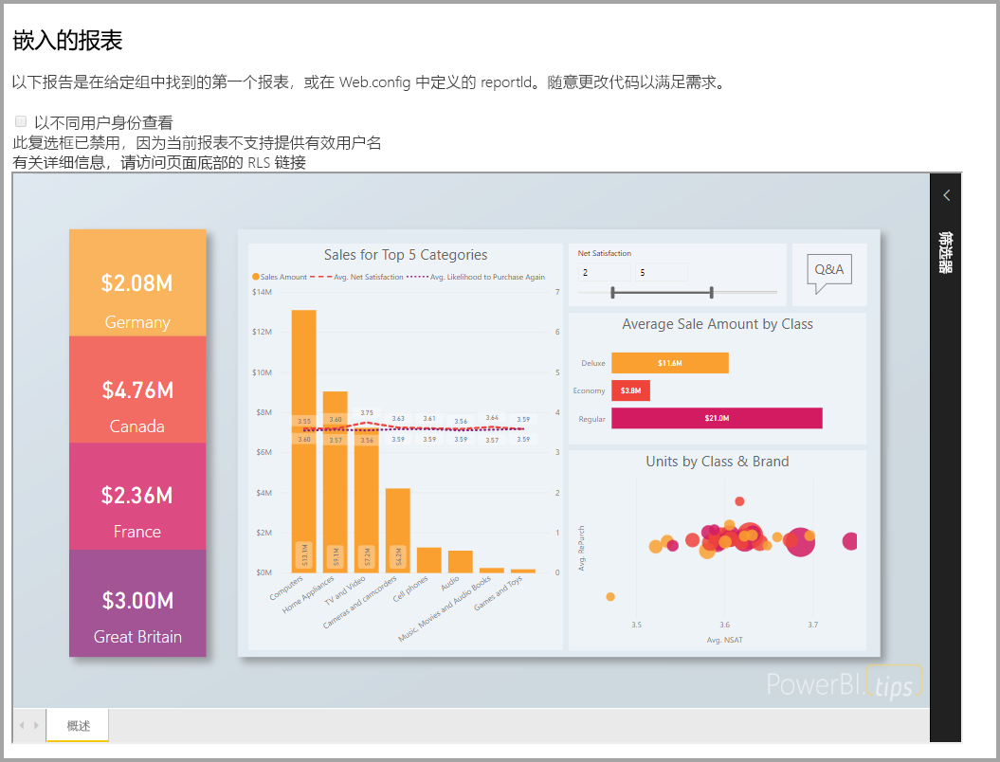

## <a name="embed-your-content-within-your-application"></a>在应用程序中嵌入内容

即使可以使用 [Power BI REST API](https://docs.microsoft.com/rest/api/power-bi/) 完成嵌入内容的步骤，也可使用 .NET SDK 编写本文中所述的示例代码。

客户在应用程序中嵌入内容时，需要从 Azure AD 获取主帐户的访问令牌。 必须为使用“应用拥有数据”的 Power BI 应用程序获取 [Azure AD 访问令牌](get-azuread-access-token.md#access-token-for-non-power-bi-users-app-owns-data)，这样才能对 [Power BI REST API](https://docs.microsoft.com/rest/api/power-bi/) 进行调用。

要使用访问令牌创建 Power BI 客户端，建议创建 Power BI 客户端对象，以便能够与 [Power BI REST API](https://docs.microsoft.com/rest/api/power-bi/) 进行交互。 为此，请使用 Microsoft.Rest.TokenCredentials 对象包装 AccessToken。

```csharp
using Microsoft.IdentityModel.Clients.ActiveDirectory;
using Microsoft.Rest;
using Microsoft.PowerBI.Api.V2;

var tokenCredentials = new TokenCredentials(authenticationResult.AccessToken, "Bearer");

// Create a Power BI Client object. It is used to call Power BI APIs.
using (var client = new PowerBIClient(new Uri(ApiUrl), tokenCredentials))
{
    // Your code to embed items.
}
```

### <a name="get-the-content-item-you-want-to-embed"></a>获取要嵌入的内容项

可使用 Power BI 客户端对象检索对要嵌入的项的引用。

下面的代码示例展示了如何从给定工作区检索首个报表。

[示例应用程序](#embed-your-content-within-a-sample-application)的 Controllers\HomeController.cs 文件中提供了获取内容项的示例，内容项包括报表、仪表板和希望嵌入的磁贴。

```csharp
using Microsoft.PowerBI.Api.V2;
using Microsoft.PowerBI.Api.V2.Models;

// You need to provide the GroupID where the dashboard resides.
ODataResponseListReport reports = client.Reports.GetReportsInGroupAsync(GroupId);

// Get the first report in the group.
Report report = reports.Value.FirstOrDefault();
```

### <a name="create-the-embed-token"></a>创建嵌入令牌

需要生成嵌入令牌，以便能够通过 JavaScript API 使用此令牌。 嵌入令牌特定于要嵌入的项。 因此，只要嵌入 Power BI 内容，就需要为其新建嵌入令牌。 有关详细信息（包括要使用哪个 accessLevel），请参阅 [GenerateToken API](https://msdn.microsoft.com/library/mt784614.aspx)。

下面是关于将报表嵌入令牌添加到应用程序的示例。

[示例应用程序](#embed-your-content-within-a-sample-application)的 Controllers\HomeController.cs 文件中提供了为报表、仪表板或磁贴创建嵌入令牌的示例。

```csharp
using Microsoft.PowerBI.Api.V2;
using Microsoft.PowerBI.Api.V2.Models;

// Generate Embed Token.
var generateTokenRequestParameters = new GenerateTokenRequest(accessLevel: "view");
EmbedToken tokenResponse = client.Reports.GenerateTokenInGroup(GroupId, report.Id, generateTokenRequestParameters);

// Generate Embed Configuration.
var embedConfig = new EmbedConfig()
{
    EmbedToken = tokenResponse,
    EmbedUrl = report.EmbedUrl,
    Id = report.Id
};
```

假设为 EmbedConfig 和 TileEmbedConfig 创建了类。 Models\EmbedConfig.cs 文件和 Models\TileEmbedConfig.cs 文件中提供了相关示例。

### <a name="load-an-item-using-javascript"></a>使用 JavaScript 加载项

可以使用 JavaScript 将报表加载到网页上的 div 元素中。

有关使用 JavaScript API 的完整示例，可以使用[演练工具](https://microsoft.github.io/PowerBI-JavaScript/demo)。 这是演练不同类型的 Power BI Embedded 示例的快速方法。 还可以通过访问 [PowerBI JavaScript wiki](https://github.com/Microsoft/powerbi-javascript/wiki) 页，获取有关 JavaScript API 的详细信息。

此示例对报表使用 EmbedConfig 模型和 TileEmbedConfig 模型及视图。

[示例应用程序](#embed-your-content-within-a-sample-application)的 the Views\Home\EmbedReport.cshtml、Views\Home\EmbedDashboard.cshtml 或 Views\Home\Embedtile.cshtml 文件中提供了为报表、仪表板或磁贴添加视图的示例。

```javascript
<script src="~/scripts/powerbi.js"></script>
<div id="reportContainer"></div>
<script>
    // Read embed application token from Model
    var accessToken = "@Model.EmbedToken.Token";

    // Read embed URL from Model
    var embedUrl = "@Html.Raw(Model.EmbedUrl)";

    // Read report Id from Model
    var embedReportId = "@Model.Id";

    // Get models. models contains enums that can be used.
    var models = window['powerbi-client'].models;

    // Embed configuration used to describe the what and how to embed.
    // This object is used when calling powerbi.embed.
    // This also includes settings and options such as filters.
    // You can find more information at https://github.com/Microsoft/PowerBI-JavaScript/wiki/Embed-Configuration-Details.
    var config = {
        type: 'report',
        tokenType: models.TokenType.Embed,
        accessToken: accessToken,
        embedUrl: embedUrl,
        id: embedReportId,
        permissions: models.Permissions.All,
        settings: {
            filterPaneEnabled: true,
            navContentPaneEnabled: true
        }
    };

    // Get a reference to the embedded report HTML element
    var reportContainer = $('#reportContainer')[0];

    // Embed the report and display it within the div container.
    var report = powerbi.embed(reportContainer, config);
</script>
```

## <a name="move-to-production"></a>移动到生产环境

现在你已完成应用程序的开发，接下来请回到应用工作区了解专用容量。 移动到生产环境需要专用容量。

### <a name="create-a-dedicated-capacity"></a>创建专用容量

通过创建专用容量，可以利用好客户的专用资源。 可以在 [Microsoft Azure 门户](https://portal.azure.com)中购买专用容量。 有关如何创建 Power BI Embedded 容量的详细信息，请参阅[在 Azure 门户中创建 Power BI Embedded 容量](azure-pbie-create-capacity.md)。

使用下表确定哪种 Power BI Embedded 容量最适合你的需求。

| 容量节点 | 总核心数<br/>（后端 + 前端） | 后端核心数 | 前端核心数 | DirectQuery/实时连接限制 | 高峰时间的最大显示页数 |
| --- | --- | --- | --- | --- | --- |
| A1 |1 个 V 核心 |0.5 个核心，3GB RAM |0.5 个核心 | 每秒 5 个 |1-300 |
| A2 |2 个 V 核心 |1 个核心，5GB RAM |1 个核心 | 每秒 10 个 |301-600 |
| A3 |4 个 V 核心 |2 个核心，10GB RAM |2 个核心 | 每秒 15 个 |601-1,200 |
| A4 |8 个 V 核心 |4 个核心，25 GB RAM |4 个核心 |每秒 30 个 |1,201-2,400 |
| A5 |16 个 V 核心 |8 个核心，50 GB RAM |8 个核心 |每秒 60 个 |2,401-4,800 |
| A6 |32 个 V 核心 |16 个核心，100 GB RAM |16 个核心 |每秒 120 个 |4,801-9600 |

**_使用 A SKU 时，无法使用免费的 Power BI 许可证访问 Power BI 内容。_**

使用 PRO 许可证的嵌入令牌仅用于开发测试，因此 Power BI 主帐户生成的嵌入令牌数量有限。 必须购买专用容量才能嵌入到生产环境。 为专用容量生成嵌入令牌时，可生成的数量不受限制。 转到[可用功能](https://docs.microsoft.com/rest/api/power-bi/availablefeatures/getavailablefeatures)查看使用量值，该值以百分比表示当前嵌入使用量。 使用量基于每个主帐户。

有关详细信息，请参阅[嵌入式分析容量规划白皮书](https://aka.ms/pbiewhitepaper)。

### <a name="assign-an-app-workspace-to-a-dedicated-capacity"></a>为应用工作区分配专用容量

创建专用容量后，可将该专用容量分配给应用工作区。 要完成此操作，请按照下列步骤执行。

1. 在“Power BI 服务”中，展开工作区并针对要嵌入内容的工作区选择相应省略号。 然后选择“编辑工作区”。

    

2. 展开“高级”，启用“专用容量”，然后选择所创建的专用容量。 然后，选择“保存”。

    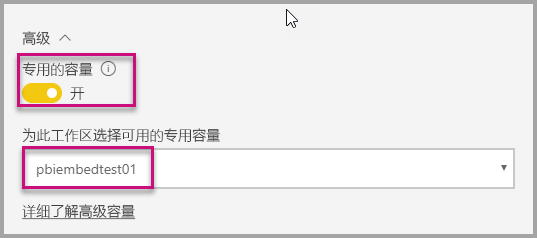

3. 选择“保存”后，应用工作区名称旁边应显示一个钻石形状。

    

## <a name="next-steps"></a>后续步骤

在本教程中，你学习了如何将 Power BI 内容嵌入到客户的应用程序中。 你也可以尝试为组织嵌入 Power BI 内容。

> [!div class="nextstepaction"]
>[为组织嵌入内容](embed-sample-for-your-organization.md)

更多问题？ [尝试咨询 Power BI 社区](http://community.powerbi.com/)
