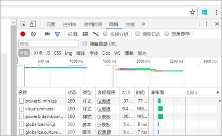
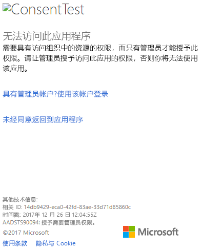
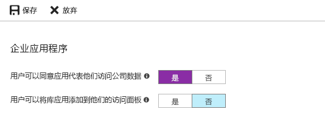

# <a name="troubleshooting-your-embedded-application"></a>嵌入式应用程序疑难解答

本文介绍了从 Power BI 嵌入内容时可能会遇到的一些常见问题。

## <a name="tools-for-troubleshooting"></a>用于故障排除的工具

### <a name="fiddler-trace"></a>Fiddler 跟踪

[Fiddler](http://www.telerik.com/fiddler) 是 Telerik 提供的一款用于监视 HTTP 流量的免费工具。  可以从客户端计算机通过 Power BI API 进行通信。 此工具可能会显示错误和其他相关信息。


### <a name="f12-in-browser-for-front-end-debugging"></a>浏览器中的 F12，用于前端调试

F12 在你的浏览器中启动开发人员窗口。 通过此工具可以查看网络流量和其他信息。



### <a name="extracting-error-details-from-power-bi-response"></a>从 Power BI 响应中提取错误详细信息

下面的代码片段展示了如何从 HTTP 异常中提取错误详细信息：

```csharp
public static string GetExceptionText(this HttpOperationException exc)
{
    var errorText = string.Format("Request: {0}\r\nStatus: {1} ({2})\r\nResponse: {3}",
    exc.Request.Content, exc.Response.StatusCode, (int)exc.Response.StatusCode, exc.Response.Content);
    if (exc.Response.Headers.ContainsKey("RequestId"))
    {
        var requestId = exc.Response.Headers["RequestId"].FirstOrDefault();
        errorText += string.Format("\r\nRequestId: {0}", requestId);
    }

    return errorText;
}
```

建议记录请求 ID（以及错误详细信息以供排查问题）。
请在联系 Microsoft 支持部门时提供请求 ID。

## <a name="app-registration"></a>应用注册

**应用注册失败**

Azure 门户或 Power BI 应用注册页面中的错误消息提到权限不足的问题。 要注册应用程序，必须是 Azure AD 租户中的管理员，或者必须为非管理员用户启用应用程序注册。

**注册新应用时 Power BI 服务不会显示在 Azure 门户中**

至少一个用户必须注册 Power BI。 如果没看到 API 列表中列出 Power BI 服务，则表示没有用户注册 Power BI。

## <a name="rest-api"></a>REST API

**API 调用返回 401**

可能需要进一步调查 Fiddler 捕获。 Azure AD 中注册的应用程序可能缺少所需的权限范围。 验证 Azure 门户内 Azure AD 的应用注册中是否存在所需的范围。

**API 调用返回 403**

可能需要进一步调查 Fiddler 捕获。 发生 403 错误可能有几个原因。

* 用户已超过可在共享容量上生成的嵌入令牌的数量。 需要购买 Azure 容量以生成嵌入令牌，并将工作区中分配给该容量。 请参阅[在 Azure 门户创建 Power BI Embedded 容量](https://docs.microsoft.com/azure/power-bi-embedded/create-capacity)。
* Azure AD 身份验证标记已过期。
* 经过身份验证的用户不是组（应用工作区）的成员。
* 经过身份验证的用户不是组（应用工作区）的管理员。
* 可能不会正确列出身份验证标头。 请确保没有拼写错误。

应用程序的后端在调用 GenerateToken 前可能需要刷新身份验证标记。

```
    GET https://wabi-us-north-central-redirect.analysis.windows.net/metadata/cluster HTTP/1.1
    Host: wabi-us-north-central-redirect.analysis.windows.net
    ...
    Authorization: Bearer eyJ0eXAiOi...
    ...
 
    HTTP/1.1 403 Forbidden
    ...
     
    {"error":{"code":"TokenExpired","message":"Access token has expired, resubmit with a new access token"}}
```

## <a name="authentication"></a>身份验证

### <a name="authentication-failed-with-aadsts70002-or-aadsts50053"></a>身份验证失败并显示 AADSTS70002 或 AADSTS50053

**AADSTS70002: 验证凭据时出错。AADSTS50053: 使用不正确的用户 ID 或密码尝试登录的次数过多)**

如果使用 Power BI Embedded 并利用 Azure AD 直接身份验证，则会收到以下形式的消息日志记录：error:unauthorized_client,error_description:AADSTS70002: 验证凭据时出错。AADSTS50053: 使用不正确的用户 ID 或密码尝试登录的次数过多，这是因为自 2018 年 6 月 14 日起已禁用直接身份验证。

可以使用组织或[服务主体](https://docs.microsoft.com/en-us/azure/active-directory/develop/active-directory-application-objects#service-principal-object)范围内的 [Azure AD 策略](https://docs.microsoft.com/en-us/azure/active-directory/manage-apps/configure-authentication-for-federated-users-portal#enable-direct-authentication-for-legacy-applications)重新启用此功能。

建议仅逐个应用地启用。

需要是在其中创建和分配策略的目录中的全局管理员才能创建此策略。 以下为创建策略并将其分配到此应用程序的 SP 的示例脚本：

1. 安装 [Azure AD 预览版 PowerShell 模块](https://docs.microsoft.com/en-us/powershell/azure/active-directory/install-adv2?view=azureadps-2.0)。

2. 逐行运行以下 PowerShell 命令（确保变量 $sp 的结果只有 1 个应用程序）。

```powershell
Connect-AzureAD
```

```powershell
$sp = Get-AzureADServicePrincipal -SearchString "Name_Of_Application"
```

```powershell
$policy = New-AzureADPolicy -Definition @("{`"HomeRealmDiscoveryPolicy`":{`"AllowCloudPasswordValidation`":true}}") -DisplayName EnableDirectAuth -Type HomeRealmDiscoveryPolicy -IsOrganizationDefault $false
```

```powershell
Add-AzureADServicePrincipalPolicy -Id $sp.ObjectId -RefObjectId $policy.Id 
```

分配策略后，请等待传播完成（大约 15 到 20 秒），然后再进行测试。

**提供有效标识时生成标记失败**

由于几个不同的原因，GenerateToken 可能会失败，并提供有效标识。

* 数据集不支持有效标识
* 未提供用户名
* 未提供角色
* 未提供 DatasetId
* 用户没有正确的权限

若要验证是哪一个，请尝试以下操作。

* 执行[获取数据集](https://docs.microsoft.com/rest/api/power-bi/datasets)。 属性 IsEffectiveIdentityRequired 是否为 true？
* Username 是任何 EffectiveIdentity 必需的。
* 如果 IsEffectiveIdentityRolesRequired 为 true，则 Role 是必需的。
* DatasetId 是任何 EffectiveIdentity 必需的。
* 对于 Analysis Services，主用户必须是网关管理员。

### <a name="aadsts90094-the-grant-requires-admin-permission"></a>AADSTS90094: 授予需要管理员权限

**表现：**</br>
非管理员用户首次尝试登录到应用程序并授予许可时，会收到以下错误：
* ConsentTest 需要具有访问组织中的资源的权限，而只有管理员才能授予此权限。 请让管理员授予访问此应用的权限，否则你将无法使用该应用。
* AADSTS90094: 授予需要管理员权限。

    

管理员用户可以成功登录并授予许可。

**根本原因：**</br>
对租户禁用用户同意。

**可能会出现几个修补程序：**

对整个租户（所有用户和所有应用程序）启用用户同意
1. 在 Azure 门户中，导航到“Azure Active Directory”= >“用户和组”= >“用户设置”
2. 启用“用户可以同意应用代表他们访问公司数据”设置并保存更改

    

由管理员授予权限 由管理员授予（整个租户或特定用户）访问应用程序的权限。

## <a name="data-sources"></a>数据源

**ISV 希望相同的数据源有不同的凭据**

数据源可以为一个主用户提供一组凭据。 如果你需要使用不同的凭据，请创建其他的主用户。 然后，在每个主用户上下文中分配不同的凭据，并使用该用户的 Azure AD 标记嵌入。

## <a name="content-rendering"></a>内容呈现

**呈现或使用嵌入内容失败或超时**

请确保嵌入的标记未过期。 请确保检查嵌入的标记是否过期并刷新。 有关详细信息，请参阅[使用 JavaScript SDK 刷新标记](https://github.com/Microsoft/PowerBI-JavaScript/wiki/Refresh-token-using-JavaScript-SDK-example)。

**不会加载报表或仪表板**

如果用户无法查看报表或仪表板，请确保报表或仪表板在 powerbi.com 内正确加载。 如果报表或仪表板没有在 powerbi.com 内加载，它将不会在你的应用程序中运行。

**报表或仪表板运行缓慢**

从 Power BI Desktop 或 powerbi.com 中打开该文件，验证性能是否可接受以排除应用程序或嵌入 API 的问题。

## <a name="troubleshooting-your-embedded-application-with-the-ierror-object"></a>使用 IError 对象对嵌入式应用程序进行故障排查

使用 [JavaScript SDK 的 error 事件中返回的 IError 对象 ](https://github.com/Microsoft/PowerBI-JavaScript/wiki/Troubleshooting-and-debugging-of-embedded-parts)调试应用程序，并更好地了解错误的原因。

获取 IError 对象之后，应查找适合你使用的嵌入类型的对应常见错误表。 将 IError 属性与表中的该属性进行比较，查找失败的可能原因。

### <a name="typical-errors-when-embedding-for-power-bi-users"></a>为 Power BI 用户嵌入内容时的典型错误

| 消息 | 详细的消息 | 错误代码 | 可能的原因 |
|-------------------------------------------------------|-----------------------------------------------------------------------------------------------------------------------------|-----------|--------------------------------------------------------|
| TokenExpired | 访问令牌已过期，请使用新的访问令牌重新提交 | 403 | 令牌已过期  |
| PowerBIEntityNotFound | 获取报表失败 | 404 | <li> 报表 ID 错误 <li> 报表不存在  |
| 参数无效 | 未指定 powerbiToken 参数 | 不适用 | <li> 未提供任何访问令牌 <li> 未提供任何报表 ID |
| LoadReportFailed | 初始化失败，无法解析群集 | 403 | *访问令牌不正确* 嵌入类型与令牌类型不匹配 |
| PowerBINotAuthorizedException | 获取报表失败 | 401 | <li> 组 ID 错误 <li> 组未经授权 |
| TokenExpired | 访问令牌已过期，请使用新的访问令牌重新提交。 无法呈现以下标题的报表视觉对象：<visual title> | 不适用 | 查询数据令牌已过期 |
| OpenConnectionError | 无法显示视觉对象。 无法呈现以下标题的报表视觉对象：<visual title> | 不适用 | 在会话中打开与容量相关的报表时，容量遭暂停或删除 |
| ExplorationContainer_FailedToLoadModel_DefaultDetails | 无法加载与此报表关联的模型架构。 请确保你已连接到服务器，然后重试。 | 不适用 | <li> 容量已暂停 <li> 容量已删除 |

### <a name="typical-errors-when-embedding-for-non-power-bi-users-using-an-embed-token"></a>（使用嵌入令牌）为非 Power BI 用户嵌入内容时的典型错误

| 消息 | 详细的消息 | 错误代码 | 原因 |
|-------------------------------------------------------|-------------------------------------------------------------------------------------------------------------------------------|------------|-------------------------------------------------|
| TokenExpired | 访问令牌已过期，请使用新的访问令牌重新提交 | 403 | 令牌已过期  |
| LoadReportFailed | 获取报表失败 | 404 | <li> 报表 ID 错误 <li> 报表不存在  |
| LoadReportFailed | 获取报表失败 | 403 | 报表 ID 与令牌不匹配 |
| LoadReportFailed | 获取报表失败 | 500 | 提供的报表 ID 不是 guid |
| 参数无效 | 未指定 powerbiToken 参数 | 不适用 | <li> 未提供任何访问令牌 <li> 未提供任何报表 ID |
| LoadReportFailed | 初始化失败，无法解析群集 | 403 | 令牌类型错误，令牌不正确 |
| PowerBINotAuthorizedException | 获取报表失败 | 401 | 错误/为组 ID 取消授权 |
| TokenExpired | 访问令牌已过期，请使用新的访问令牌重新提交。 无法呈现以下标题的报表视觉对象：<visual title> | 不适用 | 查询数据令牌已过期 |
| OpenConnectionError | 无法显示视觉对象。 无法呈现以下标题的报表视觉对象：<visual title> | 不适用 | 在会话中打开与容量相关的报表时，容量遭暂停或删除 |
| ExplorationContainer_FailedToLoadModel_DefaultDetails | 无法加载与此报表关联的模型架构。 请确保你已连接到服务器，然后重试。 | 不适用 | <li> 容量已暂停 <li> 容量已删除 |

## <a name="onboarding-experience-tool-for-embedding"></a>用于嵌入的载入体验工具

可跟随[载入体验工具](https://aka.ms/embedsetup)进行操作，以便快速下载示例应用程序。 然后，即可将你的应用程序与示例进行比较。

### <a name="prerequisites"></a>先决条件

请先验证你具备所有适当先决条件，然后再使用载入体验工具。 需要 Power BI Pro 帐户和 Microsoft Azure 订阅。

* 如果未注册 Power BI Pro，请在开始之前[注册以获得免费试用](https://powerbi.microsoft.com/en-us/pricing/)。
* 如果没有 Azure 订阅，请在开始之前先创建一个[免费帐户](https://azure.microsoft.com/free/?WT.mc_id=A261C142F)。
* 你需要具有自己的 [Azure Active Directory 租户](create-an-azure-active-directory-tenant.md)安装程序。
* 你需要安装 [Visual Studio](https://www.visualstudio.com/)（2013 版或更高版本）。

### <a name="common-issues"></a>常见问题

使用载入体验工具进行测试时，可能遇到的常见问题包括：

#### <a name="using-the-embed-for-your-customers-sample-application"></a>使用“为客户嵌入”示例应用程序

如果使用“为客户嵌入”体验，请保存并解压缩 PowerBI-Developer-Samples.zip 文件。 然后打开 PowerBI-Developer-Samples-master\App Owns Data 文件夹并运行 PowerBIEmbedded_AppOwnsData.sln 文件。

选择“授予权限”（“授予权限”步骤）时，将收到以下错误：

    AADSTS70001: Application with identifier <client ID> was not found in the directory <directory ID>

解决方案是关闭弹出窗口，等待几秒钟再重试。 可能需要多次重复此操作。 造成此问题的原因是，从完成应用程序注册过程到该应用程序对外部 API 可用之间存在时间间隔。

运行示例应用时，将显示以下错误消息：

    Password is empty. Please fill password of Power BI username in web.config.

由于未注入示例应用程序的唯一值是用户密码，因此会发生此错误。 在解决方案中打开 Web.config 文件，并用用户密码填充 pbiPassword 字段。

#### <a name="using-the-embed-for-your-organization-sample-application"></a>为组织示例应用程序使用嵌入

如果使用“为组织嵌入”体验，请保存并解压缩 PowerBI-Developer-Samples.zip 文件。 然后打开 PowerBI-Developer-Samples-master\App Owns Data\integrate-report-web-app 文件夹并运行 pbi-saas-embed-report.sln 文件。

运行“为组织嵌入”示例应用时，将收到以下错误：

    AADSTS50011: The reply URL specified in the request does not match the reply URLs configured for the application: <client ID>

这是因为为 web-server 应用程序指定的重定向 URL 不同于示例的 URL。 如果想要注册示例应用程序，请使用 `http://localhost:13526/` 作为重定向 URL。

如果想要编辑已注册的应用程序，请了解如何编辑[已向 AAD 注册的应用程序](https://docs.microsoft.com/azure/active-directory/develop/active-directory-integrating-applications#updating-an-application)，使应用程序可以向 Web API 提供访问权限。

如果想要编辑 Power BI 用户配置文件或数据，请了解如何编辑 [Power BI 数据](https://docs.microsoft.com/en-us/power-bi/service-basic-concepts)。

有关详细信息，请参阅 [Power BI Embedded 常见问题](embedded-faq.md)。

更多问题？ [尝试参与 Power BI 社区](http://community.powerbi.com/)

如需进一步的帮助，请[联系支持人员](https://powerbi.microsoft.com/en-us/support/pro/?Type=documentation&q=power+bi+embedded)或[通过 Azure 门户创建支持票证](https://ms.portal.azure.com/#blade/Microsoft_Azure_Support/HelpAndSupportBlade/newsupportrequest)，并提供你遇到的错误消息。