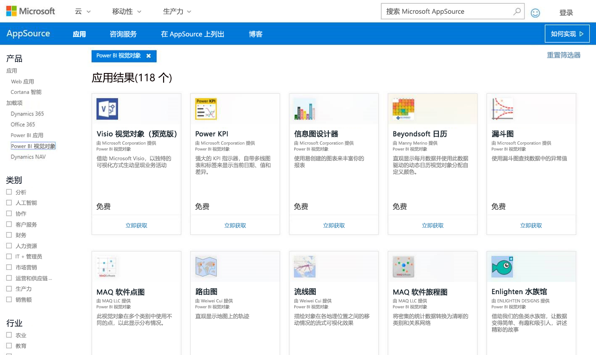
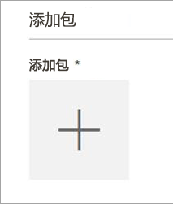
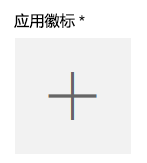
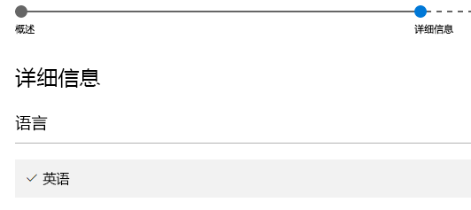

# 将自定义视觉对象发布到 AppSource

了解如何将自定义视觉对象发布到 AppSource 供其他人发现和使用。

在创建自定义视觉对象后，你可能想要将其发布到 AppSource 供其他人发现和使用。 在执行该操作之前，必须完成一些准备工作。 有关如何创建自定义视觉对象的详细信息，请参阅[开发 Power BI 自定义视觉对象](custom-visual-develop-tutorial.md)。

   

## 什么是 AppSource？

AppSource 是查找 Microsoft 产品和服务的 SaaS 应用与加载项的位置。 [AppSource](https://appsource.microsoft.com/marketplace/apps?product=power-bi-visuals) 为 Office 365、Dynamics 365、Cortana Intelligence 和其他产品的数百万用户提供解决方案，帮助他们更高效、更有见地或更为完美地完成工作。

## 准备提交自定义视觉对象

对自定义视觉对象进行编码和测试并将其打包到 pbiviz 文件后，还应准备以下信息用于提交。

| 项 | 必填 | 说明 |
| --- | --- | --- |
| Pbiviz 程序包包含全部所需元数据 |是 |视觉对象名称 显示名称 GUID 版本 说明 作者姓名和电子邮件 |
| 示例 .pbix 报表文件 |是 |要展示你的视觉对象，应帮助用户了解该视觉对象。 应向用户强调该视觉对象可以带来的价值，并提供使用示例，格式设置选项等。还可以添加 *“提示”* 页，并在页面末尾附上一些提示和技巧、操作注意事项以及类似内容。 示例 .pbix 报表文件必须脱机运行且无任何外部连接 |
| 图标 |是 |应包含将在店面中显示的自定义视觉对象徽标。 格式可以为 .png、.jpg、.jpeg 或 .gif。 它必须正好为 300 像素（宽度）x 300 像素（高度）。 **重要提示！** 在提交图标之前，请仔细查看[简短指南](https://docs.microsoft.com/office/dev/store/craft-effective-appsource-store-images)。 |
| 屏幕截图 |是 |必须至少提供一个屏幕截图。 格式可以为 .png、.jpg、.jpeg 或 .gif。 它必须正好为 1366 像素（宽度）x 768 像素（高度）。 文件大小不得超过 1024 KB。 *为了实现更好的利用率，添加文本气泡以阐明每个屏幕截图中所示的主要功能的价值主张。* |
| 支持下载链接 |是 |提供 URL 以便为对视觉对象有疑问的客户提供支持。 此链接作为 SellerDashboard 列表的一部分输入，当用户在 AppSource 上访问你的视觉对象的列表时，用户可以看到此链接。 URL 的格式应包含 https:// 或 http:// 。 |
| 隐私文档链接 |是 |为使用你的视觉对象的客户提供隐私策略链接。 此链接作为 SellerDashboard 列表的一部分输入，当用户在 AppSource 上访问你的视觉对象的列表时，用户可以看到此链接。 链接的格式应包含 https:// 或 http:// 。 |
| 最终用户许可协议 (EULA) |是 |必须上载 EULA 文件。 这可以是你自己的 EULA，也可以使用 Office 应用商店中适用于 Power BI 自定义视觉对象的默认 EULA。 若要使用默认 EULA，请将以下 URL 粘贴到卖家面板的“最终用户许可协议”文件上传对话框中：[https://visuals.azureedge.net/app-store/Power BI - Default Custom Visual EULA.pdf](https://visuals.azureedge.net/app-store/Power%20BI%20-%20Default%20Custom%20Visual%20EULA.pdf)。 |
| 视频链接 |否 |为了增加用户对自定义视觉对象的兴趣，建议提供一个指向视觉对象视频的链接。 URL 的格式应包含 https:// 或 http:// 。 |
| GitHub 存储库 |否 |最好提供一个有效的公共链接，可以链接到包含你的视觉对象和示例数据资源的 [GitHub](https://www.github.com) 存储库，以允许其他开发人员提供反馈并为代码提出改进意见。 |

## 提交到 Power BI

通过向 Power BI 自定义视觉对象提交团队发送一封电子邮件开始提交。 可以向 [pbivizsubmit@microsoft.com](mailto:pbivizsubmit@microsoft.com) 发送电子邮件。

> [!IMPORTANT]
> 必须在 pbiviz.json 文件中填写以下字段：“description”、“supportUrl”、“author”、“name”和“email”，然后再创建 .pbiviz 包。

在电子邮件中附加 .pbiviz 文件和示例报表 .pbix 文件。 Power BI 团队会回复你，并在回复邮件中添加说明以及要上传的应用包 XML 文件。 必须有此 XML 应用包，才能通过 Office 开发人员中心提交视觉对象。

> [!NOTE]
> 为了提高质量并确保现有报表不会中断，在应用商店中得到批准后，还将需要两周时间更新现有视觉对象，然后再步入生产环境。

## 提交到 AppSource

从 Power BI 团队获得应用包 XML 后，请转到[开发人员中心](https://sellerdashboard.microsoft.com/Application/Summary)，将视觉对象提交到 AppSource。

> [!NOTE]
> 必须具有有效的 Office 开发人员帐户才能登录到[“Office 开发人员中心”](https://dev.office.com/)。 Office 开发人员帐户必须是 Microsoft 帐户（Live ID，例如 hotmail.com 或 outlook.com)。

> [!IMPORTANT]
> 在将视觉对象提交到 AppSource 之前，必须先将附带 .pbiviz 文件和 .pbix 文件的电子邮件发送到 Power BI 团队。 这样，Power BI 团队便可将这些文件上传到公共共享服务器。 否则，应用商店将无法检索这些文件。 每次提交新视觉对象、更新现有视觉对象和修复被拒绝的提交内容时，都必须发送这些文件。

### 提交视觉对象的过程

请按照以下步骤来完成提交。

1. 选择“添加新应用”。

    

2. 选择“Power BI 自定义视觉对象”，然后选择“下一步”。

3. 选择“应用包”下的 **+**，然后在打开文件对话框中选择从 Power BI 团队获得的应用包 XML 文件。

    

4. 应该会看到一条批准消息，提示你这是有效的 Power BI 应用包。

    

5. 填写“常规信息”详细信息。

   * *提交标题：* 提交在开发人员中心中的命名方式
   * *版本：* 版本号通过加载项应用包自动填充。
   * *发布日期 (UTC)：* 选择应用发布到应用商店的日期。 如果选定一个将来的日期，在到达该日期后，你的应用才会在应用商店中提供。
   * *类别：* 第一个类别将自动填充为“数据可视化效果 + BI”。 这就是标记所有 Power BI 自定义视觉对象的方法。 可以最多提供 2 个其他类别，以帮助用户轻松地搜索你的视觉对象
   * *测试说明：* 可选，如果你想要为 Microsoft 测试人员提供一些说明，则可以填写此项
   * *我的应用调用、支持、包含或使用加密：* 保持未选中状态
   * *在 iPad 的 Office 外接程序目录中提供此外接程序：* 保持未选中状态
6. 通过选择“应用徽标”下的“+”上载视觉对象的徽标。 然后，选择打开文件对话框中的图标文件。 文件格式必须为 .png、.jpg、.jpeg 或 .gif。 必须正好为 300 像素（宽度）x 300 像素（高度），且大小不得超过 512 KB。

    

7. 填写“支持文档”详细信息。

   * 支持文档链接
   * 隐私文档链接
   * 视频链接
   * 最终用户许可协议 (EULA)

       必须上载 EULA 文件。 这可以是你自己的 EULA，也可以使用 Office 应用商店中适用于 Power BI 自定义视觉对象的默认 EULA。 若要使用默认 EULA，请将以下 URL 粘贴到卖家面板的“最终用户许可协议”文件上传对话框中：[https://visuals.azureedge.net/app-store/Power BI - Default Custom Visual EULA.pdf](https://visuals.azureedge.net/app-store/Power%20BI%20-%20Default%20Custom%20Visual%20EULA.pdf)。

8. 选择“下一步”以前往**详细信息**页。

9. 选择“语言”，并从列表中选择一种语言。

    

10. 填写“说明”详细信息。

    * *（此语言的）应用名称：* 输入应用的标题，因为该标题应在店面中显示。
    * *简短说明：* 输入应用的简短说明，最多 100 个字符，因为该说明应在店面中显示。 此说明及徽标将显示在最高级别的页面中。 可以从 pbiviz 程序包使用此说明。
    * *详细说明：* 提供应用的更详细说明，客户将在应用详细信息页上看到该说明。 若要将视觉对象变成开放源代码对象，以便通过社区的力量来改进视觉对象，请在此处提供公共存储库（如 GitHub）的链接。

11. 至少上载一个屏幕截图。 格式可以为 .png、.jpg、.jpeg 或 .gif。 它必须正好为 1366 像素（宽度）x 768 像素（高度）。 文件大小不得超过 1024 KB。 *为了实现更好的利用率，添加文本气泡以阐明每个屏幕截图中所示的主要功能的价值主张。*

12. 如果想要添加更多语言，请选择“添加语言”，然后重复步骤 10 和 11。 添加更多语言可帮助用户以他们自己的语言查看自定义视觉对象详细信息。 未列出的语言将默认为所选的第一语言。

13. 添加语言完成后，选择“下一步”以前往**阻止访问**页。

14. 如果你想要阻止特定国家或地区的客户使用或购买你的应用，请选中此框，然后从列表中进行选择。

15. 选择“下一步”以前往**定价**页。

16. 目前，仅支持免费视觉对象，不允许视觉对象内有附加购买（应用内购买）内容。 选择“此应用免费”。

    > [!NOTE]
    > 如果没有选择免费选项，或提交的视觉对象中有应用内购买内容，那么提交会遭拒。

17. 现在，可以选择“另存为草稿”并于稍后提交，也可以选择“提交供审批”，将自定义视觉对象提交到 Office 应用商店。

## 跟踪提交状态和使用情况

可以查看[验证策略](https://dev.office.com/officestore/docs/validation-policies#13-power-bi-custom-visuals)。

提交后，可以在[“应用仪表板”](https://sellerdashboard.microsoft.com/Application/Summary/)中查看提交状态。

## 认证视觉对象

创建视觉对象后，可以选择让视觉对象取得认证。 这意味着它可以在 Power BI 服务中运行，与该服务的其他功能一起使用，例如导出到 PowerPoint。 有关详细信息，请参阅[让自定义视觉对象取得认证](../power-bi-custom-visuals-certified.md)。

## 后续步骤

[开发 Power BI 自定义视觉对象](custom-visual-develop-tutorial.md)  
[Power BI 中的可视化效果](../visuals/power-bi-report-visualizations.md)  
[Power BI 中的自定义可视化效果](../power-bi-custom-visuals.md)  
[让自定义视觉对象取得认证](../power-bi-custom-visuals-certified.md)

更多问题？ [尝试咨询 Power BI 社区](http://community.powerbi.com/)
