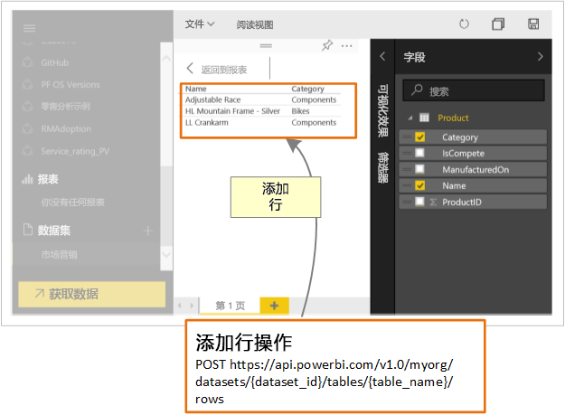

# 开发人员可以使用 Power BI API 做什么？

Power BI 显示可从众多不同数据源创建和实时更新的交互式仪表板。 通过使用支持 REST 调用的任何编程语言，可以实时创建与 Power BI 仪表板集成的应用。 此外可以将 Power BI 磁贴和报表集成到应用。

开发人员还可以构建他们自己的数据可视化效果（可用于交互报表和仪表板）。

以下是一些可以使用 Power BI API 执行的操作。

| **可执行的操作** | **操作结果** |
| --- | --- |
| 为 Power BI 用户和非 Power BI 用户（应用拥有数据）嵌入仪表板、报表和磁贴 |[如何嵌入 Power BI 仪表板、报表和磁贴](embedding-content.md) |
| 扩展现有业务工作流以将关键数据推送到 Power BI 仪表板。 |[将数据推送到仪表板](walkthrough-push-data.md) |
| 进行 Power BI 身份验证。 |[进行 Power BI 身份验证](get-azuread-access-token.md) |
| 创建自定义视觉对象。 |[开发 Power BI 自定义视觉对象](custom-visual-develop-tutorial.md) |

> [!NOTE]
> Power BI API 仍以组的形式引用应用工作区。 对组的任何引用都意味着正使用应用工作区工作。

## Power BI 开发人员示例

Power BI 开发人员示例包含用于嵌入仪表板、报表和磁贴的项。

[Power BI 开发人员示例](https://github.com/Microsoft/PowerBI-Developer-Samples)

* **应用拥有数据**中的示例适用于为非 Power BI 用户嵌入。
* **用户拥有数据**中的示例适用于为 Power BI 用户嵌入。

## GitHub 存储库

* [.NET SDK](https://github.com/Microsoft/PowerBI-CSharp)
* [JavaScript API](https://github.com/Microsoft/PowerBI-JavaScript)
* [自定义视觉对象](https://github.com/Microsoft/PowerBI-visuals)

## 开发人员工具

以下是可用于帮助开发 Power BI 项的工具。

可使用[嵌入安装程序工具](https://aka.ms/embedsetup)快速开始并下载有关如何嵌入 Power BI 内容的示例应用程序。

选择最适合你的解决方案：

* 通过[为客户嵌入内容](embedding.md#embedding-for-your-customers)，可为没有 Power BI 帐户的用户嵌入仪表板和报表。 运行[为客户嵌入](https://aka.ms/embedsetup/AppOwnsData)解决方案。

* 通过[为组织嵌入内容](embedding.md#embedding-for-your-organization)，可以扩展 Power BI 服务。 运行[为组织嵌入](https://aka.ms/embedsetup/UserOwnsData)解决方案。

有关使用 JavaScript API 的完整示例，可以使用[演练工具](https://microsoft.github.io/PowerBI-JavaScript/demo)。 此工具是演练不同类型的 Power BI Embedded 示例的快速方法。 还可以通过访问 [PowerBI JavaScript wiki](https://github.com/Microsoft/powerbi-javascript/wiki) 页，获取有关 JavaScript API 的详细信息。

## 将数据推送到 Power BI

可以使用 Power BI API 将数据推送到数据集。 借助此功能，可以将行添加到数据集内的表。 新数据随后可以在仪表板的磁贴中以及报表中的视觉对象内反映出来。

## 后续步骤

[将数据推送到数据集](walkthrough-push-data.md)  
[开发 Power BI 自定义视觉对象](custom-visual-develop-tutorial.md)  
[Power BI REST API 引用](https://docs.microsoft.com/rest/api/power-bi/)  

更多问题？ [尝试咨询 Power BI 社区](http://community.powerbi.com/)
