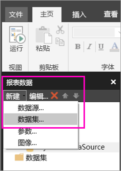
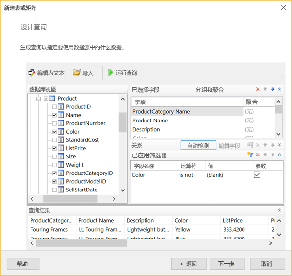
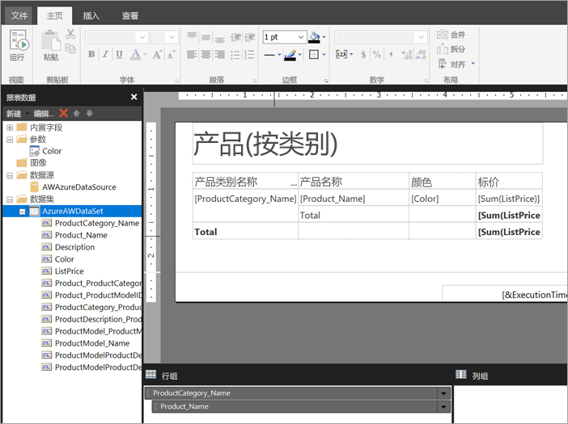

# 在 Power BI 服务中为分页报表创建嵌入数据集
本文介绍如何在 Power BI 服务中基于嵌入数据源为分页报表创建嵌入数据集。 嵌入数据集包含在单个分页报表中，并在该报表中使用。 目前，发布到 Power BI 服务的分页报表需要嵌入的数据集和嵌入的数据源。 在创建报表时，可以在报表生成器中创建嵌入数据源。 

在创建数据集之前，首先需要创建数据源。 若要了解详细信息，请参阅 Power BI 服务中[分页报表的嵌入数据源](paginated-reports-embedded-data-source.md)。
  
## 创建嵌入的数据集
  
1. 在报表生成器的“报表数据”窗格中，选择“新建” > “数据集”。

1. 在“数据集属性”对话框的“查询”选项卡中，为数据集提供一个名称。 嵌入的数据源已存在于“数据源”框中，或者，可以选择“新建”，创建其他嵌入数据源。
 
     

3. 在“查询类型”下，选择要用于数据集的命令或查询的类型。 
    - “文本”运行查询以从数据集中检索数据。 这是默认设置，适用于大部分查询。 键入一个查询，或通过选择“导入”导入一个预先存在的查询。 若要以图形方式生成查询，请选择“查询设计器”。 如果使用查询设计器生成查询，查询的文本将显示在此框中。 选择“表达式 (fx)”按钮，使用表达式来动态地生成查询。 
    - “表”选择表内的所有字段。 输入要用作数据集的表的名称。
    - “存储过程”按名称运行存储过程。

4. 在查询设计器中，可以查看数据集中的表和字段并与之交互，导入查询或作为文本编辑。 还可以在此处添加筛选器和参数。 

    

5. 在查询设计器中，选择“运行查询”对其进行测试，然后选择“确定”。

1. 返回“数据集属性”对话框，在“超时(以秒为单位)”框中，键入查询超时之前的秒数。默认值为 30 秒。 “超时”的值必须为空或大于零。 如果为空，则查询不会超时。

7.  可以在其他选项卡上设置数据集的其他属性：
    - 在“字段”选项卡上创建计算字段。
    - 在“选项”选项卡上设置高级选项。
    - 在“筛选器”和“参数”选项卡上分别执行添加或更新操作。

8. 选择“确定”
 
   报表在报表设计视图中打开。 数据源、数据集和数据集字段集合显示在“报表数据”窗格中，可以继续设计分页报表。  

     
 
## 后续步骤 

- [Power BI Premium 中的分页报表是什么？（预览）](paginated-reports-report-builder-power-bi.md)  
- [教程：创建分页报表并将其上传到 Power BI 服务](paginated-reports-quickstart-aw.md)
- [将分页报表发布到 Power BI 服务](paginated-reports-save-to-power-bi-service.md)

