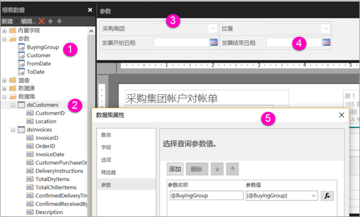

# 为 Power BI 服务中的分页报表创建参数

本文介绍了如何为 Power BI 服务中的分页报表创建参数。  报表参数提供了一种选择报表数据和更改报表显示内容的方法。 用户可以提供默认值和可用值列表，报表读者可以更改选择。  

下图显示了报表生成器中包含 @BuyingGroup、@Customer、@FromDate 和 @ToDate 参数的报表的“设计”视图。 
  

  
1.  “报表数据”窗格中的报表参数。  
  
2.  具有数据集中任一参数的表。  
  
3.  “参数”窗格。 可以在参数窗格中自定义参数的布局。 
  
4.  参数 @FromDate 和 @ToDate 具有 DateTime 数据类型。 查看报表时，可以在文本框中键入一个日期，也可以在日历控件中选择一个日期。 

5.  “数据集属性”对话框中的任一参数。  

  
## 创建或编辑报表参数  
  
1.  在报表生成器中打开分页报表。

1. 在“报表数据”窗格中，右键单击“参数”节点 >“添加参数”。 “报表参数属性”对话框随即打开。  
  
2.  在“名称”中，键入参数的名称或接受默认名称。  
  
3.  在“提示”中，键入用户在运行报表时，参数文本框旁显示的文本。  
  
4.  在“数据类型”中，选择参数值的数据类型。  
  
5.  如果参数可以包含空白值，请选择“允许空白值”。  
  
6.  如果参数可以包含 NULL 值，请选择“允许 NULL 值”。  
  
7.  若要允许用户为参数选择多个值，请选择“允许多个值”。  
  
8.  设置可见性选项。  
  
    -   若要在报表顶部的工具栏上显示参数，请选择“可见”。  
  
    -   若要隐藏参数，不让它显示在工具栏上，请选择“隐藏”。  
  
    -   若要隐藏参数，防止在发布报表后在报表服务器上修改该参数，请选择“内部”。 这样的话，就只能在报表定义中查看报表参数了。 对于此选项，必须设置默认值或允许参数接受 NULL 值。  
  
9. 选择**确定**。 
  
## 后续步骤

请参阅[查看分页报表的参数](paginated-reports-view-parameters.md)，了解在 Power BI 服务中显示的参数。

有关分页报表中参数的详细信息，请参阅 SQL Server Reporting Services 文档中的[报表参数（报表生成器和报表设计器）](https://docs.microsoft.com/sql/reporting-services/report-design/report-parameters-report-builder-and-report-designer)一文  
