# 教程：创建分页报表并将其上传到 Power BI 服务

在本教程中，你将连接到一个示例 Azure SQL 数据库。 然后，使用报表生成器中的向导创建一个分页报表，其中包含包装到多个页的表。 接着将分页报表上传到 Power BI 服务高级容量中的工作区。 Power BI 服务中的分页报表目前处于预览状态。

下面介绍将在本教程中完成的步骤：

> [!div class="checklist"]
> * 创建 Azure 示例数据库。
> * 借助向导在报表生成器中创建矩阵。
> * 设置每页包含标题、页码和列标题的报表的格式。
> * 设置货币格式。
> * 将报表上传到 Power BI 服务。

如果没有 Azure 订阅，请在开始之前先创建一个[免费帐户](https://azure.microsoft.com/free/?WT.mc_id=A261C142F)。
 
## 先决条件  

以下时创建分页报表的先决条件：

- 安装 [Microsoft 下载中心的报表生成器](http://go.microsoft.com/fwlink/?LinkID=734968)。 

- 按照快速入门，[在 Azure 门户中创建 Azure SQL 数据库示例](https://docs.microsoft.com/azure/sql-database/sql-database-get-started-portal)。 复制并保存“概述”选项卡上“服务器名称”框中的值。记住你在 Azure 中创建的用户名和密码。

以下是将分页报表上传到 Power BI 服务的先决条件：

- 需要 [Power BI Pro 许可证](service-admin-power-bi-pro-in-your-organization.md)。
- 需要 [Power BI 高级容量](service-premium.md)中的服务上的应用工作区。 它在工作区名称旁边有一个菱形图标。

## 使用向导创建矩阵
  
1.  从计算机启动报表生成器。  
  
     随即将打开“入门”对话框。  
  
     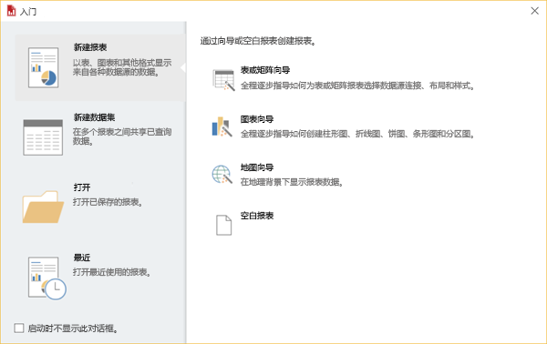
  
1.  在左窗格中，验证是否已选中“新建报表”，并在右窗格中选择“表或矩阵向导”。  
  
4.  在“选择数据集”页面中，选择“创建数据集” > “下一步”。  

    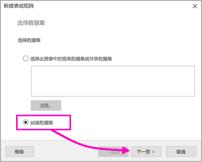
  
5.  在“选择与数据源的连接”页面中，选择“新建”。 

    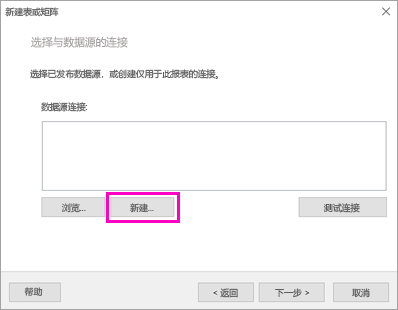
  
     随即将打开“数据源属性”对话框。  
  
6.  可以使用字符和下划线为数据源命名。 对于本教程，在“名称”框中，键入 MyAzureDataSource。  
  
7.  在“选择连接类型”框中，选择“Microsoft Azure SQL 数据库”。  
  
8.  选择“连接字符串”框旁边的“生成”。 

    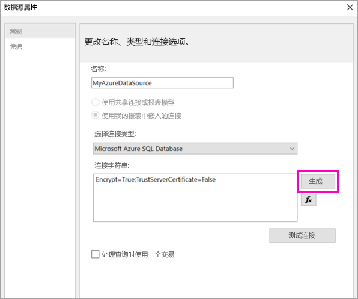

9. 在 Azure 中：返回到 Azure 门户并选择“SQL 数据库”。

1. 在本文的“先决条件”部分的快速入门“在 Azure 门户中创建 Azure SQL 数据库示例”中选择创建的 Azure SQL 数据库。

1. 在“概述”选项卡上，复制“服务器名称”框中的值。

2. 在报表生成器中：在“连接属性”对话框的“服务器名称”下粘贴复制的服务器名称。 

1. 对于“登录到服务器”，请确保选中“使用 SQL Server 身份验证”，然后键入在 Azure 中为示例数据库创建的用户名和密码。

1. 在“连接到数据库”下，选择下拉箭头并选择在 Azure 中创建的数据库名称。
 
    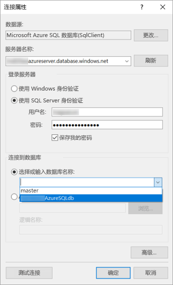

1. 选择“测试连接”。 会看到“测试结果”消息：“测试连接成功”。

1. 选择“确定” > “确定”。 

   现在，在“连接字符串”框中，报表生成器显示刚刚创建的连接字符串。 

    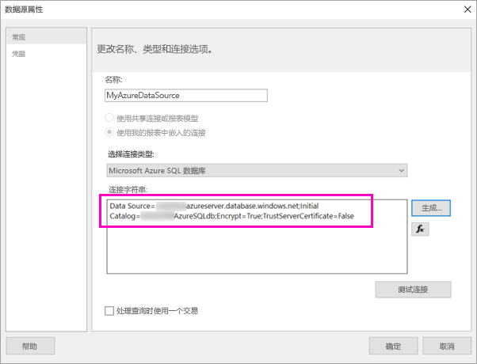

1. 选择**确定**。
  
9. 在“选择与数据源的连接”页中，会在刚刚创建的数据源连接下看到“(在此报表中)”。 选择该数据源 >“下一步”。  

    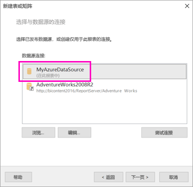

10. 在框中键入相同的用户名和密码。 
  
10. 在“设计查询”页中，依次展开 SalesLT、Tables，然后选择以下表：

    - 地址
    - 客户
    - 产品
    - ProductCategory
    - SalesOrderDetail
    - SalesOrderHeader

     由于选择了“关系” > “自动检测”，因此，报表生成器会检测这些表之间的关系。 
    
    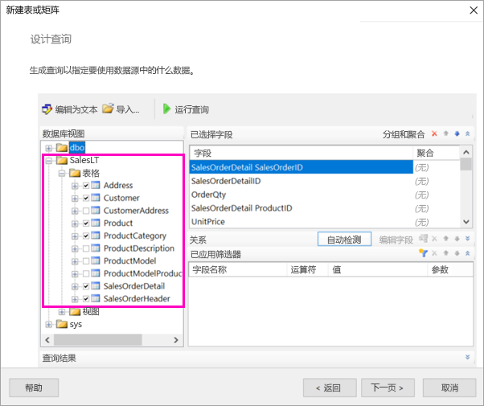
 
1.  选择“运行查询”。 报表生成器显示“查询结果”。 
 
     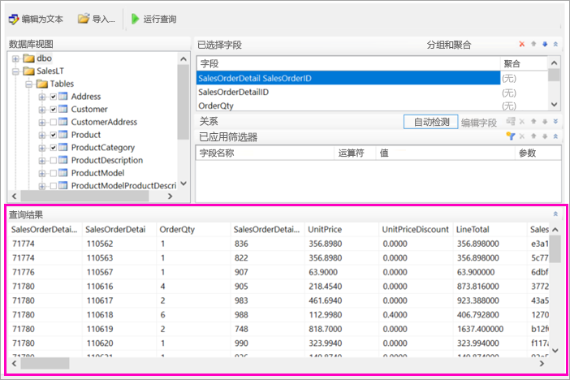

18. 选择**下一步**。 

19. 在“选择数据集”页中，选择刚刚创建的数据集 >“下一步”。

    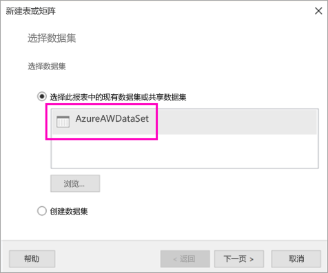

1. 在“排列字段”页中，将这些字段从“可用字段”框拖动到“行组”框：

    - CompanyName
    - SalesOrderNumber
    - Product_Name

1. 将这些字段从“可用字段”框拖动到“值”框：

    - OrderQty
    - 单价
    - LineTotal

    报表生成器自动计算“值”框中字段的总和。

    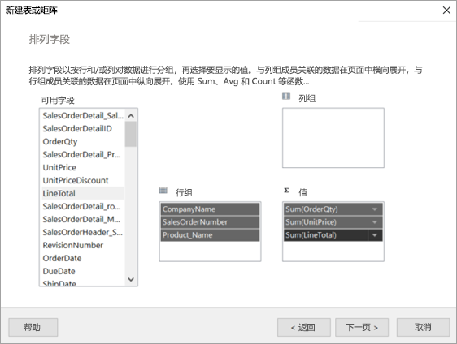

24. 在“选择布局”页中，保留所有默认设置，但清除“展开/折叠组”。 一般情况下，展开/折叠组功能非常强大，但这次希望表包装到多个页。

1. 选择“下一步” > “完成”。 该表显示在设计图面上。
 
## 所创建的内容

让我们停下来看一下向导的结果。

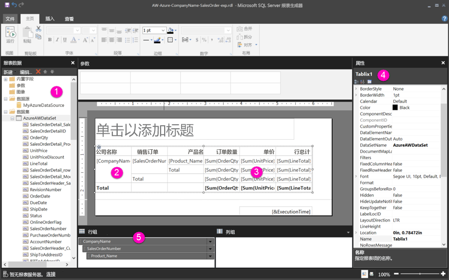

1. 在“报表数据”窗格中，可以看到嵌入的 Azure 数据源以及基于它的嵌入数据集，这两者都是你创建的。 

2. 设计图面约 6 英寸宽。 在设计图面上，可以看到矩阵、显示列标题和占位符值。 矩阵有六列，看起来只有五行高。 

3. 订单数量、单价和行合计都是总和，并且每个行组都有一个小计。 

    但仍看不到实际的数据值。 需要运行报表才能看到它们。

4. 在“属性”窗格中，选定的矩阵称为 Tablix1。 报表生成器中的 tablix 是一个以行和列显示数据的数据区域。 它可以是表，也可以是矩阵。

5. 在“分组”窗格中，你将看到在向导中创建的三个行组： 

    - CompanyName
    - 销售订单
    - 产品名称

    该矩阵不包含任何列组。

### 运行报表

若要查看实际值，需要运行报表。

1. 在“主页”工具栏中选择“运行”。

   现在，你将看到这些值。 矩阵包含的行数比你在“设计”视图中看到的要多得多！ 请注意，报表生成器会显示“第 1 页，共 2页？”。 报表生成器尽可能快地加载报表，因此它一次只能检索几页的足够数据。 问号表示报表生成器尚未加载所有数据。

   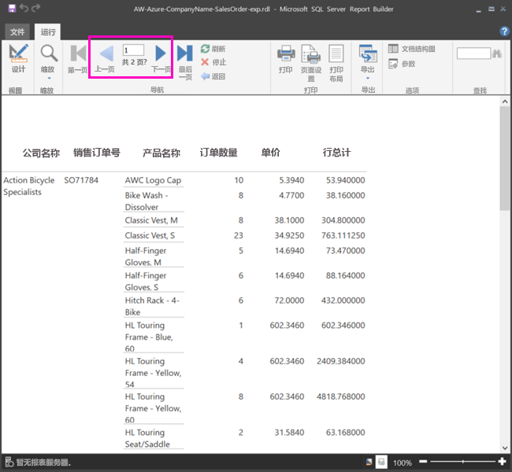

2. 选择“打印布局”。 打印时，报表将采用此格式。 报表生成器现在知道报表有 33 页，并在页脚中自动添加了日期和时间戳。

## 设置报表格式

现在，你有包含一个包装到 33 页的矩阵的报表。 让我们添加一些其他功能并改进报表的外观。 如果你想了解进展如何，可以在每个步骤后运行报表。

- 在功能区的“运行”选项卡上，选择“设计”，以便继续进行修改。  

### 设置页宽

通常，设置分页报表的格式以便适合打印，典型页面为 8 1/2 X 11 英寸。 

1. 拖动标尺以使设计图面宽 7 英寸。 每侧默认边距为 1 英寸，因此侧边距需要更窄。

1. 单击设计图面周围的灰色区域以显示“报表”属性。

    如果未看到“属性”窗格，请单击“视图”选项卡 >“属性”。

2. 展开“边距”并将“左”和“右”从 1 英寸更改为 0.75 英寸。 

    
  
### 添加报表标题  

1. 选择页面顶部的“单击以添加标题”，然后键入“按公司统计的销售量”。  

2. 选择标题文本，然后在“字体”下的“属性”窗格中，将“颜色”更改为“蓝色”。
  
### 添加页码

你会注意到报表的页脚中包含日期和时间戳。 也可以在页脚中添加页码。

1. 在设计图面的底部，会在页脚右侧看到 [&ExecutionTime]。 

2. 在“报表数据”窗格中，展开“内置字段”文件夹。 将“页码”拖动到页脚左侧，与 [&ExecutionTime] 处于同一高度。

3. 拖动 [&PageNumber] 框的右侧使其成为正方形。

4. 在“插入”选项卡上，选择“文本框”。

5. 单击 [&PageNumber] 的右侧，键入“of”，然后使文本框成为正方形。

6. 将“总页数”拖动到“of”右侧的页脚中，然后拖动其右侧也使其成为正方形。

    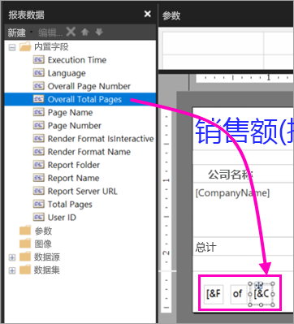

### 使表更宽  

现在，可以使矩阵足够宽以填充页面的宽度，并使文本列更宽，以便名称不会滚动太多。 
 
1. 选择矩阵，然后选择“公司名称”列。

3. 将鼠标悬停在“公司名称”列右边缘矩阵顶部的灰色栏上。 向右拖动，直到列在 1 3/8 英寸处结束。 

    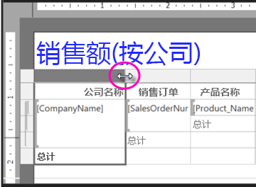

4. 拖动“产品名称”的右边缘，直到列在 3 3/4 英寸处结束。   

现在矩阵几乎和打印区域一样宽。

### 设置货币格式

你可能在运行报表时注意到，尚未将美元金额设置为货币格式。

1. 选择左上角的 [Sum(OrderQty)] 单元格，按住 Shift 键，然后选择右下角 [Sum(LineTotal)] 单元格。

    

2. 在“主页”选项卡上，选择美元符号 ($) 货币符号，然后选择“占位符样式” > “示例值”旁边的箭头。
 
    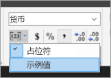

    现在，可以看到将这些值设置为货币格式。

    

### 在每个页上添加列标题

在将报表发布到 Power BI 服务之前，还需要进行一次格式设置方面的改进：使列标题显示在报表的每个页上。

1. 在“分组”窗格顶部栏的最右端，选择下拉箭头 >“高级模式”。

    

2. 选择“行组”中的顶部“静态”栏。 将看到矩阵中的“公司名称”单元格已被选中。

   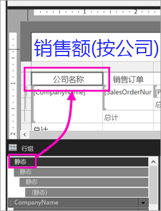

3. 在“属性”窗格中，会看到“Tablix 成员”的属性。 将“KeepWithGroup”设置为“After”，并将“RepeatOnNewPage”设置为“True”。

    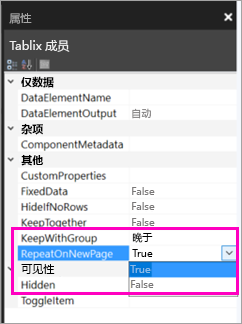

    现在是运行报表并查看其外观的时候了。

5. 选择“主页”选项卡上的“运行”。

6. 选择“打印布局”（如果尚未选择）。 现在，报表有 29 页。 滚动几页。 会看到已设置货币格式，列在每个页面上都有标题，并且报表每个页面的页脚上都有页码、日期和时间戳。
 
    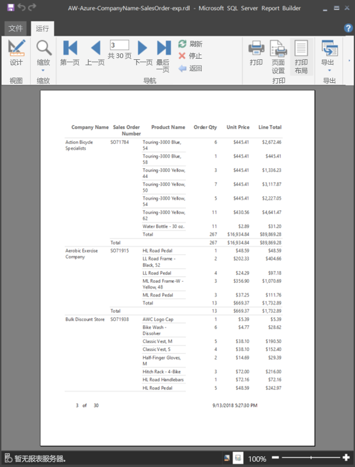

7. 将报表保存到计算机。
 
##  将报表上传到服务

既然已经创建了这个分页报表，现在是时候将它上传到 Power BI 服务了。

1. 在 Power BI 服务中（左侧导航中的 http://app.powerbi.com)，选择“工作区” > “创建应用工作区”。

2. 将工作区命名为“Azure AW”或其他唯一名称。 现在，你是唯一的成员。 

3. 选择“高级”旁边的箭头，然后启用“专用容量”。 

    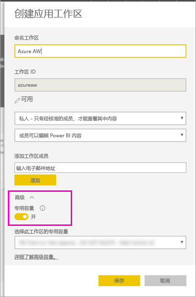

    如果无法启用，则需要让 Power BI 管理员授予你将工作区添加到专用高级容量的权限。

4. 如有必要，请为此工作区选择可用的专用容量，然后选择“保存”。
    
    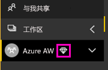

    如果工作区不处于高级容量，当你尝试上传报表时，会看到消息：“无法上传分页报表”。 请与 Power BI 管理员联系以移动工作区。

1. 在新工作区中，选择“获取数据”。

2. 在“文件”框中，选择“获取”。

3. 选择“本地文件”，导航至保存文件的位置，然后选择“打开”。

   Power BI 导入文件，你可以在应用列表页的“报表”下看到该文件。

    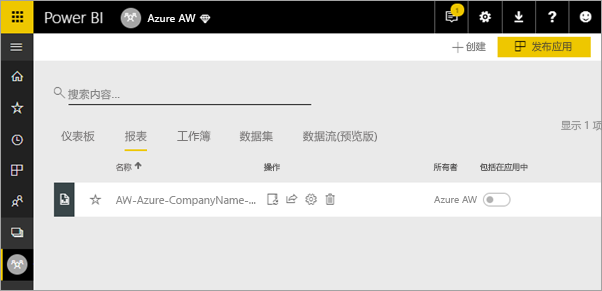

4. 选中报表以进行查看。

5. 如果出现错误，则可能需要重新输入凭据。 选择“管理”图标。

    

6. 选择“编辑凭据”，然后输入在创建 Azure 数据库时在 Azure 中使用的凭据。

    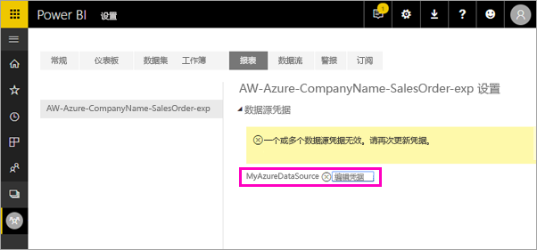

7. 现在，可以在 Power BI 服务中查看分页报表。

    

## 后续步骤

[Power BI Premium 中的分页报表是什么？（预览）](paginated-reports-report-builder-power-bi.md)

