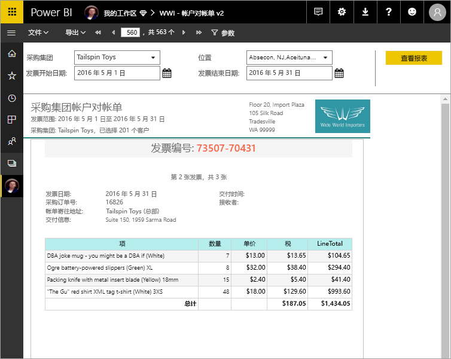

# Power BI Premium 中的分页报表是什么？ （预览）
长期以来，分页报表一直是 SQL Server Reporting Services 中的标准报表格式，现在可在 Power BI 服务中使用。 可以打印或共享这些报表。 它们被称为“分页”，因为它们已进行了格式化，以适应页面。 即使某个表跨多个页，分页报表也能显示表中的所有数据。 它们有时被称为“像素完美”，因为用户可以准确地控制其报表页面布局。 分页报表基于 SQL Server Reporting Services 中的 RDL 报表技术。 报表生成器是用于创作分页报表的独立工具。 

分页报表可以有很多页。 例如，此报表有 563 页。 每页都采用精准布局，每个发票占一页，重复页眉和页脚。

可以在报表生成器中预览报表，然后将报表发布到 Power BI 服务： http://app.powerbi.com。 需要具有 Power BI Pro 许可证才能将报表发布到服务。 只要工作区处于 Power BI 高级容量中，就可以在“我的工作区”或应用工作区中发布和共享分页报表。 另外，Power BI 管理员需要在 Power BI 管理门户中启用分页报表。 详细了解如何[配置工作负载](service-admin-premium-manage.md#configure-workloads)。 

## 在报表生成器中创建报表

分页报表具有其自己的设计工具，即报表生成器。 它与用于为 Power BI 报表服务器或SQL Server Reporting Services (SSRS) 创建分页报表的工具相同且版本也相同。 实际上，为 SSRS 2016 和 2017 或为本地 Power BI 报表服务器创建的分页报表与 Power BI 服务兼容。 Power BI 服务保持向后兼容性，因此，用户可以向前移动报表，并且可以升级任何旧版分页报表。 在发布时，并非所有报表功能都可用。 有关详细信息，请参阅本文中的[限制和注意事项](#limitations-and-considerations)。
     
## 来自各种数据源的报表

一个分页报表可能包含许多不同的数据源。 与 Power BI 报表不同的是，它没有基础数据模型。 对于 Power BI 服务中分页报表的初始发布，可以在报表本身创建嵌入数据源和数据集。 尚无法使用共享数据源或共享数据集。 可以在本地计算机上的报表生成器中创建报表。 如果报表连接到本地数据，则在将报表上传到 Power BI 服务后，需要创建网关并重定向数据连接。 对于初始版本，以下是可以连接到的数据源：

- Azure SQL 数据库和数据仓库
- 通过网关连接的 SQL Server
- 通过网关连接的 SQL Server Analysis Services
 
预览期间将会出现更多数据源。

## 设计报表  

### 创建具有矩阵、图表和自由格式布局的分页报表

表格报表非常适用于基于列的数据。 矩阵报表（如交叉表或数据透视表报表）适用于汇总数据。 图表报表以图形格式显示数据，自由格式列表报表几乎可以显示任何其他内容，例如发票。 
  
可以从其中一个报表生成器向导开始操作。 表、矩阵和图表向导将引导用户创建嵌入数据源连接和嵌入数据集。 然后拖放字段以创建数据集查询，选择布局和样式，以及自定义报表。  
  
使用“地图”向导，可以创建根据地理或几何背景显示聚合数据的报表。 地图数据可能是来自 Transact-SQL 查询或美国环境系统研究所公司(ESRI) 形状文件的空间数据。 除此之外，还可以添加 Microsoft 必应地图图块背景。  

### 向报表添加更多内容

通过筛选、分组数据和对数据排序，或通过添加公式或表达式来修改数据。 添加图表、仪表、迷你图和指示器，以可视化格式汇总数据。  使用参数和筛选器筛选自定义视图的数据。 嵌入或引用图像和其他资源，包括外部内容。  

分页报表中的所有内容（包括从报表本身到每个文本框、图像、表格和图表）都有一系列属性，用户可以设置这些属性，使报表看起来完全符合自己的要求。

## 创建报表定义

在设计分页报表时，实际上要创建报表定义。 它不包含数据。 它指定获取数据的位置、要获取的数据以及如何显示数据。 运行报表时，报表处理器将获取用户指定的报表定义、检索数据，并将其与报表布局组合以生成报表。 可以将报表定义上传到 Power BI 服务： http://app.powerbi.com，以上传到“我的工作区”或与同事共享的工作区中。 如果报表数据源位于本地环境中，则在上传报表后，可以将数据源连接重定向到网关。 

## 查看分页报表
可以通过浏览器在 Power BI 服务中查看分页报表，也可以在 Power BI 移动应用中查看。 在 Power BI 服务中，可以将报表导出为多种格式，例如 HTML、MHTML、PDF、XML、CSV、TIFF、Word 和 Excel。 还可以与其他人共享它。  
  
## 限制和注意事项

以下是初始版本中不支持的一些其他功能：

- 将报表页或视觉对象固定到 Power BI 仪表板。 用户仍可以从 Power BI 报表服务器或 Reporting Services 报表服务器上的本地分页报表将可视化效果固定到 Power BI 仪表板。 有关详细信息，请参阅[将 Reporting Services 项目固定到 Power BI 仪表板](https://docs.microsoft.com/sql/reporting-services/pin-reporting-services-items-to-power-bi-dashboards)。
- 交互功能，如文档映射和显示/隐藏按钮。
- 子报表和钻取报表。
- 订阅。
- 共享数据源和共享数据集。
- Power BI 数据集。
- Power BI 报表中的视觉对象。
- 应用中的分页报表。 可以从应用工作区共享分页报表，但无法在从该工作区发布应用时将其包含在内。
 
## 后续步骤

- [安装 Microsoft 下载中心的报表生成器](http://go.microsoft.com/fwlink/?LinkID=734968)
- [教程：创建分页报表](paginated-reports-quickstart-aw.md)
- [直接在分页报表中输入数据](paginated-reports-enter-data.md)

  

