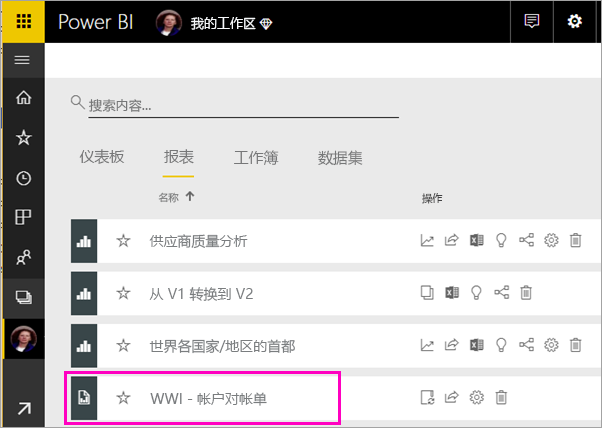
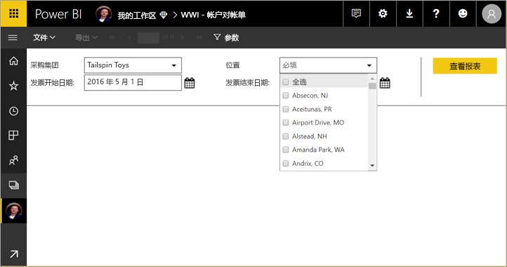
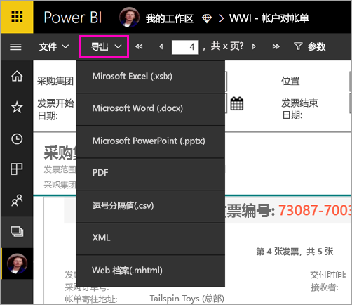

# 在 Power BI 服务中查看分页报表（预览）

本文介绍在 Power BI 服务中查看分页报表的方法。 分页报表是在报表生成器中创建并上传到高级容量中的任何工作区的报表。 请查找工作区名称旁边的钻石型图标  。 

分页报表具有自己的图标， 。

另外还可以将分页报表导出为多种格式： 

- Microsoft Excel
- Microsoft Word
- Microsoft PowerPoint
- PDF
- 逗号分隔的值
- XML
- Web 档案 (.mhtml)

## 查看分页报表

1. 选择工作区中的分页报表。

    

2. 如果报表具有参数（如本报表所示），则在首次打开时可能看不到该报表。 选择参数，然后选择“查看报表”。 

     

    可以随时更改参数。

1. 通过选择页面顶部的箭头或在框中键入页码来翻页浏览报表。
    
   

4. 选择“导出”，查找导出分页报表的格式。

    

## 后续步骤

[Power BI Premium 中的分页报表是什么？（预览）](paginated-reports-report-builder-power-bi.md)
