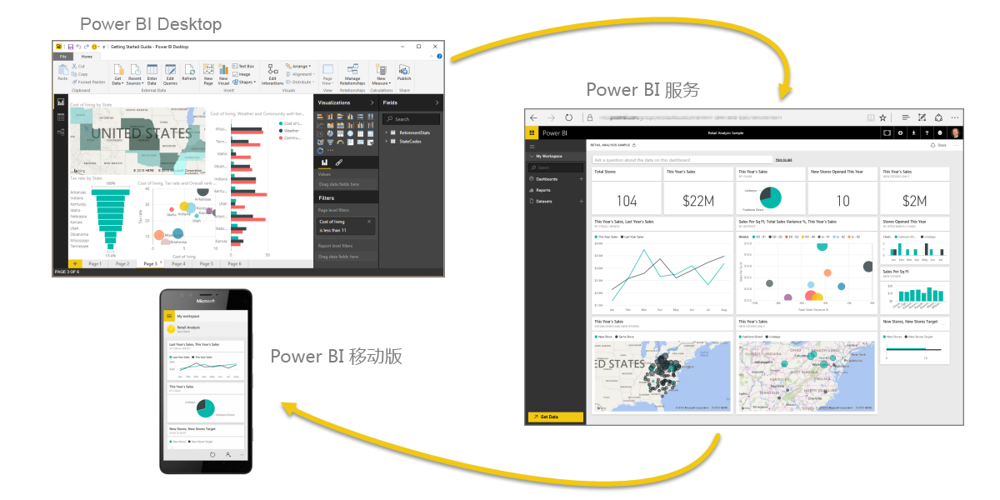
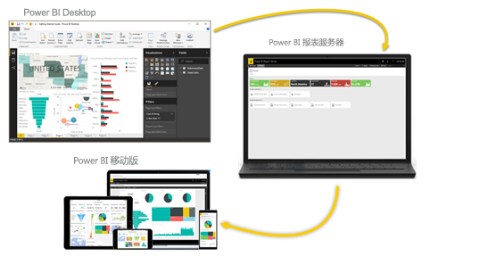

# 什么是 Power BI？
**Power BI** 是软件服务、应用和连接器的集合，它们协同工作以将相关数据来源转换为连贯的视觉逼真的交互式见解。 无论你的数据是简单的 Excel 电子表格，还是基于云和本地混合数据仓库的集合，**Power BI** 都可让你轻松地连接到数据源，直观看到（或发现）重要内容，与任何所希望的人进行共享。

**Power BI** 简单且快速，能够从 Excel 电子表格或本地数据库创建快速见解。 同时 **Power BI** 也是可靠的、企业级的，可进行丰富的建模和实时分析，及自定义开发。 因此它既是你的个人报表和可视化工具，还可用作组项目、部门或整个企业背后的分析和决策引擎。

## Power BI 的组成部分
Power BI 包含 Windows 桌面应用程序（称为 **Power BI Desktop**）、联机 SaaS（软件即服务）服务（称为 **Power BI 服务**），及移动 Power BI **应用**（可在 Windows 手机和平板电脑及 iOS 和 Android 设备上使用）。

这三个元素 - **Desktop**、**服务**和**移动**，旨在使用户通过最有效的方式创建、共享和使用商业见解。

## Power BI 如何与你的角色匹配
使用 Power BI 的方式取决于你在项目中的角色或你所在的团队。 不同角色的人们可能以不同方式使用 Power BI，这很正常。

例如，你可能主要使用 **Power BI 服务**，但处理数字、生成业务报表的同事可能主要使用 **Power BI Desktop**（并将 Desktop 报表发布到 Power BI 服务，然后你可查看）。 而另一个负责销售的同事可能主要使用 Power BI 手机应用，监视销售配额的进度，深入了解新的潜在销售顾客详细信息。

如果你是开发人员，可以使用 Power BI API 将数据推送到数据集或将仪表板和报表嵌入到你自己的自定义应用程序。 有关于新视觉对象的意见或建议？ 自行生成并与他人共享。  

还可能会在不同时间使用 **Power BI** 的每个元素，具体取决于给定项目或工作中尝试实现的目标或你的角色。

也许你在服务的实时仪表板中查看库存和生产进度，也使用 **Power BI Desktop** 来为自己团队创建有关客户参与统计信息的报表。 如何使用 Power BI 基于哪项 Power BI 功能或服务是适用于所处情景的最佳工具，但是 Power BI 的每个部分都会提供给你，因此它非常灵活、令人无法抗拒。

若要浏览与你的角色相关的文档：
- 面向[***设计人员***](desktop-what-is-desktop.md)的 Power BI
- 面向[***使用者***](consumer/end-user-consumer.md)的 Power BI
- 面向[***开发人员***](developer/what-can-you-do.md)的 Power BI
- 面向[***管理员***](service-admin-administering-power-bi-in-your-organization.md)的 Power BI

## Power BI 中的工作流
通过连接到数据源并在 Power BI Desktop 中生成报表，Power BI 中的常见工作流将开始。 然后，报表会从“Desktop”发送到“Power BI 服务”并共享，以便“服务”和“移动版”中的用户可以使用（查看并与其交互）报表。
有时，你可能想要为同事提供类似于你自己的权限（“创建者”权限），以便他们可以使用“服务”来编辑报表、创建仪表板，同时共享其工作。

它不总是以这种方式发生，尽管这是一个更为常见的工作流，而且会显示三个主要的 Power BI 元素如何相互补充。

但是，如果你准备好移动到云，并且希望将报表保留在企业防火墙后，那该怎么做？  请继续阅读。

## 使用 Power BI 报表服务器进行本地报告
使用 Power BI 报表服务器提供的各种现成工具和服务在本地创建、部署和管理 Power BI 报表、移动报表和分页报表。

Power BI 报表服务器是在防火墙后部署的一种解决方案，然后以不同方式将报表交付给正确用户，无论是在 Web 浏览器、移动设备还是在电子邮件中查看它们。 Power BI 报表服务器与云中的 Power BI 兼容，因此可以在就绪时转到云。

## 后续步骤
[登录、获取数据并以自己的方式了解 Power BI 服务](service-the-new-power-bi-experience.md)   
[教程：Power BI 服务入门](service-get-started.md)
