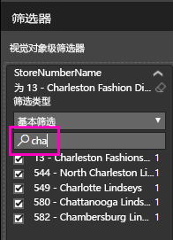
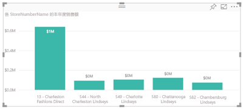
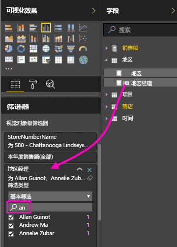
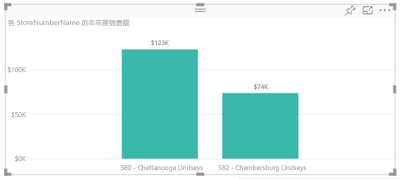

# 在“编辑”视图中向报表添加筛选器

本文介绍了如何向 Power BI 中的报表添加页面级筛选器、可视化效果级筛选器、报表级筛选器或钻取级筛选器。 本文展示了 Power BI 服务中的示例。 具体步骤与在 Power BI Desktop 中添加筛选器几乎完全相同。

**你知道吗？** Power BI 提供新的筛选器体验，当前处于预览状态。 阅读有关 [Power BI 报表中的新筛选器体验](power-bi-report-filter-preview.md)的详细信息。

## 编辑视图或阅读视图中的筛选器
可以在下列两个不同的视图中与报表进行交互：阅读视图和编辑视图。 筛选功能是否可用取决于所处的视图。 阅读所有[有关 Power BI 报表中筛选器和突出显示](power-bi-reports-filters-and-highlighting.md)的详细信息。

本文介绍了如何在报表的编辑视图中创建筛选器。  若要详细了解阅读视图中的筛选器，请参阅[在报表的阅读视图中与筛选器交互](consumer/end-user-reading-view.md)。

## “筛选器”窗格中的筛选器类型
不管使用 Desktop 还是 Power BI 服务，“筛选器”窗格都显示在报表画布的右侧。 如果未看到“筛选器”窗格，请选择右上角的“>”图标将其展开。

筛选器有以下四种类型：页面级筛选器、视觉对象级筛选器、钻取级筛选器和报表级筛选器。

筛选器具有持久性，即当你离开报表时，Power BI 会保留你对筛选器、切片器和其他数据视图所做的更改。 因此，在返回报表时，可以从上次停下的地方继续。 如果不要保留筛选器更改，请选择顶部菜单栏中的“重置为默认值”。

## 向视觉对象添加筛选器
可使用两种不同的方法，向特定视觉对象添加筛选器（亦称为“视觉对象级筛选器”）。 

* 筛选已由可视化效果使用的字段。
* 标识可视化效果尚未使用的字段，并将此字段直接添加到“视觉对象级筛选器”桶中。

顺便提一下，此过程使用的是“零售分析”示例；如果愿意，可下载示例并跟着一起操作。 下载[“零售分析”示例](sample-retail-analysis.md)。

### 筛选视觉对象中的字段

1. [在编辑视图中打开报表](service-the-report-editor-take-a-tour.md)。
   
   
2. 打开“可视化效果和筛选器”窗格和“字段”窗格（如果尚未打开）。
   
   
3. 选择视觉对象，将其激活。 视觉对象使用的所有字段既在“字段”窗格中列出，也在“筛选器”窗格中列出（在“视觉对象级筛选器”标题下方）。
   
   
4. 此时将向可视化效果已在使用的字段添加筛选器。 
   
    向下滚动到“**视觉对象级筛选器**”区域，然后选择箭头以展开要筛选的字段。 此示例将筛选“StoreNumberName”。
     
     
    
    设置“基本”、“高级”或“前 N 个”筛选控件。 此示例将在“基本”筛选中搜索“cha”，并选择这五个存储。
     
     
   
    视觉对象会随新的筛选器而变化。 如果你将此筛选器与报表一起保存，报表读者会看到首先要筛选的视觉对象，并能在阅读视图中通过选择或清除值与筛选器进行交互。
     
    

### 使用视觉对象中没有的字段进行筛选

接下来，将新字段作为视觉对象级筛选器添加到可视化效果中。
   
1. 在“字段”窗格中，选择要添加为新视觉对象级筛选器的字段，再将它拖到“视觉对象级筛选器”区域中。  在此示例中，将把“区域经理”拖到“视觉对象级筛选器”桶中，搜索“an”并选择这三个经理。 
     
    

    请注意，“区域经理”未添加到可视化效果本身。 可视化效果仍由轴“StoreNumberName”和值“本年度销售额”组成。  
     
    

    此外，现在已将可视化效果本身筛选为，仅显示这些经理本年度在指定商店的销售额。
     
    

    如果你将此筛选器与报表一起保存，报表读者便能在阅读视图中通过选择或清除值与“区域经理”筛选器进行交互。

## 向整个页面添加筛选器

还可以向整个页面添加筛选器（页面视图级筛选器）
1. [在编辑视图中打开报表](service-the-report-editor-take-a-tour.md)。
2. 打开“可视化效果和筛选器”窗格和“字段”窗格（如果尚未打开）。
3. 在“字段”窗格中，选择要添加为新页面级筛选器的字段，再将它拖到“页面级筛选器”区域中。  
4. 选择要筛选的值，并设置“基本”或“高级”筛选控件。
   
   在此筛选器的影响下，将重新绘制页面上的所有可视化效果以反映更改。 
   
   

    如果你将此筛选器与报表一起保存，报表读者便能在阅读视图中通过选择或清除值与筛选器进行交互。

## 添加钻取筛选器
通过在 Power BI 服务和 Power BI Desktop 中使用钻取，可以创建一个侧重于特定实体（如供应商、客户或制造商）的目标报表页。 现在，从其他报表页中，用户可以右键单击该实体的数据点并钻取到已设定焦点的页。

### 创建钻取筛选器
若要执行此操作，请在编辑视图中打开客户盈利率示例。 我们假设你需要一个侧重于管理层业务领域的页。   

1. 向报表中添加一个新页，并将其命名为“管理人员团队”。 该页将是钻取目标。
2. 添加可跟踪团队管理层业务领域的关键指标的可视化效果。    
3. 将“管理人员”>“管理人员名称”添加到钻取筛选器。    
   
    
   
    请注意，Power BI 向报表页添加了一个后退箭头。  选择后退箭头可使用户返回到初始报表页，即他们选择进行钻取时所在的页。 后退箭头仅在阅读视图中可用。
   
     

### 使用钻取筛选器
让我们来看看钻取筛选器的工作原理。

1. 从“团队记分卡”报表页开始操作。    
2. 假设你是 Andrew Ma，并且你希望看到管理人员团队报表页仅筛选出你的数据。  从左上角区域图表中，右键单击任意绿色数据点打开钻取菜单选项。
   
    
3. 选择“钻取”>“管理人员团队”钻取到名为“管理人员团队”的报表页。 在你是 Andrew Ma 的情况下，对该页进行筛选以显示有关右键单击的数据点的相关信息。 只有“钻取筛选器”框中的字段才会被传递到钻取报表页。  
   
    

## 向整个报表添加筛选器（又称报表筛选器）
1. [在编辑视图中打开报表](service-the-report-editor-take-a-tour.md)。
2. 打开“可视化效果和筛选器”窗格和“字段”窗格（如果尚未打开）。
3. 在“字段”窗格中，选择要添加为新报表级筛选器的字段，再将它拖到“报表级筛选器”区域中。  
4. 选择要筛选的值。

    活动页面上的视觉对象与报表中所有页面上的视觉对象都会随新的筛选器而变化。 如果你将此筛选器与报表一起保存，报表读者便能在阅读视图中通过选择或清除值与筛选器进行交互。

1. 选择后退箭头返回到上一个报表页。

## 注意事项和疑难解答

- 在某些情况下，视觉对象级筛选器与页面级筛选器可能会返回不同的结果。  例如，在你添加视觉对象级筛选器后，Power BI 会筛选聚合结果。  默认聚合为“求和”，不过你也可以[更改聚合类型](service-aggregates.md)。  

    然后，在你添加页面级筛选器后，Power BI 会筛选非聚合结果。  它不会聚合，因为页面可能有多个视觉对象，而且每个视觉对象可能使用不同的聚合类型。  因此，该筛选器会应用于每个数据行。

- 如果未看到“字段”窗格，请确保你处于报表[编辑视图](service-interact-with-a-report-in-editing-view.md)中    
- 如果对筛选器进行了大量更改，而希望返回报表作者的默认设置，请选择顶部菜单栏中的“重置为默认值”。

## 后续步骤
[导览报表的“筛选器”窗格](consumer/end-user-report-filter.md)

[报表中的筛选器和突出显示](power-bi-reports-filters-and-highlighting.md)

[在报表的阅读视图中与筛选器和突出显示功能进行交互](consumer/end-user-reading-view.md)

[更改报表视觉对象相互交叉筛选和交叉突出显示的方式](consumer/end-user-interactions.md)

更多问题？ [尝试参与 Power BI 社区](http://community.powerbi.com/)

