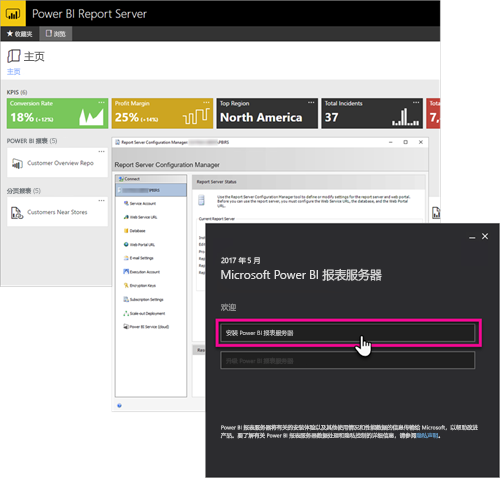

# 开发者手册概述：Power BI 报表服务器

欢迎阅读 Power BI 报表服务器的开发者手册。Power BI 报表服务器是用于存储和管理 Power BI 报表、移动报表和分页报表的本地位置。

本手册重点介绍开发者可以使用的 Power BI 报表服务器选项。

## 嵌入

对于 Power BI 报表服务器中的任何报表，都可以将查询字符串参数 `?rs:Embed=true` 添加到 URL 中，从而将报表嵌入 iFrame 内。 此方法适用于 Power BI 报表以及其他任何类型报表。

### 报告查看器控件

对于分页报表，可以利用报表查看器控件。 使用它，可以将此控件嵌入 .NET Windows 或 Web 应用中。 有关详细信息，请参阅[报表查看器控件入门](https://docs.microsoft.com/sql/reporting-services/application-integration/integrating-reporting-services-using-reportviewer-controls-get-started)。

## API

可以通过多个 API 选项与 Power BI 报表服务器进行交互。 此方法包括以下内容。

* [REST API](rest-api.md)
* [URL 访问](https://docs.microsoft.com/sql/reporting-services/url-access-ssrs)
* [WMI 提供程序](https://docs.microsoft.com/sql/reporting-services/wmi-provider-library-reference/reporting-services-wmi-provider-library-reference-ssrs)

还可以使用开放源代码 [PowerShell 实用工具](https://github.com/Microsoft/ReportingServicesTools)来管理报表服务器。

> [!NOTE]
> PowerShell 实用工具暂不支持 Power BI Desktop 文件 (.pbix)。

## 自定义扩展插件

扩展插件库是 Power BI 报表服务器中包含的一组类、接口和值类型。 此库提供对系统功能的访问权限，在此基础之上可以使用 Microsoft.NET Framework 应用来扩展 Power BI 报表服务器组件。

可以生成以下几种类型的扩展插件。

* 数据处理扩展插件
* 传递扩展插件
* 分页报表的呈现扩展插件
* 安全扩展插件

若要了解详细信息，请参阅[扩展插件库](https://docs.microsoft.com/sql/reporting-services/extensions/reporting-services-extension-library)。

## 后续步骤

[报表查看器控件入门](https://docs.microsoft.com/sql/reporting-services/application-integration/integrating-reporting-services-using-reportviewer-controls-get-started)  
[使用 Web 服务和 .NET Framework 生成应用](https://docs.microsoft.com/sql/reporting-services/report-server-web-service/net-framework/building-applications-using-the-web-service-and-the-net-framework)  
[URL 访问](https://docs.microsoft.com/sql/reporting-services/url-access-ssrs)  
[扩展插件库](https://docs.microsoft.com/sql/reporting-services/extensions/reporting-services-extension-library)  
[WMI 提供程序](https://docs.microsoft.com/sql/reporting-services/wmi-provider-library-reference/reporting-services-wmi-provider-library-reference-ssrs)

更多问题？ [尝试咨询 Power BI 社区](https://community.powerbi.com/)