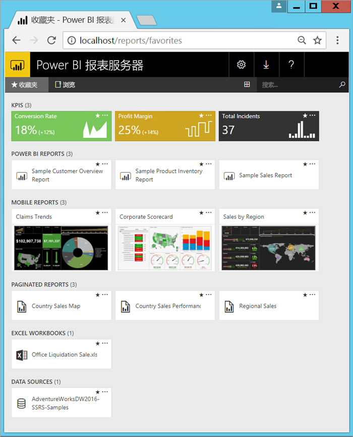

# 什么是 Power BI 报表服务器？

Power BI 报表服务器是一个本地报表服务器，其中包含可显示和管理报表和 KPI 的 Web 门户，以及用于创建 Power BI 报表、分页报表、移动报表和 KPI 的工具。 用户可以采用不同的方式访问这些报表：在 Web 浏览器、移动设备或在收件箱中以电子邮件的形式查看报表。

## 比较 Power BI 报表服务器 
Power BI 报表服务器类似于 SQL Server Reporting Services 和 Power BI 联机服务，但采用不同的方式。 像 Power BI 服务一样，Power BI 报表服务器可托管 Power BI 报表 (.PBIX) 和 Excel 文件。 像 Reporting Services 一样，Power BI 报表服务器是本地服务器，可托管分页报表 (.RDL)。 Power BI 报表服务器是 Reporting Services 的超集：可以使用 Power BI 报表服务器等执行 Reporting Services 中可以执行的所有操作，还包括对 Power BI 报表的支持。 有关详细信息，请参阅[比较 Power BI 报表服务器和 Power BI 服务](compare-report-server-service.md)。

## 授权 Power BI 报表服务器
可以通过以下两个不同许可证来访问 Power BI 报表服务器：带软件保障的 [Power BI Premium](../service-premium.md) 和 [SQL Server Enterprise Edition](https://www.microsoft.com/sql-server/sql-server-2017-editions)。 使用 Power BI Premium 许可证可以创建混合云和本地的混合部署。  

> [!NOTE]
> 对于 Power BI Premium，Power BI 报表服务器仅包含在 P SKU 中。 它不包含在 EM SKU 中。

## Web 门户
Power BI 报表服务器的入口点是可以在任意新式浏览器中查看的安全 Web 门户。 可以在此处访问所有报表和 KPI。 Web 门户上的内容在传统的文件夹层次结构中进行分类。 在你的文件夹中，内容按以下类型进行分组：Power BI 报表、移动报表、分页报表、KPI 和 Excel 工作簿，以及用作报表构建基块的共享数据集和共享数据源。 可以标记收藏夹以在单个文件夹中查看这些内容。 此外，还可以直接在 Web 门户中创建 KPI。 

根据你的权限，可以在 Web 门户中管理内容。 可以安排报表处理、按需访问报表，并订阅已发布报表。 还可以向 Web 门户应用自己的自定义[品牌](https://docs.microsoft.com/sql/reporting-services/branding-the-web-portal)。 

有关 [Power BI 报表服务器 Web 门户](https://docs.microsoft.com/sql/reporting-services/web-portal-ssrs-native-mode)的详细信息。

## Power BI 报表
使用更适合报表服务器的 Power BI Desktop 版本创建 Power BI 报表 (.PBIX)。 然后将其发布到自己环境的 Web 门户中并在其中查看这些报表。

Power BI 报表是数据模型的多角度视图，使用可视化效果表示数据模型的各种结果和见解。  报表可包含单个可视化效果，也可包含充满可视化效果的多个页面。 根据你的角色，可以读取和浏览报表，也可以为其他人创建报表。

安装[更适合 Power BI 报表服务器的 Power BI Desktop](quickstart-create-powerbi-report.md)。

## 分页报表
分页报表 (.RDL) 是具有可视化效果的文档样式报表，表格在其中从横向和纵向展开，以便根据需要逐页显示其所有数据。 这非常适合生成更适合打印的布局固定且像素效果完美的文档，如 PDF 和 Word 文件。

可以使用 [SQL Server Data Tools (SSDT)](https://docs.microsoft.com/sql/reporting-services/tools/reporting-services-in-sql-server-data-tools-ssdt) 中的[报表生成器](https://docs.microsoft.com/sql/reporting-services/report-builder/report-builder-in-sql-server-2016)或报表设计器来创建新式报表。

## Reporting Services 移动报表
移动报表连接到本地数据，并且具有可适应不同的设备以及不同的屏幕方向的响应式布局。 使用 SQL Server 移动报表发布服务器创建这些报表。

有关 [Reporting Services 移动报表](https://docs.microsoft.com/sql/reporting-services/mobile-reports/create-mobile-reports-with-sql-server-mobile-report-publisher)的详细信息。 

## 报表服务器编程功能
利用 Power BI 报表服务器编程功能，可以使用 API 在自定义应用中集成或扩展数据和报表处理，从而扩展和自定义报表功能。

详细阅读[报表服务器开发者文档](https://docs.microsoft.com/sql/reporting-services/reporting-services-developer-documentation)。

## 后续步骤
[安装 Power BI 报表服务器](install-report-server.md)  
[下载报表生成器](https://www.microsoft.com/download/details.aspx?id=53613)  

更多问题？ [尝试咨询 Power BI 社区](https://community.powerbi.com/)

