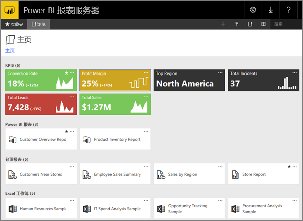
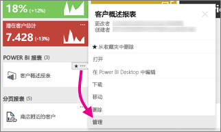
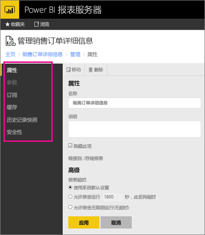

# 管理 Web 门户中的内容 
Power BI 报表服务器 Web 门户是用于查看、存储和管理 Power BI 报表、移动报表和分页报表以及 KPI 的本地位置。

可以在任意新式浏览器中查看 Web 门户。 在 Web 门户中，可以将报表和 KPI 整理到文件夹中，并将它们标记为收藏项。 此外，还可以在门户上存储 Excel 工作簿。 在 Web 门户中，可以启动创建报表所需的工具：

* 使用 Power BI Desktop 创建的 Power BI 报表：可以在 Web 门户和 Power BI 移动应用中查看此类报表。
* 在报表生成器中创建的分页报表：更适合打印的布局固定的新式文档。
* 直接在 Web 门户中创建了 **KPI**。

在 Web 门户中，可以浏览报表服务器文件夹，也可以搜索特定报表。 可以查看报表及其常规属性，以及在报表历史记录中捕获的报表过往副本。 还可以订阅报表，将其传送到电子邮件收件箱或文件系统上的共享文件夹，具体视权限而定。

## Web 门户角色和权限
Web 门户应用程序在浏览器中运行。 启动 Web 门户后看到的具体页面、链接和选项视你在报表服务器中的权限而定。 如果你分配到的角色拥有全部权限，则有权使用一整套应用菜单和页面来管理报表服务器。 如果你分配到的角色拥有报表查看和生成权限，则只能看到执行这些活动所需的菜单和页面。 可以在不同的报表服务器上分配到不同的角色，甚至可以针对一个报表服务器上的不同报表和文件夹分配到不同的角色。

## 启动 Web 门户
1. 打开 Web 浏览器。
   
    请参阅[支持的 Web 浏览器和版本](browser-support.md)列表。
2. 在地址栏中，键入 Web 门户 URL。
   
    默认情况下，URL 为 <em>http://[ComputerName]/reports</em>。
   
    可以将报表服务器配置为使用特定端口。 例如， <em>http://[ComputerName]:80/reports</em> 或 <em>http://[ComputerName]:8080/reports</em>
   
    Web 门户按照以下类别进行项目分类：
   
   * KPI
   * 移动报表
   * 分页报表
   * Power BI Desktop 报表
   * Excel 工作簿
   * 数据集
   * 数据源
   * 资源

## 管理 Web 门户中的项目
Power BI 报表服务器允许对 Web 门户中存储的项目进行精细化控制。 例如，可以对各个分页报表设置订阅、缓存、快照和安全保护措施。

1. 依次选择项目右上角的省略号（“...”）和“管理”。
   
    
2. 选择要设置的属性或其他功能。
   
    
3. 选择**应用**。

详细了解如何[在 Web 门户中处理订阅](https://docs.microsoft.com/sql/reporting-services/working-with-subscriptions-web-portal)。

## 后续步骤
[什么是 Power BI 报表服务器？](get-started.md)

更多问题？ [尝试咨询 Power BI 社区](https://community.powerbi.com/)

