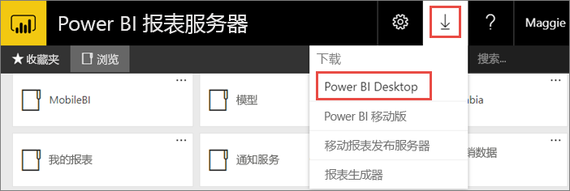
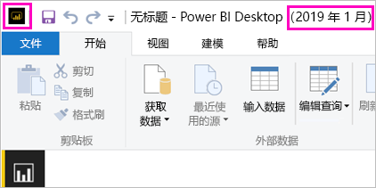
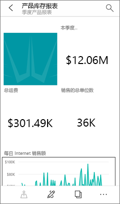

# 安装更适合 Power BI 报表服务器的 Power BI Desktop
了解如何安装更适合 Power BI 报表服务器的 Power BI Desktop。

若要为 Power BI 报表服务器创建 Power BI 报表，需要下载并安装已针对 Power BI 报表服务器进行优化的 Power BI Desktop。 此版本不同于用于 Power BI 服务的 Power BI Desktop。 例如，用于 Power BI 服务的 Power BI Desktop 版本包含预览版功能，而这些功能在发布后才包含在 Power BI 报表服务器版本中。 使用此版本可确保报表服务器能够与已知版本的报表和模型交互。 

好消息是，可在同一台计算机上并行安装 Power BI Desktop 以及针对 Power BI 报表服务器进行了优化的 Power BI Desktop。

## 下载并安装 Power BI Desktop

确保使用已针对 Power BI 报表服务器进行优化的最新 Power BI Desktop 版本的最简单方法是从报表服务器的 Web 门户启动。

1. 在报表服务器 Web 门户中，选择“下载”箭头 >“Power BI Desktop”。

    

    或者，在 Microsoft 下载中心直接转到 [Microsoft Power BI Desktop](https://go.microsoft.com/fwlink/?linkid=2055039)（已针对 Power BI 报表服务器进行优化 - 2019 年 1 月版）。

2. 在“下载中心”页中，选择“下载”。

3. 根据所用的计算机选择： 

    - **PBIDesktopRS.msi**（32 位版本）或

    - **PBIDesktopRS_x64.msi**（64 位版本）。

1. 下载安装程序后，运行 Power BI Desktop（2019 年 1 月版）安装向导。

2. 安装结束时，请选中“立即启动 Power BI Desktop”。
   
    此时，它会自动启动，可以开始使用了。

## 验证当前使用的版本是否正确。
简单操作即可验证你是否在使用正确的 Power BI Desktop：查看 Power BI Desktop 中的启动屏幕或标题栏。 标题栏指示了发行月份和年份。 此外，Power BI 徽标的颜色也会颠倒，在黑色上面显示黄色而不是在黄色上面显示黑色。

Power BI 服务的 Power BI Desktop 版本不会在标题栏中显示发行月份和年份。

## 文件扩展名关联
如果在同一计算机上同时安装 Power BI Desktop 以及针对 Power BI 报表服务器进行了优化的 Power BI Desktop，则最新安装的 Power BI Desktop 具有与 .pbix 文件关联的文件。 因此，当你双击 .pbix 文件时，它会启动你最近安装的 Power BI Desktop。

如果你具有 Power BI Desktop，然后再安装针对 Power BI 报表服务器进行了优化的 Power BI Desktop，则所有 .pbix 文件均在针对 Power BI 报表服务器进行了优化的 Power BI Desktop 中默认打开。 如果你更希望在打开 .pbix 文件时默认启动 Power BI Desktop，请[从 Microsoft Store 重新安装 Power BI Desktop](http://aka.ms/pbidesktopstore)。

始终可以打开要优先使用的 Power BI Desktop 版本。 然后，在 Power BI Desktop 中打开文件。

如果从 Power BI 报表服务器内部编辑 Power BI 报表，或者通过 Web 门户创建新的 Power BI 报表，则始终打开正确版本的 Power BI Destop。

## 注意事项和限制
Power BI 报表服务器、Power BI 服务 (http://app.powerbi.com)) 和 Power BI 移动应用中 Power BI 报表的行为几乎完全相同，但有一些功能不同。

### 在浏览器中
Power BI 报表服务器报表支持所有可视化效果，包括：

* 自定义视觉对象

Power BI 报表服务器报表不支持：

* R 视觉对象
* ArcGIS 地图
* 痕迹导航栏
* Power BI Desktop 预览功能

### 在 Power BI 移动应用中
Power BI 报表服务器报表支持 [Power BI 移动应用](../consumer/mobile/mobile-apps-for-mobile-devices.md)中的所有基本功能，其中包括：

* [手机报表布局](../desktop-create-phone-report.md)：可以优化 Power BI 移动应用的报表。 在移动手机上，优化后的报表具有一个特定图标  和布局。
  
    

Power BI 报表服务器报表不支持 Power BI 移动应用中的如下功能：

* R 视觉对象
* ArcGIS 地图
* 自定义视觉对象
* 痕迹导航栏
* 地理位置筛选或条码

## 适用于早期版本 Power BI 报表服务器的 Power BI Desktop

如果报表服务器是早期版本的，则需要相应版本的 Power BI Desktop。 此处是先前版本。

- Microsoft Power BI Desktop（[已针对 Power BI 报表服务器优化 - 2018 年 8 月](https://www.microsoft.com/download/details.aspx?id=57271)）

## 后续步骤
至此，已安装 Power BI Desktop，可以开始创建 Power BI 报表了。

[为 Power BI 报表服务器创建 Power BI 报表](quickstart-create-powerbi-report.md)  
[什么是 Power BI 报表服务器？](get-started.md)

更多问题？ [尝试咨询 Power BI 社区](https://community.powerbi.com/)

