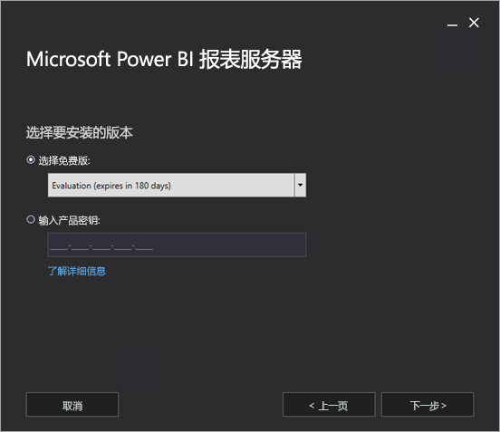
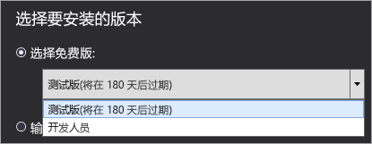
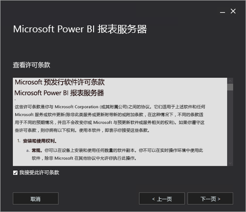
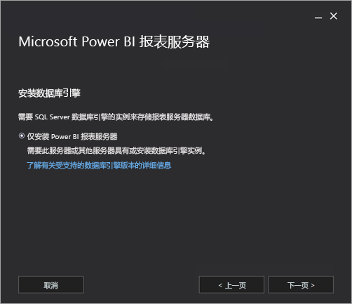
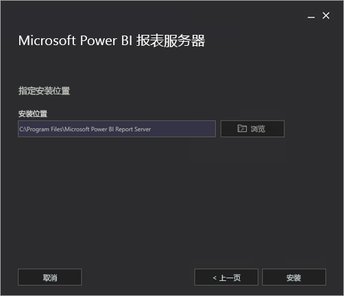
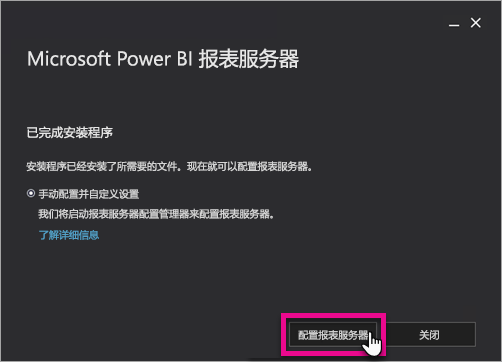
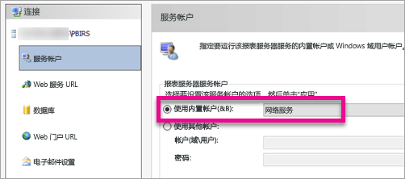
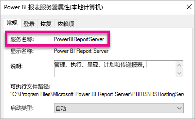

# 安装 Power BI 报表服务器

了解如何安装 Power BI 报表服务器。

 下载 

要下载 Power BI 报表服务器，请转到[使用 Power BI 报表服务器进行本地报告](https://powerbi.microsoft.com/report-server/)并选择“下载免费试用版”。 

## 开始之前
建议在安装 Power BI 报表服务器之前先查看[安装 Power BI 报表服务器所要满足的硬件和软件要求](system-requirements.md)。

### Power BI 报表服务器产品密钥

#### Power BI Premium
如果已购买 Power BI Premium，则可以在 Power BI 管理门户的“Premium 设置”选项卡中访问 Power BI 报表服务器产品密钥。 这仅适用于分配了 Power BI 服务管理员角色的全局管理员或用户。

选择“Power BI 报表服务器密钥”会显示包含产品密钥的对话框。 可以复制该密钥并用来进行安装。

#### SQL Server Enterprise 软件保障 (SA)
如果有 SQL Server Enterprise SA 协议，则可以从[批量许可服务中心](https://www.microsoft.com/Licensing/servicecenter/)获取产品密钥。

## 安装报表服务器
安装 Power BI 报表服务器非常简单。 只需执行几个步骤，即可安装文件。

安装时，不需要使用 SQL Server 数据库引擎服务器。 安装完毕后，需要使用一个此类服务器来配置 Reporting Services。

1. 查找 PowerBIReportServer.exe，然后启动安装程序。
2. 选择“安装 Power BI 报表服务器”。
   
    
3. 选择要安装的版本，然后选择“下一步”。
   
    
   
    可以从下拉列表中选择 Evaluation 或 Developer 版本。
   
    
   
    否则，可以为服务器输入从 Power BI 服务或批量许可服务中心获取的产品密钥。 有关如何获取产品密钥的详细信息，请参阅[开始之前](#before-you-begin)部分。
4. 阅读并同意许可条款和条件，然后选择“下一步”。
   
    
5. 需要使用数据库引擎来存储报表服务器数据库。 选择“下一步”，仅安装报表服务器。
   
    
6. 指定报表服务器的安装位置。 选择“安装”即可继续。
   
    
   
    默认路径为 C:\Program Files\Microsoft Power BI Report Server。

1. 在成功安装后，选择“配置报表服务器”，启动 Reporting Services 配置管理器。
   
    

## 配置报表服务器

在安装程序中选择“配置报表服务器”后，便会看到 Reporting Services 配置管理器。 有关详细信息，请参阅 [Reporting Services 配置管理器](https://docs.microsoft.com/sql/reporting-services/install-windows/reporting-services-configuration-manager-native-mode)。

必须[创建报表服务器数据库](https://docs.microsoft.com/sql/reporting-services/install-windows/ssrs-report-server-create-a-report-server-database)，才能完成 Reporting Services 的初始配置。 若要完成此步骤，必须要有 SQL Server 数据库服务器。

### 在其他服务器上创建数据库
若要在其他计算机上的数据库服务器中创建报表服务器数据库，需要将报表服务器的服务帐户更改为数据库服务器识别的凭据。 

默认情况下，报表服务器使用虚拟服务帐户。 如果尝试在其他服务器上创建数据库，可能会在执行“应用连接权限”一步时看到以下错误消息。

`System.Data.SqlClient.SqlException (0x80131904): Windows NT user or group '(null)' not found. Check the name again.`

若要修复此错误，可以将服务帐户更改为网络服务帐户或域帐户。 将服务帐户更改为网络服务帐户会在报表服务器的计算机帐户上下文中应用权限。

有关详细信息，请参阅[配置报表服务器服务帐户](https://docs.microsoft.com/sql/reporting-services/install-windows/configure-the-report-server-service-account-ssrs-configuration-manager)。

## Windows 服务
Windows 服务是在安装过程中创建的。 它显示为“Power BI 报表服务器”。 服务名称是“PowerBIReportServer”。

## 默认 URL 保留项
URL 保留项由前缀、主机名、端口和虚拟目录组成：

| 部分 | 说明 |
| --- | --- |
| 前缀 |默认前缀为 HTTP。 如果以前安装了安全套接字层 (SSL) 证书，安装程序会尝试创建使用 HTTPS 前缀的 URL 保留项。 |
| 主机名 |默认主机名为强通配符 (+)。 它指定报表服务器接受针对解析为计算机的任何主机名从指定端口发出的任何 HTTP 请求，包括 `http://<computername>/reportserver`、`http://localhost/reportserver` 或 `http://<IPAddress>/reportserver.` |
| 端口 |默认端口为 80。 如果使用的端口不是 80，则需要在浏览器窗口中打开 Web 门户时，将其明确添加到 URL 中。 |
| 虚拟目录 |默认情况下，对于报表服务器 Web 服务，虚拟目录的创建格式为 ReportServer；对于 Web 门户，虚拟目录的创建格式为 Reports。 对于报表服务器 Web 服务，默认虚拟目录为 reportserver。 对于 Web 门户，默认虚拟目录为 reports。 |

完整 URL 字符串的示例如下所示：

* `http://+:80/reportserver`：提供对报表服务器的访问权限。
* `http://+:80/reports`：提供对 Web 门户的访问权限。

## 防火墙
如果要从远程计算机访问报表服务器，需要确保已配置所有防火墙规则（如果有防火墙的话）。

需要打开已为 Web 服务 URL 和 Web 门户 URL 配置的 TCP 端口。 默认情况下，这些规则是在 TCP 端口 80 上进行配置。

## 其他配置
* 若要配置与 Power BI 服务的集成，以便将报表项固定到 Power BI 仪表板中，请参阅[与 Power BI 服务集成](https://docs.microsoft.com/sql/reporting-services/install-windows/power-bi-report-server-integration-configuration-manager)。
* 若要配置电子邮件来处理订阅，请参阅[电子邮件设置](https://docs.microsoft.com/sql/reporting-services/install-windows/e-mail-settings-reporting-services-native-mode-configuration-manager)和[报表服务器中的电子邮件传送](https://docs.microsoft.com/sql/reporting-services/subscriptions/e-mail-delivery-in-reporting-services)。
* 若要将 Web 门户配置为允许用户在报表计算机上进行访问，以便查看和管理报表，请参阅[配置防火墙以保护报表服务器访问](https://docs.microsoft.com/sql/reporting-services/report-server/configure-a-firewall-for-report-server-access)和[配置报表服务器以供远程管理](https://docs.microsoft.com/sql/reporting-services/report-server/configure-a-report-server-for-remote-administration)。

## 后续步骤
[管理员概述](admin-handbook-overview.md)  
[如何查找报表服务器产品密钥](find-product-key.md)  
[安装更适合 Power BI 报表服务器的 Power BI Desktop](install-powerbi-desktop.md)  
[验证 Reporting Services 安装](https://docs.microsoft.com/sql/reporting-services/install-windows/verify-a-reporting-services-installation)  
[配置报表服务器服务帐户](https://docs.microsoft.com/sql/reporting-services/install-windows/configure-the-report-server-service-account-ssrs-configuration-manager)  
[配置报表服务器 URL](https://docs.microsoft.com/sql/reporting-services/install-windows/configure-report-server-urls-ssrs-configuration-manager)  
[配置报表服务器数据库连接](https://docs.microsoft.com/sql/reporting-services/install-windows/configure-a-report-server-database-connection-ssrs-configuration-manager)  
[初始化报表服务器](https://docs.microsoft.com/sql/reporting-services/install-windows/ssrs-encryption-keys-initialize-a-report-server)  
[在报表服务器上配置 SSL 连接](https://docs.microsoft.com/sql/reporting-services/security/configure-ssl-connections-on-a-native-mode-report-server)  
[配置 Windows 服务帐户和权限](https://docs.microsoft.com/sql/database-engine/configure-windows/configure-windows-service-accounts-and-permissions)  
[Power BI 报表服务器的浏览器支持](browser-support.md)

更多问题？ [尝试咨询 Power BI 社区](https://community.powerbi.com/)

