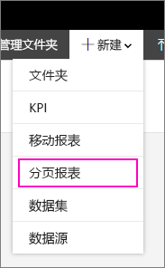
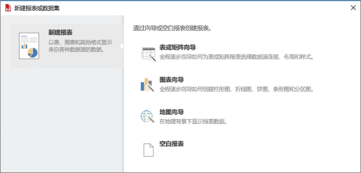
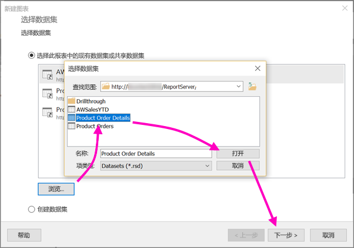
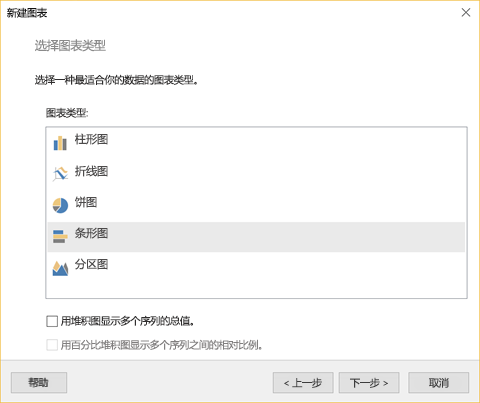
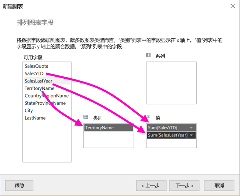
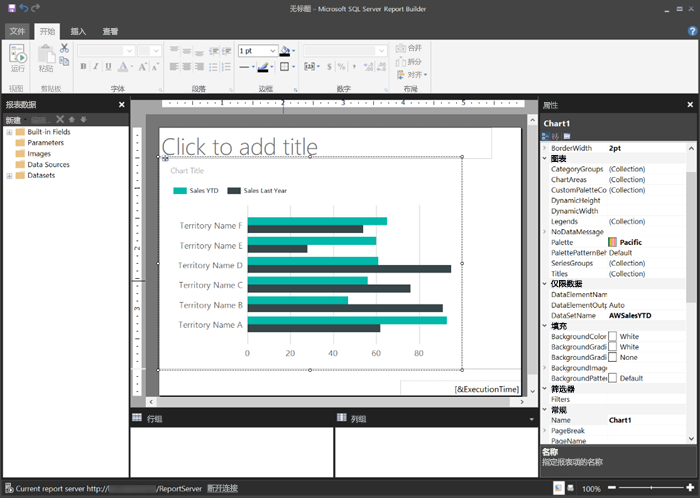
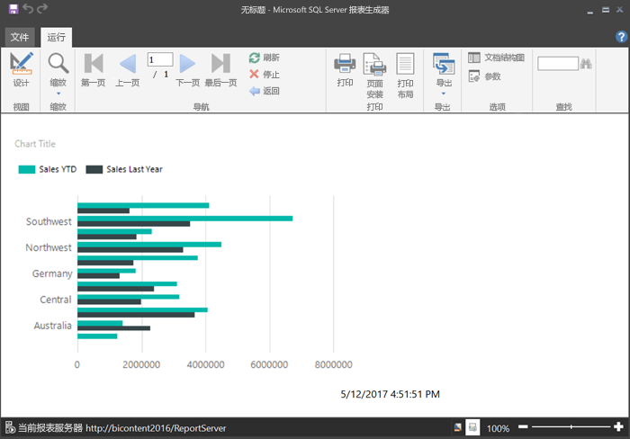
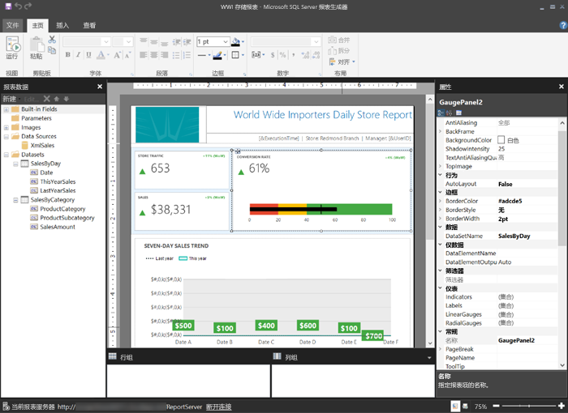

# 为 Power BI 报表服务器创建分页报表
顾名思义，分页报表可以生成很多页。 它们以固定格式布局，并允许进行精准自定义。 分页报表是 .rdl 文件。

可以在 Power BI 报表服务器 Web 门户中存储和管理分页报表，就像在 SQL Server Reporting Services (SSRS) Web 门户中一样。 在 SQL Server Data Tools (SSDT) 中的报表生成器或报表设计器中创建和编辑分页报表，然后将其发布到任意 Web 门户。 接下来，组织中的报表读取器可以在浏览器或移动设备上的 Power BI 移动应用中查看报表。

如果已在报表生成器或报表设计器中创建了分页报表，则可以为 Power BI 报表服务器创建分页报表。 如果还没有，可以参阅下面的一些快速入门步骤。

## 步骤 1：安装并启动报表生成器
可能已安装报表生成器来为 SSRS 服务器创建报表。 可以使用相同版本的报表生成器来为 Power BI 报表服务器创建报表。 如果尚未安装，也不用担心，操作过程非常简单。

1. 在 Power BI 报表服务器 Web 门户中，选择“新建” > “分页报表”。
   
    
   
    如果尚未安装报表生成器，现在系统会引导你逐步完成安装过程。
2. 安装后，报表生成器中会打开“新建报表或数据集”屏幕。
   
    
3. 选择要创建的报表种类所对应的向导：
   
   * 表或矩阵
   * 图表
   * 地图
   * 空白
4. 让我们从“图表向导”入手。
   
    “图表向导”会引导你在报表中逐步创建基本图表。 之后，可以自定义报表，几乎不受限制。

## 步骤 2：完成“图表向导”
“图表向导”会引导你逐步完成在报表中创建可视化效果的基本步骤。

分页报表可以连接各种数据源，包括 Microsoft SQL Server 和 Microsoft Azure SQL 数据库、Oracle、Hyperion 等。 了解[分页报表支持的数据源](connect-data-sources.md)。

在“图表向导”的第 1 页中，选择一个数据集。可以创建数据集，也可以选择服务器上的共享数据集。 数据集通过查询外部数据源返回报表数据。

1. 依次选择“浏览”、服务器上的共享数据集、“打开” > “下一步”。
   
    
   
     需要创建数据集？ 请参阅[创建共享或嵌入式数据集](https://docs.microsoft.com/sql/reporting-services/report-data/create-a-shared-dataset-or-embedded-dataset-report-builder-and-ssrs)。
2. 选择图表类型，在此示例中，选择“条形图”。
   
    
3. 将字段拖到“类别”、“系列”和“值”框中进行排列。
   
    
4. 选择“下一步” > “完成”。

## 步骤 3：设计报表
现在位于“报表设计”视图中。 请注意，数据为占位符数据，不是你的数据。

* 若要查看你的数据，请选择“生成”。
  
     
* 若要返回到设计视图，请选择“设计”。

可以修改刚刚创建的图表：更改布局、值、图例（实际上可以更改一切内容）。

可以添加其他各种可视化效果：仪表、表、矩阵、地图等。 可以添加多个页的页眉和页脚。 请参阅[报表生成器教程](https://docs.microsoft.com/sql/reporting-services/report-builder-tutorials)，尝试自行操作。

## 步骤 4：将报表保存到报表服务器
创建并设计完报表后，可以将其保存到 Power BI 报表服务器。

1. 在“文件”菜单上，选择“另存为”，然后将其保存到报表服务器。 
2. 现在可以在浏览器中查看报表。
   
    

## 后续步骤
若要了解如何在 SQL Server Data Tools 的报表生成器和报表设计器中设计报表，可以参阅许多有价值的资源。 不妨先从报表生成器教程入手。

* [报表生成器教程](https://docs.microsoft.com/sql/reporting-services/report-builder-tutorials)
* [什么是 Power BI 报表服务器？](get-started.md)  

更多问题？ [尝试咨询 Power BI 社区](https://community.powerbi.com/)

