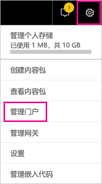
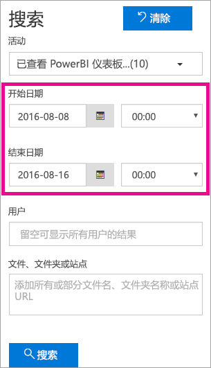
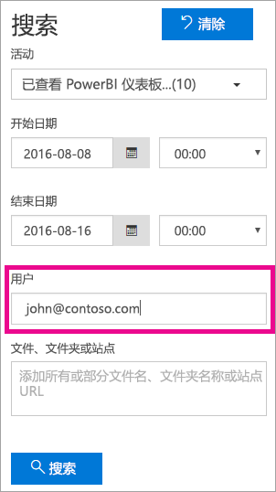
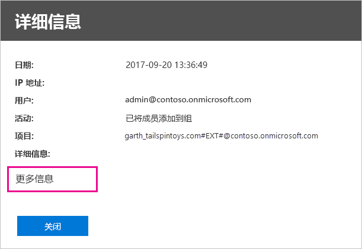
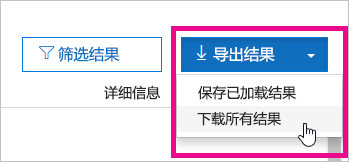

# <a name="using-auditing-within-your-organization"></a>在组织内使用审核

了解 Power BI 租户中谁正在对何项目执行何种操作对帮助组织满足其需求非常关键（如满足法规遵从性和记录管理需求）。 Power BI 审核可用于审核用户执行的操作，如“查看报表”和“查看仪表板”。 无法使用审核来审核权限。

若要使用审核，请使用 Office 365 安全与合规中心或 PowerShell。 本文对这两种方法都进行了介绍。 可按日期范围、用户、仪表板、报表、数据集和活动类型筛选审核数据。 还可将活动下载到 CSV（逗号分隔值）文件供脱机分析。

## <a name="requirements"></a>要求

必须满足以下要求才能访问审核日志：

- 若要访问 Office 365 安全性和符合性中心的审核部分，必须具有 Exchange Online 许可证（Office 365 企业版 E3 和 E5 订阅已随附）。

- 或者，必须是全局管理员，或者是有权访问审核日志的 Exchange 管理员角色。 Exchange 管理员角色通过 Exchange 管理员中心进行控制。 有关详细信息，请参阅 [Exchange Online 中的权限](/exchange/permissions-exo/permissions-exo/)。

- 如果你有权访问审核日志但不是全局管理员或 Power BI 服务管理员，则无法访问 Power BI 管理员门户。 在这种情况下，必须获取 [Office 365 安全与合规中心](https://sip.protection.office.com/#/unifiedauditlog)的直接链接。

- 若要在租户中查看 Power BI 审核日志，则租户中需要至少有一个 Exchange 邮箱许可证。

## <a name="accessing-your-audit-logs"></a>访问审核日志

若要访问日志，请先确保已在 Power BI 中启用日志记录。 有关详细信息，请参阅管理门户文档中的[审核日志](service-admin-portal.md#audit-logs)。 启用审核后，最多可能会延迟 48 小时才能查看审核数据。 如果无法立即查看数据，请稍后检查审核日志。 获取查看审核日志的权限和得以访问日志之间也存在类似的延迟。

可直接通过 [Office 365 安全与合规中心](https://sip.protection.office.com/#/unifiedauditlog)访问 Power BI 审核日志。 此外，Power BI 管理门户中也有对应的链接：

1. 在 Power BI 中，依次选择右上角的齿轮图标和“管理门户”。

   

1. 选择“审核日志”。

1. 选择“转到 O365 管理中心”。

   

若要向非管理员帐户授予对审核日志的访问权限，必须在 Exchange Online 管理中心内分配权限。 例如，可以将用户分配至“组织管理”等现有角色组，或者可以创建一个新的包含“审核日志”角色的角色组。 有关详细信息，请参阅 [Exchange Online 中的权限](/exchange/permissions-exo/permissions-exo/)。

## <a name="search-only-power-bi-activities"></a>仅搜索 Power BI 活动

若要让搜索结果中仅包含 Power BI 活动，请按以下步骤操作。 有关活动列表，请参阅本文稍后介绍的 [Power BI 审核的活动列表](#list-of-activities-audited-by-power-bi)。

1. 在“审核日志搜索”页上，选择“搜索”下的“活动”下拉列表。

2. 选择“Power BI 活动”。

   

3. 选择选框外任意位置以将其关闭。

搜索现仅筛选 Power BI 活动。

## <a name="search-the-audit-logs-by-date"></a>按日期搜索审核日志

使用“开始日期”和“结束日期”字段，可按日期范围搜索日志。 默认选择过去七天。 将以协调世界时 (UTC) 格式显示日期和时间。 可以指定的最大日期范围为 90 天。 

如果所选日期范围大于 90 天，将显示错误。 如果使用最大日期范围 90 天，请选择当前时间作为“开始日期”。 否则将收到错误，提醒开始日期早于结束日期。 如果是在过去 90 天内启用审核，日期范围的开始日期不得早于审核启用日期。



## <a name="search-the-audit-logs-by-users"></a>按用户搜索审核日志

可搜索特定用户所执行活动的审核日志条目。 为此，请在“用户”字段中输入一个或多个用户名。 用户名类似于电子邮件地址；它是用户登录 Power BI 时使用的帐户。 将此框留空以返回组织中所有用户（和服务帐户）的条目。



## <a name="view-search-results"></a>查看搜索结果

当你选择“搜索”后，系统先加载搜索结果，过一会儿再在“结果”下显示搜索结果。 搜索完成后，将显示找到的结果数。 系统最多显示 1000 个事件；如果符合搜索条件的事件超过 1000 个，系统显示最近发生的 1000 个事件。

### <a name="view-the-main-results"></a>查看主要结果

“结果”区域包含搜索功能返回的每个事件的以下信息。 选择“结果”下的列标题，即可对结果进行排序。

| **列** | **定义** |
| --- | --- |
| 日期 |事件发生的日期和时间（UTC 格式）。 |
| IP 地址 |记录活动记时所用设备的 IP 地址。 IP 地址以 IPv4 或 IPv6 地址格式显示。 |
| 用户 |执行触发该事件的操作的用户（或服务帐户）。 |
| 活动 |用户执行的活动。 此值对应于你在“活动”下拉列表中选择的活动。 对于来自于 Exchange 管理审核日志的事件，此列中的值为 Exchange cmdlet。 |
| 项 |相应活动导致创建或修改的对象。 例如，已查看或修改的文件，或已更新的用户帐户。 并非所有活动在此列中都具有值。 |
| 详细信息 |有关活动的其他详细信息。 同样，并非所有活动都具有此值。 |

### <a name="view-the-details-for-an-event"></a>查看事件的详细信息

单击搜索结果列表中的事件记录，可查看事件的更多详细信息。 此时，“详细信息”页显示，其中包含事件记录中的详细属性。 所显示的属性取决于事件发生于的 Office 365 服务。 

若要查看这些详细信息，请选择“更多信息”。 所有 Power BI 条目的 RecordType 属性值均为 20。 若要了解其他属性，请参阅[审核日志中的详细属性](/office365/securitycompliance/detailed-properties-in-the-office-365-audit-log/)。

   

## <a name="export-search-results"></a>导出搜索结果

若要将 Power BI 审核日志导出为 csv 文件，请按以下步骤操作。

1. 选择“导出结果”。

1. 选择“保存已加载结果”或“下载所有结果”。

    

## <a name="use-powershell-to-search-audit-logs"></a>使用 PowerShell 搜索审核日志

也可以使用 PowerShell 根据登录名来访问审核日志。 下面的示例展示了如何使用 [Search-UnifiedAuditLog](/powershell/module/exchange/policy-and-compliance-audit/search-unifiedauditlog?view=exchange-ps/) 命令拉取 Power BI 审核日志条目。

帐户必须分配有 Exchange Online 许可证，且你必须有权访问租户的审核日志，才能运行 [New-PSSession](/powershell/module/microsoft.powershell.core/new-pssession/) 命令。 有关连接到 Exchange Online 的详细信息，请参阅[连接到 Exchange Online PowerShell](/powershell/exchange/exchange-online/connect-to-exchange-online-powershell/connect-to-exchange-online-powershell/)。

```powershell
Set-ExecutionPolicy RemoteSigned

$UserCredential = Get-Credential

$Session = New-PSSession -ConfigurationName Microsoft.Exchange -ConnectionUri https://outlook.office365.com/powershell-liveid/ -Credential $UserCredential -Authentication Basic -AllowRedirection

Import-PSSession $Session
Search-UnifiedAuditLog -StartDate 9/11/2018 -EndDate 9/15/2018 -RecordType PowerBI -ResultSize 1000 | Format-Table | More
```

有关展示了如何对审核日志使用 PowerShell 的其他示例，请参阅[使用 Power BI 审核日志和 PowerShell 分配 Power BI Pro 许可证](https://powerbi.microsoft.com/blog/using-power-bi-audit-log-and-powershell-to-assign-power-bi-pro-licenses/)。

## <a name="activities-audited-by-power-bi"></a>Power BI 审核的活动

Power BI 审核以下活动。

* AddDatasourceToGateway
* AddGroupMembers
* AnalyzedByExternalApplication
* AnalyzeInExcel
* AttachDataflowStorageAccount
* BindToGateway
* ChangeCapacityState
* ChangeGatewayAdministrators
* ChangeGatewayDatasourceUsers
* CreateApp
* CreateDashboard
* CreateDataflow
* CreateDataset
* CreateEmailSubscription
* CreateFolder
* CreateGateway
* CreateGroup
* CreateOrgApp
* CreateReport
* DeleteComment
* DeleteDashboard
* DeleteDataflow
* DeleteDataset
* DeleteEmailSubscription
* DeleteFolder
* DeleteGateway
* DeleteGroup
* DeleteGroupMembers
* DeleteOrgApp
* DeleteReport
* DownloadReport
* EditDataset
* EditReport
* ExportDataflow
* ExportReport
* ExportTile
* GenerateDataflowSasToken
* GenerateEmbedToken
* GetDatasources
* 导入
* InstallApp
* MigrateWorkspaceIntoCapacity
* OptInForProTrial
* PostComment
* PrintDashboard
* PrintReport
* PublishToWebReport
* RefreshDataset
* RemoveDatasourceFromGateway
* RemoveWorkspacesFromCapacity
* RenameDashboard
* SetAllConnections
* SetScheduledRefresh
* SetScheduledRefreshOnDataflow
* ShareDashboard
* ShareReport
* TakeOverDataset
* TakeOverDatasource
* UnpublishApp
* UpdateApp
* UpdateCapacityAdmins
* UpdateCapacityDisplayName
* UpdateCapacityResourceGovernanceSettings
* UpdateCapacityUsersAssignment
* UpdatedAdminFeatureSwitch
* UpdateDataflow
* UpdateDatasetParameters
* UpdateDatasourceCredentials
* UpdateDatasources
* UpdateEmailSubscription
* UpdateFolder
* UpdateFolderAccess
* ViewDashboard
* ViewDataflow
* ViewReport
* ViewTile
* ViewUsageMetrics

## <a name="next-steps"></a>后续步骤

[什么是 Power BI 管理？](service-admin-administering-power-bi-in-your-organization.md)  

[Power BI 管理门户](service-admin-portal.md)  

更多问题？ [尝试咨询 Power BI 社区](http://community.powerbi.com/)
