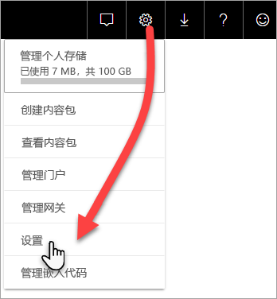

# 使用应用监视高级容量

监视容量对于正确决定如何充分利用高级容量资源至关重要。 可以在管理门户中或使用 Power BI Premium Capacity Metrics 应用监视容量。 本文介绍如何使用 Premium Capacity Metrics 应用。 应用提供有关容量性能的深度信息。 有关过去七天内平均使用量指标的更高级别概述，可以使用管理门户。 要了解在门户中监视的详细信息，请参阅[在管理门户中监视高级容量](service-admin-premium-monitor-portal.md)。

应用定期更新新特性和新功能。 请确保正在运行最新版本。
**应用的最新版本为 1.10.1.1（2019 年 2 月 5 日）**。   
如果已安装上个版本，则最好将其从应用中删除，然后按 Ctrl+F5 进行刷新。 

## 安装应用

可以直接转到 [Premium Capacity Metrics 应用](https://app.powerbi.com/groups/me/getapps/services/capacitymetrics)，也可以像在 Power BI 中操作其他应用一样安装它。

1. 在 Power BI 中，单击“应用”。   
    

2. 在右侧，单击“获取应用”。
3. 在“应用”类别中，搜索“Power BI Premium Capacity Metrics 应用”。
4. 订阅以安装应用。

请耐心等待。 安装和刷新指标需要几分钟。 如果应用显示空白指标，请按 F5 刷新浏览器。

## 获取应用刷新历史记录

要查看上一次刷新 Premium Capacity Metrics 应用的时间，请单击“设置” > “数据集” > “Power BI Premium Capacity Metrics” > “刷新历史记录”。 

随即显示上次刷新时间，或单击“刷新历史记录”查看计划或按需刷新。

## 通过应用监视容量

现在你已经安装了应用，可以查看有关组织容量的指标。 我们来看看一些可用的关键指标。

### 指标仪表板

打开应用时，它首先会显示一个仪表板，其中包含你拥有管理员权限的所有容量的摘要。

仪表板包含以下指标：

| **报表区域** | **指标** |
| --- | --- |
| **系统摘要** |  应用程序版本   你作为管理员所管理的容量数   报告了指标的容量中的工作区数   过去七天内的平均内存消耗量 (GB)   过去七天内的最大内存消耗量 (GB)   发生最大内存消耗量时的当地时间   过去七天内 CPU 超过阈值的 80% 的次数（按三分钟的时间段划分）   过去七天内 CPU 超过阈值的 80% 的最多次数（按一小时的时间段划分）   CPU 在一小时内超过 80% 的次数最多的时候的当地时间 |
| **数据集摘要** |  所管理的容量中所有工作区的数据集总量   过去七天内直接查询/实时连接数超过阈值的 80% 的次数（按三分钟的时间段划分）   过去七天内直接查询/实时连接数超过阈值的 80% 的最多次数（按一小时的时间段划分）   直接查询/实时连接在一小时内超过 80% 的次数最多的时候的当地时间   过去七天内的刷新总次数   平均刷新等待时间 - 计划时间与刷新开始时间之间的平均延迟（以分钟为单位）   平均刷新持续时间 - 完成刷新所需的时间（以分钟为单位）   过去七天内查询运行的总次数   平均查询等待时间 - 一个查询在开始执行之前等待系统资源的时间（以毫秒为单位）   平均查询持续时间 - 完成查询所需的时间（以毫秒为单位）   由于内存压力导致模型收回的总次数   数据集的平均大小    加载到内存中的数据集的平均计数 |
| **数据流摘要** |  容量中所有工作区的数据流总量   过去七天内的刷新总次数   平均刷新等待时间 - 计划时间与刷新开始时间之间的平均延迟（以分钟为单位）   平均刷新持续时间 - 完成刷新所需的时间（以分钟为单位） |
| **分页报表摘要** |  容量中所有工作区的分页报表总量   所有报表被用户查看的总次数   所有报表中数据的总行数   所有报表的所有阶段（数据检索、处理和呈现）花费的总时间（以毫秒为单位） |
|  |  |

### 指标报表

单击仪表板，转到基础报表。 在报表的底部，有五个选项卡：

* [数据集](#datasets) - 提供容量内有关 Power BI 数据集运行状况的详细指标。

* [分页报表](#paginated-reports) - 提供容量中分页报表运行状况的详细指标。

* [数据流](#dataflows) - 容量中数据流的刷新详细指标。

* [资源消耗量](#resource-consumption) - 提供整体容量指标，包括内存和 CPU 高使用率。

* [ID 和 Info](#ids-and-info) - 容量、工作区和工作负荷的名称、ID 和所有者。

在每个选项卡上，可以按容量和日期范围进行筛选。 如果未选择任何筛选器，则报表会默认显示报告了指标的所有容量过去一周的指标。 

#### 数据集

可使用“数据集”选项卡顶部的按钮导航到各不同区域：“刷新”、“查询持续时间”、“查询等待”和“数据集”。

##### “刷新”区域

“刷新”区域包含以下指标。

| **报表区域** | **指标** |
| --- | --- |
| **刷新可靠性** |  总计：每个数据集的总刷新次数   可靠性：针对每个数据集完成的刷新百分比   平均等待时间：计划时间与刷新数据集开始时间之间的平均延迟（以分钟为单位）   最长等待时间：数据集的最长等待时间（以分钟为单位）    平均持续时间：刷新数据集的平均持续时间（以分钟为单位）   最长持续时间：数据集运行时间最长的刷新持续时间（以分钟为单位） |
| **按平均刷新持续时间排列的前 5 个数据集** |  具有最长平均刷新持续时间的五个数据集（以分钟为单位） |
| **按平均等待时间排列的前 5 个数据集** |  具有最长平均刷新等待时间的五个数据集（以分钟为单位） |
| **每小时平均刷新等待时间** |  平均刷新等待时间，按一小时的时间段划分，以本地时间报告。 多个高刷新等待时间峰值表示容量过度运行。 |
| **每小时刷新计数和内存占用率** |  成功、失败和内存占用率，按一小时的时间段划分，以本地时间报告 |
|  |  |

##### “查询持续时间”区域

“查询持续时间”区域包含以下指标。

| **报表区域** | **指标** |
| --- | --- |
| **查询持续时间** |  此区域中的数据在过去七天内由数据集、工作区和每小时 Bucket 数进行划分   总计:为数据集运行的查询的总数   平均值：数据集的平均查询持续时间（以毫秒为单位）   最大值：数据集中运行时间最长的查询的持续时间（以毫秒为单位）|
| **查询持续时间分布** |  查询持续时间直方图由查询持续时间（以毫秒为单位）的 Bucket 数划分为以下类别：<= 30 毫秒、30-100 毫秒、100-300 毫秒、300 毫秒-1 秒、1 秒-3 秒、3 秒-10 秒、10 秒-30 秒和 > 30 秒时间间隔。 较长的查询持续时间和较长的等待时间表示容量过于繁忙。 这也可能意味着，单个数据集会导致问题，需要进一步调查。 |
| **按平均持续时间排列的前 5 个数据集** |  具有最长平均查询持续时间的五个数据集（以毫秒为单位） |
| **直接查询/实时连接（> 80% 利用率）** |  直接查询或实时连接超过 CPU 利用率的 80% 的次数，按一小时的时间段划分，以本地时间报告 |
| **每小时查询持续时间分布** |  按一小时的时间段划分的查询计数和平均持续时间（以毫秒为单位）与内存占用率（以 GB 为单位），以本地时间报告 |
|  |  |

##### 查询等待区域

“查询等待”区域包含以下指标。

| **报表区域** | **指标** |
| --- | --- |
| **查询等待次数** |  此区域中的数据在过去七天内由数据集、工作区和每小时 Bucket 数进行划分   总计:为数据集运行的查询的总数   等待计数：在开始执行之前在系统资源上等待的数据集中的查询数    平均值：数据集的平均查询等待时间（以毫秒为单位）   最大值：数据集中等待时间最长的查询的持续时间（以毫秒为单位）|
| **等待时间分布** |  查询持续时间直方图由查询持续时间（以毫秒为单位）的 Bucket 数划分为以下类别：<= 50 毫秒、50-100 毫秒、100-200 毫秒、200-400 毫秒、400 毫秒-1 秒、1 秒-5 秒和 > 5 秒时间间隔 |
| **按平均等待时间排列的前 5 个数据集** |  要开始执行查询的具有最长平均等待时间的五个数据集（以毫秒为单位） |
| **每小时查询等待计数和时间** |  按一小时的时间段划分的查询等待计数和平均等待时间（以毫秒为单位）与内存占用率（以 GB 为单位），以本地时间报告 |
|  |  |

##### “数据集”区域

“数据集”区域包含以下指标。

| **报表区域** | **指标** |
| --- | --- |
| **数据集逐出计数** |  总计:为每个容量执行数据集逐出的总数。 容量面临内存压力时，节点从内存中逐出一个或多个数据集。 首先逐出处于非活动状态（当前没有执行查询/刷新操作）的数据集。 然后按“最近最少使用的项”(LRU) 这一顺序依次逐出。|
| **每小时数据集逐出和内存占用率** |  数据集逐出与内存占用率（以 GB 为单位），按一小时的时间段划分，以本地时间报告 |
| **每小时加载的数据集计数** |  加载到内存中的数据集数与内存占用率（以 GB 为单位），按一小时的时间段划分，以本地时间报告 |
| **占用内存百分比** |  内存中活动的总数据集（总内存的百分比）。 活动数据集和可以逐出的所有定义数据集之间的增量。 过去七天按小时显示。 |
| **数据大小**  |  最大大小：显示的时间段内数据集的最大大小（以 MB 为单位） |
|  |  |

#### 分页报表

“分页报表”选项卡显示容量中分页报表运行状况的详细指标。

| **报表区域** | **指标** |
| --- | --- |
| **总体使用情况** |  视图总数：用户查看报表的次数   行计数：报表中数据的行数   检索（平均值）：检索报表数据所需的平均时间（以毫秒为单位）。 较长的持续时间可能表示查询速度缓慢或其他数据源问题。    处理（平均值）：处理报表数据所需的平均时间（以毫秒为单位）  呈现（平均值）：在浏览器中呈现报表所需的平均时间（以毫秒为单位）   总时间：报表所有阶段所需的时间（以毫秒为单位）|
| **按平均数据检索时间排列的前 5 个报表** |  具有最长平均数据检索时间的五个报表（以毫秒为单位） |
| **按平均报表处理时间排列的前 5 个报表** |  具有最长的平均报表处理时间的五个报表（以毫秒为单位） |
| **每小时持续时间** |  数据检索与处理和呈现时间，按一小时的时间段划分，以本地时间报告 |
| **每小时的结果** |  成功、失败和内存占用率，按一小时的时间段划分，以本地时间报告 |
|  |  |

#### 数据流

“数据流”选项卡显示容量中数据流的刷新详细指标。

| **报表区域** | **指标** |
| --- | --- |
| **刷新** |  总计:每个数据流的总刷新次数   可靠性：针对每个数据流完成的刷新百分比   平均等待时间：计划时间与刷新数据流开始时间之间的平均延迟（以分钟为单位）   最长等待时间：数据流的最长等待时间（以分钟为单位）    平均持续时间：刷新数据流的平均持续时间（以分钟为单位）   最长持续时间：数据流运行时间最长的刷新持续时间（以分钟为单位） |
| **按平均刷新持续时间排列的前 5 个数据流** |  具有最长平均刷新持续时间的五个数据流（以分钟为单位） |
| **按平均等待时间排列的前 5 个数据流** |  具有最长平均刷新等待时间的五个数据流（以分钟为单位） |
| **每小时平均刷新等待时间** |  平均刷新等待时间，按一小时的时间段划分，以本地时间报告。 多个高刷新等待时间峰值表示容量过度运行。 |
| **每小时刷新计数和内存占用率** |  成功、失败和内存占用率，按一小时的时间段划分，以本地时间报告 |
|  |  |

#### 资源消耗

“资源消耗”选项卡显示所有容量和工作负载的 CPU 和内存占用率。

| **报表区域** | **指标** |
| --- | --- |
| **CPU 使用率** |  工作负荷消耗（CPU 总容量的百分比）。 过去七天按小时显示。 |
| **内存占用率** |  工作负荷的内存使用量 (GB)（实线）与工作负荷限制（虚线）重叠。 过去七天按小时显示。 |
|  |  |

#### ID 和信息

“ID 和信息”选项卡包含容量、工作区和工作负载的名称、ID 和所有者。

## 监视 Power BI Embedded 容量

可以使用 Power BI Premium Capacity Metrics 应用监视 Power BI Embedded 中的 A SKU 容量。 只要你是容量管理员，这些容量就会显示在报告中。 但是，除非你在 A SKU 上向 Power BI 授予某些权限，否则报告刷新将失败：

1. 在 Azure 门户中打开你的容量。

1. 单击“访问控制 (IAM)”，并将“Power BI Premium”应用添加到读取者角色。 如果无法按名称找到该应用，也可以通过其客户端 ID 来添加它：cb4dc29f-0bf4-402a-8b30-7511498ed654。

    

> [!NOTE]
> 可以在应用或 Azure门户中监视 Power BI Embedded 容量使用情况，但无法在 Power BI 管理门户中监视。

## 后续步骤

> [!div class="nextstepaction"]
> [Power BI Premium 容量资源管理和优化](service-premium-understand-how-it-works.md)
