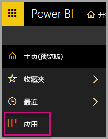

# 监视 Power BI Premium 和 Power BI Embedded 容量

本文概述了监视 Power BI Premium 容量的指标。 监控容量使用情况使你能够采取明智的方法来管理容量。

可以使用 Power BI Premium Capacity Metrics 应用或在管理门户中监视容量。 建议使用应用来监视容量，因为它可以提供了更多详细信息，但本文涵盖了这两个选项。

<iframe width="560" height="315" src="https://www.youtube.com/embed/UgsjMbhi_Bk?rel=0&amp;showinfo=0" frameborder="0" allowfullscreen></iframe>

## 安装 Premium Capacity Metrics 应用

可以直接转到 [Premium Capacity Metrics 应用](https://app.powerbi.com/groups/me/getapps/services/capacitymetrics)，也可以像在 Power BI 中操作其他应用一样安装它。

1. 在 Power BI 中，单击“应用”。

    

2. 在右侧，单击“获取应用”。

3. 在“应用”类别中，搜索“Power BI Premium Capacity Metrics 应用”。

4. 订阅以安装应用。

现在你已经安装了应用，可以查看有关组织容量的指标。 我们来看看一些可用的关键指标。

## 使用指标应用

打开应用时，它首先会显示一个仪表板，其中包含你拥有管理员权限的所有容量的摘要。

该报表具有三个选项卡，我们将在以下部分详细介绍。

* 筛选器应用于所有页面：使你能够将报表中其他页面筛选到特定的容量。
* 数据集：提供容量内有关数据集健康状况的详细指标。
* 系统：提供整体容量指标，包括内存和 CPU 高使用率。 

### “筛选器应用于所有页面”选项卡

使用“筛选器应用于所有页面”选项卡，可以选择过去七天内的容量、数据集和日期范围。 随后筛选器将应用到报表中的所有相关页和磁贴。 如果未选择任何筛选器，则报表会默认显示你拥有的每个容量过去一周的指标。

### “数据集”选项卡

“数据集”选项卡提供了应用中的大量度量值。 使用该选项卡顶部的四个按钮，可导航到不同区域：“摘要”、“刷新”、“查询”，以及“数据集”。

#### “摘要”区域

“摘要”区域可基于实体、系统资源和数据集工作负载显示容量视图。

| | **指标** |
| --- | --- |
| **实体** | * 拥有的容量数  * 容量中不同数量的数据集  * 容量中不同数量的工作区 |
| **系统** | * 过去七天内的平均内存使用量 (GB)  * 过去七天内的最高内存消耗量 (GB) 以及发生时的当地时间  * 过去七天内 CPU 超过阈值的 80% 的次数（按三分钟的时间段划分）  * 过去七天内 CPU 超过阈值的 80% 的大多数情况（按一小时的时间段划分）以及发生时的当地时间  * 过去七天内直接查询/活动连接数超过阈值的 80% 的次数（按三分钟的时间段划分）  * 过去七天内直接查询/活动连接数超过阈值的 80% 的大多数情况（按一小时的时间段划分）以及发生时的当地时间 |
| **数据集工作负载** | * 过去七天内的刷新总次数  * 过去七天内的刷新成功总次数  * 过去七天内的刷新失败总次数  * 由于内存不足导致刷新失败的总次数  * 以分钟为单位度量平均刷新持续时间，完成操作所需的时间  * 以分钟为单位度量平均刷新等待时间，计划时间与操作开始时间之间的平均延迟  * 过去七天内查询运行的总次数  * 过去七天内查询成功的总次数  * 过去七天内查询失败的总次数  * 以分钟为单位度量平均查询持续时间，完成操作所需的时间  * 由于内存压力导致模型收回的总次数 |
|  |  |

#### “刷新”区域

“刷新”区域可列出过去七天内按数据集划分的完整刷新、成功度量、平均/最大刷新等待时间和平均/最大刷新持续时间。 底部的两个图表显示刷新与内存消耗量（以 GB 为单位）以及以当地时间报告的平均等待时间（按一小时的时间段划分）。 顶部条形图可按完成数据集刷新（刷新持续时间）所花费的平均时间和平均刷新等待时间列出前五个数据集。 多个高刷新等待时间峰值表示容量过度运行。

#### “查询”区域

“查询”区域可列出过去七天内按数据集、工作区和每小时 Bucket 数划分的运行查询总数、实时查询/直接查询的查询等待计数总数、平均/最大持续时间、报告的平均/最大等待时间（以毫秒为单位）。 底部的图表显示了按本地时间报告的每小时 Bucket 数划分的查询计数、平均持续时间（以毫秒为单位）和平均等待时间（以毫秒为单位）与内存消耗量（以 GB 为单位）。 右上角的两个图表按平均查询持续时间和完成查询所用的等待时间列出了前五个数据集。 较长的查询持续时间和较长的等待时间表示容量过于繁忙。 这也可能意味着，单个数据集会导致问题，需要进一步调查。

#### “数据集”区域

“数据集”区域按小时显示由于内存压力而收回的完整数据集。

### “系统”选项卡

“系统”选项卡显示 CPU 高利用率（利用率超过 80% 的次数）、直接查询/实时连接利用率和内存消耗。

## 监视 Power BI Embedded 容量

还可以使用 Power BI Premium Capacity Metrics 应用监视 Power BI Embedded 中的 A SKU 容量。 只要你是容量管理员，这些容量就会显示在报告中。 但是，除非你在 A SKU 上向 Power BI 授予某些权限，否则报告刷新将失败：

1. 在 Azure 门户中打开你的容量。
1. 单击“访问控制 (IAM)”，并将“Power BI Premium”应用添加到读取者角色。 如果无法按名称找到该应用，也可以通过其客户端 ID 来添加它：cb4dc29f-0bf4-402a-8b30-7511498ed654。

    

> [!NOTE]
> 可以在应用或 Azure门户中监视 Power BI Embedded 容量使用情况，但无法在 Power BI 管理门户中监视。

## 管理门户中的基本监视

管理门户的“容量设置”区域提供了四个仪表，用于指示过去七天的负载和容量所使用的资源。 这四个磁贴以小时为频率工作，指示过去七天内相应指标超过 80% 的小时数。 此指标表明最终用户体验可能会降级。

| **指标** | **说明** |
| --- | --- |
| CPU |CPU 使用率超过 80% 的次数。 |
| 内存抖动 |表示后端核心的内存压力。 具体而言，这一指标指示因使用多个数据集产生的内存压力，而从内存清除数据集的次数。 |
| 内存使用情况 |平均内存使用量，以千兆字节 (GB) 表示。 |
| DQ/秒 | 直接查询和实时连接数超过限制的 80% 的次数。   * 我们限制 DirectQuery 的总数和每秒实时连接查询数。* 限制如下：P1 为 30/s，P2 为 60/s，P3 为 120/s。 * 直接查询和实时连接查询数计入上述限额。 例如，如果一秒内有 15 个 DirectQueries 和 15 次实时连接，则达到限制 * 这同样适用于本地连接和云连接。 |
|  |  |

指标反映的是过去一周的利用率。  如果想要查看更详尽的指标视图，可单击任意摘要磁贴进行查看。  此操作将调出详细图表，显示高级容量的每个指标。 下图显示了 CPU 指标的详细信息。

这些图表过去一周内每小时汇总一次，有助于在高级容量可能出现特定的性能相关事件时进行隔离。

也可将指标的基础数据随意导出到 csv 文件。  导出后，过去一周每天每隔三分钟即显示一次详细信息。

## 后续步骤

你现已了解如何监视 Power BI Premium 容量，可以了解有关优化容量的更多信息。

> [!div class="nextstepaction"]
> [Power BI Premium 容量资源管理和优化](service-premium-understand-how-it-works.md)
