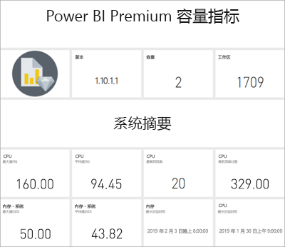
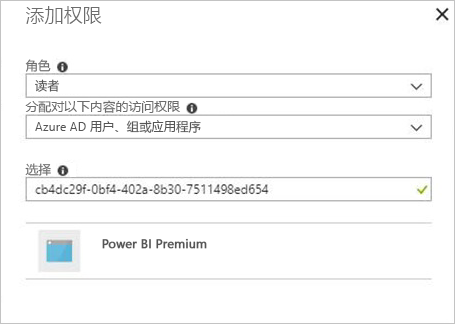

# 监视组织中的 Power BI Premium 容量

本文概述了监视 Power BI Premium 容量的指标。 监控容量使用情况使你能够采取明智的方法来管理容量。 

可以使用 Power BI Premium Capacity Metrics 应用或在管理门户中监视容量。 建议使用应用来监视容量，因为它可以提供了更多详细信息，但本文涵盖了这两个选项。

## 安装 Premium Capacity Metrics 应用

可以直接转到 [Premium Capacity Metrics 应用](https://app.powerbi.com/groups/me/getapps/services/capacitymetrics)，也可以像在 Power BI 中操作其他应用一样安装它。

> [!IMPORTANT]
> 要安装和使用此应用，必须至少是一个容量的容量管理员。 仅仅是 Power BI 管理员还不够。 

1. 在 Power BI 中，单击“应用”。

    

2. 在右侧，单击“获取应用”。

3. 在“应用”类别中，搜索“Power BI Premium Capacity Metrics 应用”。

4. 订阅以安装应用。

现在你已经安装了应用，可以查看有关组织容量的指标。 我们来看看一些可用的关键指标。

## 使用指标应用 
打开应用时，它首先会显示一个仪表板，其中包含你拥有管理员权限的所有容量的摘要。

### 筛选

使用“应用于所有页面的筛选器”选项卡，可以选择过去七天内的容量、数据集和/或日期范围。 这些筛选器将选择内容应用于此报表中的所有相关页面和磁贴。 如果未选择任何内容，报告会默认显示你拥有的每个容量过去一周的指标。

### “摘要”选项卡

“摘要”选项卡显示了基于实体、系统和数据集的容量的视图。

| **区域** | **指标** |
| --- | --- |
| **实体** | * 拥有的容量数  * 容量中不同数量的数据集  * 容量中不同数量的工作区 |
| **系统** | * 过去七天内的平均内存使用量 (GB)  * 过去七天内的最高内存消耗量 (GB) 以及发生时的当地时间  * 过去七天内 CPU 超过阈值的 80% 的次数（按三分钟的时间段划分）  * 过去七天内 CPU 超过阈值的 80% 的大多数情况（按一小时的时间段划分）以及发生时的当地时间  * 过去七天内直接查询/活动连接数超过阈值的 80% 的次数（按三分钟的时间段划分）  * 过去七天内直接查询/活动连接数超过阈值的 80% 的大多数情况（按一小时的时间段划分）以及发生时的当地时间 |
| **数据集工作负载** | * 过去七天内的刷新总次数  * 过去七天内的刷新成功总次数  * 过去七天内的刷新失败总次数  * 由于内存不足导致刷新失败的总次数  * 以分钟为单位度量平均刷新持续时间，完成操作所需的时间  * 以分钟为单位度量平均刷新等待时间，计划时间与操作开始时间之间的平均延迟  * 过去七天内查询运行的总次数  * 过去七天内查询成功的总次数  * 过去七天内查询失败的总次数  * 以分钟为单位度量平均查询持续时间，完成操作所需的时间  * 由于内存压力导致模型收回的总次数 |
|  |  |

### “刷新”选项卡

“刷新”选项卡列出了过去七天内由数据集切片的完整刷新、成功度量、平均/最大刷新等待时间和平均/最大刷新持续时间。 底部的两个图表显示刷新与内存消耗量（以 GB 为单位）以及以当地时间报告的平均等待时间（按一小时的时间段划分）。 顶部条形图按完成数据集刷新（刷新持续时间）所花费的最长时间和最大刷新等待时间的总和列出前五个数据集。 多个高刷新等待时间峰值表示容量过度运行。

### “数据集”选项卡

“数据集”选项卡按小时显示由于内存压力收回的完整数据集。

### “系统”选项卡

“系统”选项卡显示 CPU 高利用率（超过了 80% 利用率的次数），直接查询/实时连接高利用率和内存消耗。

## 监视 Power BI Embedded 容量

还可以使用 Power BI Premium Capacity Metrics 应用监视 Power BI Embedded 中的 A SKU 容量。 只要你是容量管理员，这些容量就会显示在报告中。 但是，除非你在 A SKU 上向 Power BI 授予某些权限，否则报告刷新将失败：

1. 在 Azure 门户中打开你的容量。
1. 单击“访问控制 (IAM)”，并将“Power BI Premium”应用添加到读取者角色。 如果无法按名称找到该应用，也可以通过其客户端 ID 来添加它：cb4dc29f-0bf4-402a-8b30-7511498ed654。

    

> [!NOTE]
> 可以在应用或 Azure门户中监视 Power BI Embedded 容量使用情况，但无法在 Power BI 管理门户中监视。

## 管理门户中的基本监视

管理门户的“容量设置”区域提供了四个仪表，用于指示过去七天的负载和容量所使用的资源。 这四个磁贴以小时为频率工作，指示过去七天内相应指标超过 80% 的小时数。 此指标表明最终用户体验可能会降级。

| **指标** | **说明** |
| --- | --- |
| CPU |CPU 使用率超过 80% 的次数。 |
| 内存抖动 |表示后端核心的内存压力。 具体而言，这一指标指示因使用多个数据集产生的内存压力，而从内存清除数据集的次数。 |
| 内存使用情况 |平均内存使用量，以千兆字节 (GB) 表示。 |
| DQ/秒 | 直接查询和实时连接数超过限制的 80% 的次数。   * 我们限制 DirectQuery 的总数和每秒实时连接查询数。* 限制如下：P1 为 30/s，P2 为 60/s，P3 为 120/s。 * 直接查询和实时连接查询数计入上述限额。 例如，如果一秒内有 15 个 DirectQueries 和 15 次实时连接，则达到限制 * 这同样适用于本地连接和云连接。 |
|  |  |

指标反映的是过去一周的利用率。  如果想要查看更详尽的指标视图，可单击任意摘要磁贴进行查看。  此操作将调出详细图表，显示高级容量的每个指标。 下图显示了 CPU 指标的详细信息。

这些图表过去一周内每小时汇总一次，有助于在高级容量可能出现特定的性能相关事件时进行隔离。

也可将指标的基础数据随意导出到 csv 文件。  导出后，过去一周每天每隔三分钟即显示一次详细信息。

## 后续步骤

你现已了解如何监视 Power BI Premium 容量，可以了解有关优化容量的更多信息。

> [!div class="nextstepaction"]
> [Power BI Premium 容量资源管理和优化](service-premium-understand-how-it-works.md)
