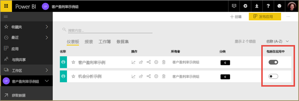
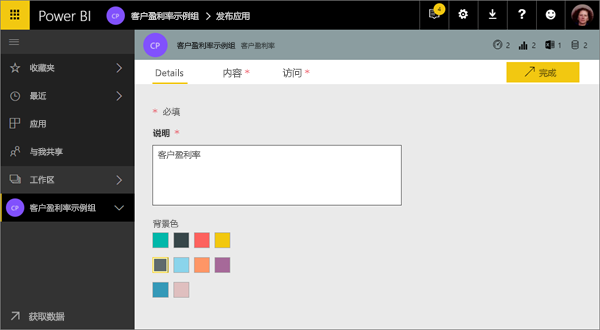
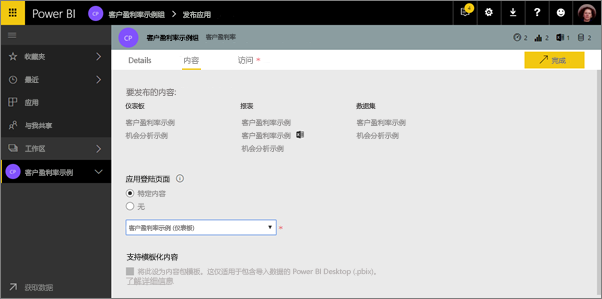
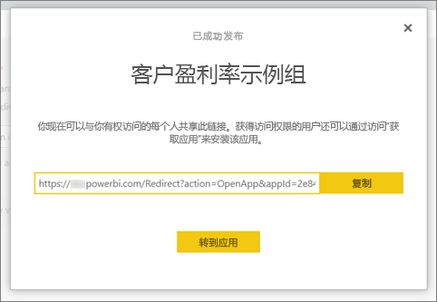
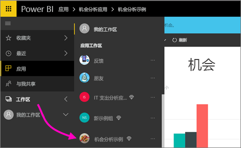
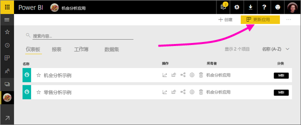
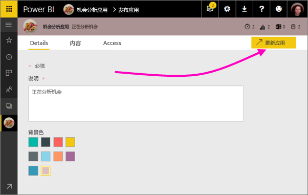
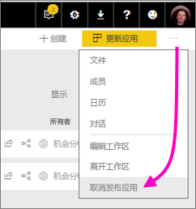

# 在 Power BI 中发布包含仪表板和报表的应用

在 Power BI 中，可以发布包含相关仪表板和报告集合的应用。 在应用工作区中创建应用，可在工作区中与同事协作处理 Power BI 内容。 然后可以将已完成的应用发布给组织中的许多人员。 详细了解如何[创建应用工作区](service-create-workspaces.md)。

业务用户通常需要多个 Power BI 仪表板和报表，才能经营自己的业务。 使用 Power BI 应用，可以创建仪表板和报表集合并将这些应用发布到整个组织或发布到特定人员或组。 对于报表创建者或管理员，应用能使管理这些集合的权限变得更轻松。

业务用户可以通过多种不同的方式获取你的应用。 如果 Power BI 管理员已授予权限，则可以将这些应用自动安装到同事的 Power BI 帐户中。 或者，他们可以从 Microsoft AppSource 安装这些应用，也可以直接向他们发送一个链接。 他们可以轻松地找到并返回到你的内容，因为所有内容都在同一个位置。 他们无法修改应用的内容，但他们可以在 Power BI 服务或其中一个移动应用中与之进行交互 - 自行对数据进行筛选、突出显示和排序。 他们将自动获得更新，你可以控制数据刷新的频率。 详细了解[业务用户的应用体验](consumer/end-user-apps.md)。

**你知道吗？** Power BI 正在提供新工作区体验预览。 阅读[创建新工作区（预览）](service-create-the-new-workspaces.md)，查看工作区将来如何更改。 

## 应用和组织内容包
应用由组织内容包演变而来。 内容包在新工作区体验预览中不可用。 新工作区体正式发布后，无法在新创建的工作区中使用内容包。 请开始将内容包迁移到应用（如果尚未迁移）。

## 视频：应用和应用工作区
<iframe width="640" height="360" src="https://www.youtube.com/embed/Ey5pyrr7Lk8?showinfo=0" frameborder="0" allowfullscreen></iframe>

## 应用许可证
应用工作区的每个成员都需要 Power BI Pro 许可证。 对于应用用户，有两种选项。

* 选项 1：所有业务用户需要 Power BI Pro 许可证才能查看应用。 
* 选项 2：如果应用驻留在 Power BI 高级容量中，则组织中的免费用户可以查看应用内容。 请阅读[什么是 Power BI Premium？](service-premium.md)了解详细信息。

## 发布应用
工作区中的仪表板和报表准备就绪后，选择要发布的仪表板和报表，然后将其作为应用发布。 你可以向更广大受众发送一个直接链接，他们也可以通过转到“从 AppSource 下载并浏览更多应用”，在“应用”选项卡中找到你的应用。 

1. 在工作区列表视图中决定应用要包含的仪表板和报表。

     

     如果选择不发布某个报表，该报表及与其相关的仪表板旁边将显示一条警告。 此时仍然可以发布应用，但这个相关的仪表板将缺少来自该报表的磁贴。

     

2. 选择右上角中的“发布应用”按钮，启动在该工作区中共享所有内容的过程。
   
     

3. 在“详细信息”中，填写说明以帮助用户查找应用。 可以选择背景颜色对其进行个性化设置。
   
     

4. 在“内容”中，会看到即将作为应用的一部分进行发布的内容，即已在该工作区中选择的所有内容。 此外，还可以设置应用登录页，即当用户转到你的应用时首先看到的仪表板或报表。 你可以选择“无”。 然后，他们将登录到应用中的所有内容列表。 
   
     

5. 在“访问”中，决定有权访问应用的人员：要么是组织中的所有人，要么是特定人员或者 Active Directory 安全组。 如果具有相应的权限，则可以决定是否为收件人自动安装应用。 可以在 [Power BI 管理门户](#how-to-enable-pushing-apps)启用此设置. 可以详细了解有关[推送应用](#how-to-enable-pushing-apps)的注意事项。

    

6. 选择“完成”时，将看到一条消息，确认已准备好发布。 在成功对话框中，你可以复制直接链接到此应用的 URL 并将其发送给共享的人员。
   
     

详细了解[业务用户的应用体验](consumer/end-user-apps.md)。

## 更改已发布的应用
发布应用后，你可能想要更改或更新它。 对于应用工作区的管理员或成员，或者新应用工作区中的参与者，可以轻松进行更新。 

1. 打开对应于应用的应用工作区。 
   
     
2. 打开仪表板或报表。 你会发现你可以执行任何所需的更改。
   
     应用工作区为临时区域，因此应用中所做更改在再次发布前不会生效。 这样就方便进行更改，而不会影响已发布的应用。  
 
3. 返回到内容的应用工作区列表，再选择“更新应用”。
   
     

4. 如果需要，更新“详细信息”、“内容”和“访问权限”，然后选择“更新应用”。
   
     

应用的发布对象会自动看到更新版应用。 

## 自动为最终用户安装应用
应用提供最终用户完成作业所需的数据。 如果管理员授予权限，则可以自动为最终用户安装应用，从而更轻松地将正确的应用分发给适当的人员或群组。 现在，应用可自动显示在最终用户的应用内容列表中，而无需从 Microsoft AppSource 或通过安装链接查找。 这样，你可以更轻松地向用户推出标准 Power BI 内容。

### 如何自动为最终用户安装应用
管理员分配权限后，可通过一个新选项来自动安装应用。 当选中该框并选择“完成”（或为现有应用选择“更新应用”）时，该应用将推送到“访问”选项卡上应用“权限”部分中定义的所有用户或组。

### 用户如何获取已推送给他们的应用
推送应用后，应用将自动显示在应用列表中。 可以精选组织中特定用户或工作角色需要随时使用的应用。

### 自动安装应用的注意事项
下面是将应用推送给最终用户时需要注意的事项：

* 自动向用户安装应用可能需要一些时间。 大多数应用将立即为用户安装，但推送应用可能需要一些时间。  这取决于应用中的项数和授予访问权限的人员数。 我们建议在下班期间推送应用，那时的时间充足，用户也不需要使用应用。 请先与多位用户验证，再发送有关应用可用性的广泛沟通。

* 刷新浏览器。 用户可能需要刷新或关闭和重新打开浏览器才能看到“应用”列表中的推送应用。

* 如果用户没有在“应用”列表中立即看到应用，则应刷新或关闭浏览器并重新打开。

* 尽量不要让用户不知所措。 请注意不要推送太多应用，以便用户了解预先安装的应用是有用的。 最好控制可以将应用推送给最终用户的人员，以协调计时。 可以建立一个联系点，用于将组织中的应用推送给最终用户。

* 不会为未接受邀请的来宾用户自动安装应用。  

## 取消发布应用
应用工作区的任何成员都可以取消发布应用。

* 在应用工作区中，依次选择右上角的省略号（“...”）和“取消发布应用”。
  
     

此操作会为已向其发布该应用的所有人员卸载此应用，而且他们也不再有权访问此应用。 此操作不会删除应用工作区或其内容。

## 后续步骤
* [创建应用工作区](service-create-workspaces.md)
* [在 Power BI 中安装并使用应用](consumer/end-user-apps.md)
* [适用于外部服务的 Power BI 应用](service-connect-to-services.md)
* [Power BI 管理门户](https://docs.microsoft.com/power-bi/service-admin-portal)
* 是否有任何问题？ [尝试咨询 Power BI 社区](http://community.powerbi.com/)
