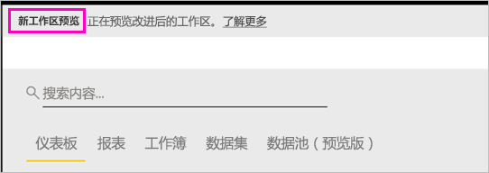
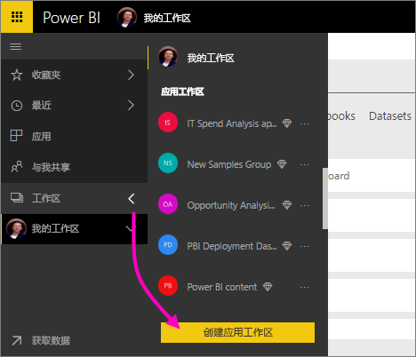
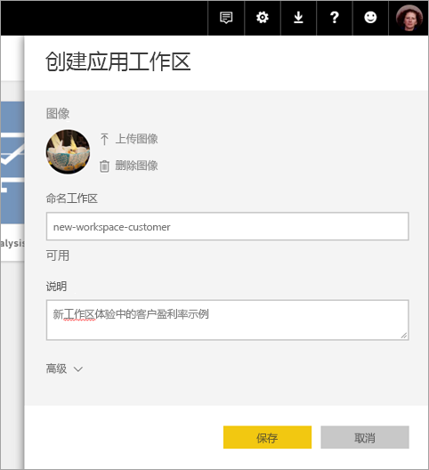
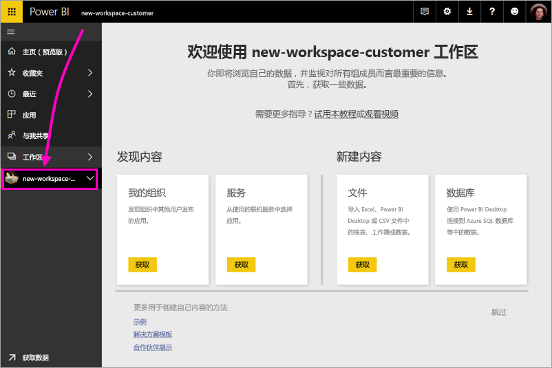
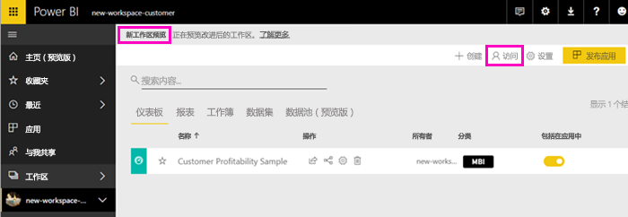
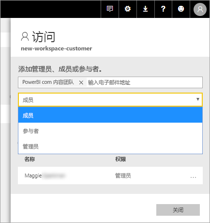

# 在 Power BI 中创建新工作区（预览）

Power BI 以预览的形式引入了新工作区体验。 工作区仍是与同事协作创建仪表板和报表集合的地方，可将其捆绑到应用并分发到整个组织或者特定人员或组。 

使用新的工作区预览，可以：

- 将工作区角色分配给用户组：安全组、通讯组列表、Office 365 组和个人。
- 在 Power BI 中创建工作区，而无需创建 Office 365 组。
- 使用更精细的工作区角色在工作区中实现更灵活的权限管理。
 
创建一个新工作区时，无需创建关联的基础 Office 365 组。 所有工作区管理操作都在 Power BI 中进行，而不是在 Office 365 中。 仍可将 Office 365 组添加到工作区，继续通过 Office 365 组管理用户对内容的访问。 不过，还可在 Power BI 中使用安全组、通讯组列表以及直接添加个人，以灵活的方式来管理工作区访问。 因为工作区管理现在在 Power BI 中，所以将由 Power BI 管理员来决定组织中可创建工作区的用户。 请参阅 [Power BI 管理门户文章，工作区部分](service-admin-portal.md#workspace-settings)以了解详细信息。 

可将用户组或个人作为成员、参与者或管理员添加到新工作区中。 用户组中的每个人都会获得定义的角色。 如果某个人是多个用户组的成员，则其获得角色提供的最高级别的权限。  有关不同角色的说明，请参阅后文的[新工作区中的角色](#roles-in-the-new-workspaces)。

添加到应用工作区中的每个人都需要 Power BI Pro 许可证。 在工作区中，这些用户全都可协作处理计划向更广泛的受众甚至整个组织发布的仪表板和报表。 如果要将内容分发给组织内的其他人，可将 Power BI Pro 许可证分配给这些用户，或将工作区置于 Power BI 高级容量中。

我们正在重新设计新工作区的某些功能。 有关预览中预计永久保留的更改的说明，请参阅后文中的[工作方式不同的应用工作区功能](#app-workspace-features-that-work-differently)。 由于这是一项预览功能，因此应注意一些限制。 请参阅后文有关当前限制的说明的[已知问题](#known-issues)。 

## 推出新的应用工作区

在预览期间，新旧工作区可以共存，可以创建其中任意一个。 新工作区预览结束且正式发布时，旧工作区仍可存在一段时间。 用户将无法创建它们，并且需要准备将工作区迁移到新的工作区基础结构。 别担心，有几个月的时间可用来完成迁移。

## 创建一个新的应用工作区

1. 首先，创建应用工作区。 选择“工作区” > “创建应用工作区”。
   
     

2. 在“预览改进的工作区”，选择“立即试用”。
   
     

2. 为工作区命名。 如果命名不可用，则对其进行编辑以给定一个唯一的 ID。
   
     应用将与工作区同名。
   
1. 如果需要，可添加图像。 文件大小必须小于 45 KB。
 
    

1. 选择**保存**。

    下面是新工作区的“欢迎”屏幕，可在其中添加数据。 

    

1. 例如，选择“示例” > “客户盈利率示例”。

    现在，在工作区内容列表中，可看到“新工作区预览”。 管理员还可看到新操作“访问”。

    

1. 选择“访问”。

1. 将安全组、通讯组列表、Office 365 组或个人作为成员、参与者或管理员添加到这些工作区中。 有关不同角色的说明，请参阅后文的[新工作区中的角色](#roles-in-the-new-workspaces)。

    

9. 选择“添加” > “关闭”。

1. Power BI 创建工作区并将其打开。 它显示在你作为成员的工作区的列表中。 管理员可以选择省略号 (…)，返回并更改工作区设置（添加新成员或更改其权限）。

     

## 将内容添加到应用工作区

创建新样式的应用工作区后，便可向其中添加内容。 在新旧样式的工作区中添加内容的过程类似，但有一个例外。 在任一应用工作区中，都可以上传文件或连接到文件，这类似于在“我的工作区”中所执行的操作。 在新工作区中，无法连接到组织内容包或第三方内容包（如 Microsoft Dynamics CRM、Salesforce 或 Google Analytics）。 在当前工作区中，可以连接到内容包。

在应用工作区内容列表中查看内容时，应用工作区名称列为所有者。

### 在新工作区中连接到第三方服务（预览）

在新工作区体验中，我们正在做出改变以专注于应用。 适用于第三方服务的应用可让用户轻松从所用服务（如 Microsoft Dynamics CRM、Salesforce 或 Google Analytics）中获取数据。
组织应用为用户提供所需内部数据。 我们计划为组织应用添加相关功能，以便用户可以自定义他们在应用中找到的内容。 这样就无需内容包。 

使用新工作区预览，无法创建或使用组织内容包。 但可以使用为连接到第三方服务提供的应用，或要求内部团队为当前正在使用的任何内容包提供应用。 

## 新工作区中的角色

借助角色，可管理哪些人员可在工作区中执行哪些操作，以便实现团队协作。 新的工作区支持向个人和用户组（安全组、Office 365 组和通讯组列表）分配角色。 

向用户组分配角色，组中的个人有权访问内容。 如果嵌套用户组，则包含的所有用户都具有权限。 如果用户属于具有不同角色的多个用户组，则其获得被授予的最高级别的权限。 

新工作区提供三种角色：管理员、成员和参与者。

**管理员可以：**

- 更新和删除工作区。 
- 添加/删除人员，包括其他管理员。
- 执行成员可以执行的所有操作。

**成员可以：** 

- 添加成员或具有较低权限的其他人。
- 发布和更新应用。
- 共享一个项或共享应用。
- 允许其他人重新共享项目。
- 执行参与者可以执行的所有操作。

**参与者可以：** 

- 在工作区中创建、编辑和删除内容。 
- 将报表发布到工作区，删除内容。
- 无法为新用户提供对内容的访问权限；无法共享新内容，但可以与已与其共享工作空间、项目或应用的人员共享。 
- 无法修改组内成员。
 
我们将在整个服务中构建请求访问工作流，以便没有访问权限的用户可以发出请求。 当前存在针对仪表板、报表和应用的请求访问工作流。

## 分发应用

内容准备好后，选择想要发布的仪表板和报表，然后将其作为应用发布。 可从每个工作区创建一个应用。 你的同事可通过几种不同的方式获取你的应用。 如果 Power BI 管理员已授予权限，则可将这些应用自动安装到同事的 Power BI 帐户中。 另外，他们可从 Microsoft AppSource 查找并安装应用，或者你可向他们发送一个直接链接。 他们将自动获得更新，你可以控制数据刷新的频率。 有关详细信息，请参阅[在 Power BI 中发布包含仪表板和报表的应用](consumer/end-user-create-apps.md)。

## 将旧应用工作区转换为新应用工作区

在预览期间，无法自动将旧应用工作区转换为新应用工作区。 但是，可以创建新应用工作区并将内容发布到新位置。 

当新工作区共正式发布 (GA) 后，用户可以选择自动迁移旧工作区。 在 GA 后的某个时刻，必须进行迁移。

## Power BI 应用常见问题

### 新应用工作区与当前应用工作区有何不同？
* 创建应用工作区不会像当前应用工作区那样在 Office 365 中创建相应的实体。 （仍可以通过为 Office 365 组分配一个角色，将其添加到工作区）。 
* 在当前应用工作区中，仅可将个人添加到成员和管理员列表中。 在新应用工作区中，可以向这些列表添加多个 AD 安全组、通讯组列表或 Office 365 组，以便更轻松地管理用户。 
- 可以从当前应用工作区创建组织内容包。 无法从新应用工作区创建组织内容包。
- 可以从当前应用工作区使用组织内容包。 无法从新应用工作区使用组织内容包。
- 在预览期间，新应用工作区尚未启用某些功能。 有关详细信息，请参阅下一节[其他计划的新工作区功能](service-create-the-new-workspaces.md#other-planned-new-app-workspace-preview-features)。

## 计划的新应用工作区预览功能

某些其他新应用工作区预览功能仍在开发中，但在我们启动预览时还不可用：

- 没有“退出工作区”按钮。
- 尚不支持使用情况指标。
- 高级容量工作原理：可以在高级容量中分配和创建工作区，而要在容量之间移动工作区，请转到工作区设置。
- 尚不支持 SharePoint web 部件嵌入。
- 在Office 365 组“获取数据/文件”中，没有“OneDrive”按钮。

## 工作方式不同的应用工作区功能

新应用工作区中，某些功能的工作方式与当前应用工作区不同。 基于客户提供的反馈，这些差异是有意为之，支持更灵活地使用工作空间进行协作：

- 成员可以或无法重新共享：替换为参与者角色
- 只读工作区：不向用户授予对工作区的只读访问权限，而是将用户分配给即将推出的查看器角色，该角色允许对工作区中的内容进行类似的只读访问。

## 已知问题

存在以下已知问题，正在开发修复程序：

- 作为订阅收件人添加到电子邮件的免费用户或用户组可能不会收到电子邮件，尽管他们应该收到这些邮件。 当新工作区体验工作区处于高级容量中，但创建订阅的用户的“我的工作区”不在高级容量中时，会出现此问题。 如果“我的工作区”处于高级容量中，免费用户和用户组都可收到电子邮件。
- 工作区从高级容量迁移至共享容量后，在某些情况下，免费用户和用户组继续接收电子邮件，尽管他们不应该收到这些邮件。 当创建订阅的用户的“我的工作区”处于高级容量中时，会出现此问题。

## 后续步骤

- [创建当前工作区](service-create-workspaces.md)
* [在 Power BI 中安装并使用应用](consumer/end-user-apps.md)
* 是否有任何问题？ [尝试咨询 Power BI 社区](http://community.powerbi.com/)
