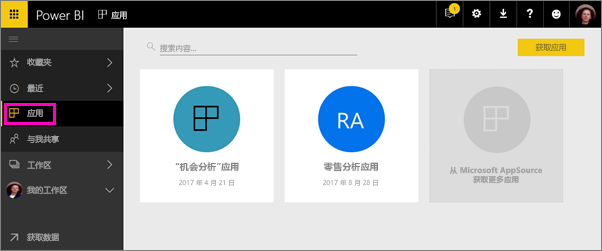

# 与同事一起在 Power BI 中创建工作区

可在 Power BI 中创建工作区，可与同事在工作区中协作，创建和优化仪表板和报表集合。 然后可将这些集合捆绑到应用，并可将该应用分发到整个组织或特定人员或组。 

创建工作区时，将创建关联的基础 Office 365 组。 所有工作区管理操作都在 Office 365 中进行。 可以以成员或管理员身份将同事添加到这些工作区。 在工作区中，所有人可协作处理计划向更广大受众发布的仪表板、报表和其他项目。 添加到应用工作区中的每个人都需要 Power BI Pro 许可证。 

**你知道吗？** Power BI 正在提供新工作区体验预览。 有关新工作区的详细信息，请参阅[在新工作区（预览版）中组织工作](service-new-workspaces.md)。 

## 视频：应用和应用工作区
<iframe width="640" height="360" src="https://www.youtube.com/embed/Ey5pyrr7Lk8?showinfo=0" frameborder="0" allowfullscreen></iframe>

## 基于 Office 365 组创建应用工作区

创建应用工作区时，即会创建 Office 365 组。

[!INCLUDE [powerbi-service-create-app-workspace](./includes/powerbi-service-create-app-workspace.md)]

首次创建工作区时，可能需要等待一小时左右，让工作区传播到 Office 365。 

### 将图像添加到 Office 365 应用工作区（可选）
默认情况下，Power BI 会为应用创建一个带有应用首字母的彩色小圆圈。 但你可能会想要使用图像对其进行自定义。 若要添加映像，需要 Exchange Online 许可证。

1. 选择“工作区”，然后选择工作区名称旁边的省略号 (...)，选择“成员”。 
   
     
   
    工作区的 Office 365 Outlook 帐户将在新的浏览器窗口中打开。
2. 将鼠标悬停在左上方的彩色圆圈上时，它将变为铅笔图标。 请选择它。
   
     
3. 再次选择铅笔图标，然后找到你要使用的图像。
   
     

4. 选择“保存”。
   
     
   
    图像会替换 Office 365 Outlook 窗口中的彩色圆圈。 
   
     
   
    几分钟后，它将在 Power BI 中的应用中显示。
   
     

## 将内容添加到应用工作区

创建应用工作区后，便可向其中添加内容。 添加内容的操作类似于将内容添加到“我的工作区”，只不过工作区中的其他人员也可以查看并使用它。 一个明显区别是，在操作完成后，可以将内容作为应用发布。 在应用工作区内容列表中查看内容时，应用工作区名称列为所有者。

### 在应用工作区中连接到第三方服务

为 Power BI 支持的所有第三方服务都提供了应用，使用户可以轻松从所用服务（如 Microsoft Dynamics CRM、Salesforce 或 Google Analytics）获取数据。 可以发布组织应用程序，为用户提供所需数据。

在当前工作区中，也可以使用组织内容包和 Microsoft Dynamics CRM、Salesforce 或 Google Analytics 等第三方内容包进行连接。 请考虑将组织内容包迁移到应用。

## 分发应用

内容准备好后，选择想要发布的仪表板和报表，然后将其作为应用发布。 你的同事可以通过几种不同的方式获取你的应用。 如果 Power BI 管理员已授予权限，则可以将这些应用自动安装到同事的 Power BI 帐户中。 另外，他们可以从 Microsoft AppSource 查找并安装这些应用，或者你可向他们发送一个直接链接。 他们将自动获得更新，你可以控制数据刷新的频率。 有关详细信息，请参阅[在 Power BI 中发布包含仪表板和报表的应用](service-create-distribute-apps.md)。

## Power BI 应用常见问题

### 应用与组织内容包有什么不同？
应用由组织内容包演变而来。 如果你已具有组织内容包，它们将继续与应用并行工作。 应用和内容包有几个主要区别。 

* 业务用户在安装内容包后，它将失去其分组的标识：它只是穿插了其他仪表板和报表的仪表板和报表列表。 另一方面，应用即使在安装后也会维护其分组和标识。 因此，随着时间的推移，此分组使业务用户能够继续轻松地导航到应用。
* 你可以从任何工作区创建多个内容包，但应用与其工作区具备一对一的关系。 
* 随着时间的推移，我们计划弃用组织内容包，因此，我们建议你从现在开始构建应用。  
* 通过新工作区体验预览，我们迈出了弃用组织内容包的第一步。 无法在预览工作区中使用或创建它们。

请参阅[新应用工作区与现有应用工作区有何不同？](service-new-workspaces.md#how-are-the-new-workspaces-different-from-current-workspaces)来比较两者。 

## 后续步骤
* [在 Power BI 中安装并使用应用](service-create-distribute-apps.md)
- [创建新工作区（预览）](service-create-the-new-workspaces.md)
* 是否有任何问题? [尝试咨询 Power BI 社区](http://community.powerbi.com/)
