# 在 Power BI 服务中创建 Power BI 仪表板
你已经阅读了 [Power BI 中的仪表板](service-dashboards.md)，并且现在想要创建你自己的仪表板。 有许多不同的方法可用于创建仪表板：从报表、从头开始、从数据集、通过复制现有仪表板等。  

在你初次使用它时可能会感到不知所措，因此我们先创建一个快速简单的仪表板，方法是从已构建的报表固定可视化效果。 完成此快速入门后，你将很好地了解仪表板和报表之间的关系、如何在报表编辑器中打开编辑视图、固定磁贴以及在仪表板和报表之间导航。 然后，使用左侧目录中的链接或底部的“下一步”继续学习更高级的主题。

## 谁可以创建仪表板？
创建仪表板是创建者功能，需要拥有报表编辑权限。 报表创建者及其所授予访问权限的同事拥有编辑权限。 例如，如果 David 在 workspaceABC 中创建了一个报表，然后将你添加为该工作区的成员，则你和 David 都将拥有编辑权限。 另一方面，如果报表已与你直接共享或作为 [Power BI 应用](service-install-use-apps.md)的一部分（你正在使用该报表），则你将无法将磁贴固定到仪表板。

> **注意**：仪表板是 Power BI 服务的一项功能，而不是 Power BI Desktop 的功能。 无法在 Power BI 移动设备中创建仪表板，但可以[查看和共享](mobile-apps-view-dashboard.md)仪表板。
>
> 

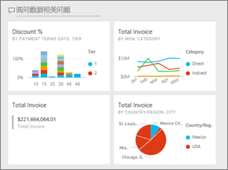

## 视频：通过从报表中固定视觉对象和图像创建仪表板
观看 Amanda 通过从报表中固定可视化效果来创建新仪表板。 然后，使用采购分析示例，按照视频下面的步骤亲自尝试。

<iframe width="560" height="315" src="https://www.youtube.com/embed/lJKgWnvl6bQ" frameborder="0" allowfullscreen></iframe>

### 先决条件
若要跟着介绍一起操作，需要下载“采购分析”示例 Excel 工作簿并在 Power BI 服务 (app.powerbi.com) 中打开它。

## 使用报表导入数据集
我们将导入一个 Power BI 示例数据集，并使用它来创建我们的新仪表板。 我们使用的示例是包含两个 PowerView 工作表的 Excel 工作簿。 当 Power BI 导入工作簿时，它将向你的工作区添加一个数据集和一个报表。  该报表是从 PowerView 工作表自动创建的。

1. [选择此链接](http://go.microsoft.com/fwlink/?LinkId=529784)下载并保存采购分析示例 Excel 文件。 我们建议你将其保存在你的 OneDrive for Business 中。
2. 在浏览器 (app.powerbi.com) 中打开 Power BI 服务。
3. 选择“我的工作区”。
4. 从左侧导航窗格中，选择“获取数据”。

    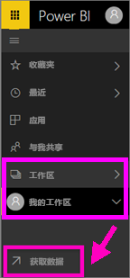
5. 然后，选择“文件”。

   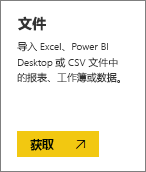
6. 导航到你保存采购分析示例 Excel 文件的位置。 选择它，然后选择“连接”。

   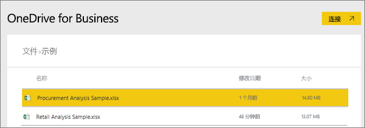
7. 对于此练习，请选择“导入”。

    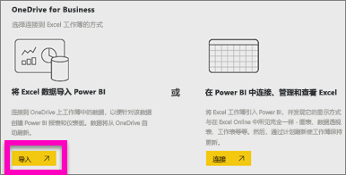
8. 出现成功消息时，选择 **x** 将其关闭。

   

### 打开报表并将一些磁贴固定到仪表板
1. 在同一工作区中，选择“报表”选项卡。新导入的报表显示有黄色星号。 选择报表名称以打开它。

    
2. 报表会在[阅读视图](service-reading-view-and-editing-view.md)中打开。 请注意，它的底部包含两个选项卡：折扣分析和支出概况。 每个选项卡表示报表的一页。
    选择“编辑报表”在编辑视图中打开报表。

    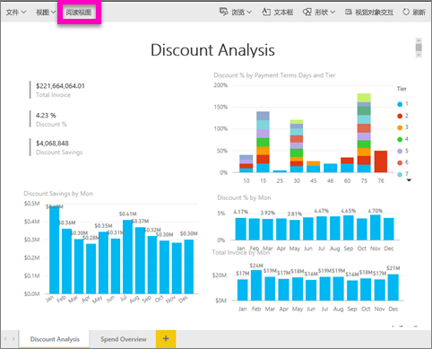
3. 将鼠标悬停在可视化效果上方以显示可用的选项。 要将可视化效果添加到仪表板，请选择固定  图标。

    
4. 由于我们正在创建新仪表板，请选择“新建仪表板”选项，并为其指定名称。

   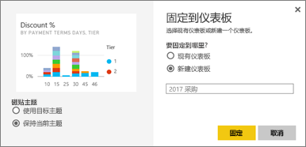
5. 当你选择“固定”时，Power BI 将在当前工作区中创建新仪表板。 当“已固定到仪表板”消息出现时，选择“转到仪表板”。 如果系统提示你保存报表，请选择“保存”。

     
6. Power BI 将打开新的仪表板，其中包含一个磁贴，即你刚刚固定的可视化效果。

   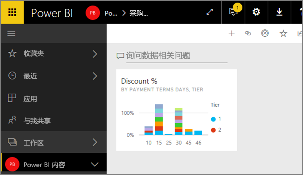
7. 要返回到报表，请选择该磁贴。 将更多磁贴固定到新仪表板。 此时，显示“固定到仪表板”窗口，请选择“现有仪表板”。  

   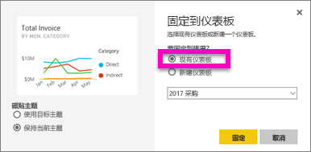

## 将整个报表页固定到仪表板
可[将整个报表页固定为*动态磁贴*](service-dashboard-pin-live-tile-from-report.md)（而不是一次固定一个视觉对象）。 我们开始操作吧。

1. 在报表编辑器中，选择“支出概况”选项卡打开报表的第 2 页。

   

2. 你希望在仪表板上具有所有这些视觉对象。  在菜单栏右上角，选择“固定活动页面”。 在仪表板上，活动页面磁贴将在每次刷新页面时更新。

   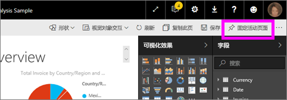

3. 显示“固定到仪表板”窗口时，请选择“现有仪表板”。

   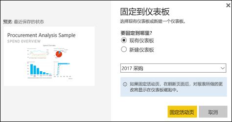

4. 看到“成功”消息时，选择“转至仪表板”。 可以在此处看到从报表固定的磁贴。 在以下示例中，我们已从报表的第 1 页固定了 2 个磁贴，并从报表的第 2 页固定了一个动态磁贴。

   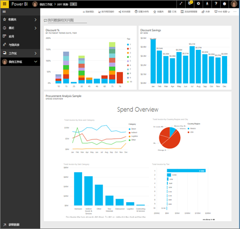

恭喜你创建了第一个仪表板！ 现在你拥有了一个仪表板，通过它你可以执行更多操作。  请尝试执行下面建议的**后续步骤**的任一步骤，或者自己开始操作和探索。   

## 后续步骤
* [调整大小和移动磁贴](service-dashboard-edit-tile.md)
* [关于仪表板磁贴的所有内容](service-dashboard-tiles.md)
* [通过创建应用共享仪表板](service-create-distribute-apps.md)
* [Power BI - 基本概念](service-basic-concepts.md)
* [设计出色仪表板的提示](service-dashboards-design-tips.md)

更多问题？ [尝试参与 Power BI 社区](http://community.powerbi.com/)
