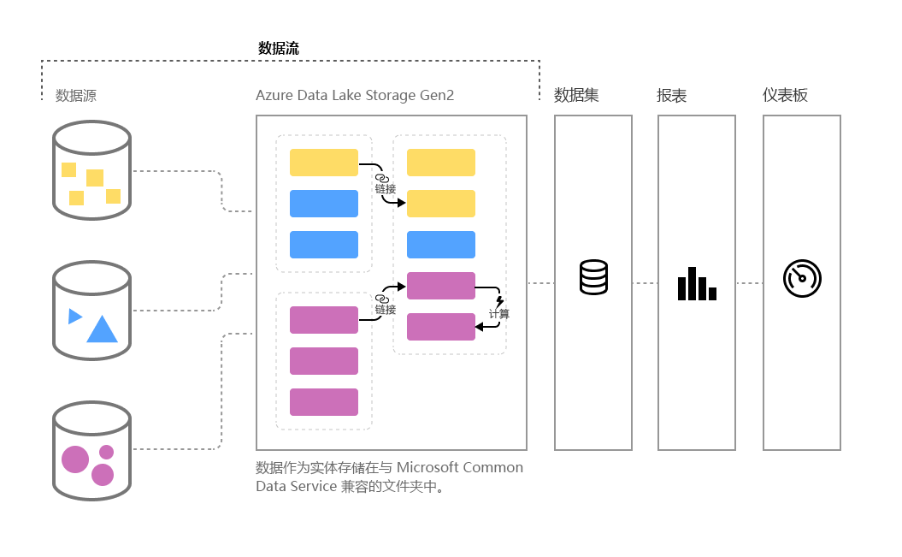

# Power BI 中的自助服务数据准备（预览）

随着数据量的不断增长，将数据转换为格式正确且可操作信息的挑战也随之增加。 我们希望数据已准备好用于分析，可填充视觉效果、报告和仪表板，以便我们可以快速将数据量转化为可操作的见解。 借助 Power BI 中针对大数据的自助服务数据准备，用户只需单击几下即可将数据转换成 Power BI 见解。

Power BI 引入数据流，以帮助组织统一来自不同来源的数据并为建模做好数据准备。 分析人员可以使用熟悉的自助服务工具轻松创建数据流。 数据流用于通过定义数据源连接、ETL 逻辑、刷新计划等来引入、转换、集成和丰富大数据。 此外，作为数据流一部分的新模型驱动计算引擎使数据准备过程更易于管理且更具决定性，并且对于数据分析人员和报表创建者等来说都不那么麻烦。 与电子表格处理所有受影响公式的重新计算类似，数据流代表用户管理实体或数据元素的更改，自动更新，并缓解曾经甚至对基本数据刷新也很繁琐且耗时的逻辑检查。 通过数据流，分析人员和报告创建者只需单击几下即可处理曾经需要数据科学家监督（且需要几个小时或几天才能完成）的任务。 

数据作为实体存储在 Azure Data Lake Storage Gen2 中的[通用数据模型](https://docs.microsoft.com/powerapps/common-data-model/overview)中。 使用 Power BI 服务在应用工作区中创建和管理数据流。  

> [!NOTE]
> 数据流功能处于预览状态，可能会在正式版推出前更改和更新。

 
数据流设计为使用通用数据模型，该模式是 Microsoft 发布的标准化数据架构集合，它采用模块化结构，可进行扩展，旨在简化生成、使用和分析数据的过程。 使用此模型，用户可以不费摧毁之力将数据源导入到 Power BI 仪表板。

用户可以使用数据流从大型且不断增长的受支持的本地和基于云的数据源（包括 Dynamics 365、Salesforce、Azure SQL 数据库、Excel、SharePoint 等）中引入数据。

然后，可以将数据映射到通用数据模型中的标准实体，修改和扩展现有实体以及创建自定义实体。 高级用户可以使用自助服务、低代码/无代码、内置 Power Query 创作体验创建完全自定义的数据流，类似于数百万 Power BI Desktop 用户和 Excel 用户已经熟悉的 Power Query 体验。  

创建数据流后，可以使用 Power BI Desktop 和 Power BI 服务创建数据集、报表、仪表板和应用，利用通用数据模型的强大功能深入了解业务活动。 

数据流刷新计划直接从创建数据流的工作区进行管理，就像数据集一样。 

## 数据流的工作原理

以下是数据流如何开展工作的一些示例：

* 组织可以将其数据映射到通用数据模型中的标准实体，或创建自己的自定义实体。 然后，可以将这些实体用作构建基块，以创建马上可以使用的报表、仪表板和应用，并将它们分发给整个组织中的用户。 

* 使用广泛的 Microsoft 数据连接器集合，组织可以将自己的数据源连接到数据流，使用 Power Query 映射来自其来源的数据并将其引入 Power BI。 数据流导入数据（并以指定的频率刷新）后，可以在 Power BI Desktop 应用程序中使用这些数据流实体来创建引人注目的报表和仪表板。 

## 如何使用数据流

前一部分介绍了可使用数据流在 Power BI 中快速创建强大分析的一些方法。 在本部分中，你将了解使用组织中的数据流创建见解的速度有多快，并快速了解 BI 专业人员如何创建自己的数据流以及如何为他们自己的组织自定义见解。

### 扩展通用数据模型以满足业务需求
对于希望扩展通用数据模型 (CDM) 的组织，数据流可使商业智能专业人员自定义标准实体或创建新实体。 然后，可以将这种自定义数据模型的自助服务方法与数据流一起使用，以生成针对组织定制的应用和 Power BI 仪表板。

### 以编程方式定义数据流
你可能还希望开发自己的编程解决方案来创建数据流。 借助公共 API 和以编程方式创建自定义数据流定义文件 (model.json) 的功能，可以创建适合贵组织的唯一数据和分析需求的自定义解决方案。 

公共 API 允许开发人员以简单轻松的方式与 Power BI 和数据流进行交互。

### 通过 Azure 扩展功能
每个付费 Power BI 订阅均包含 Azure Data Lake Storage Gen2（每个用户 10 GB，每个 P1 节点 100 TB）。 因此，可以轻松地在 Azure Data Lake 上开始进行自助服务数据准备。 

可以将 Power BI 配置为在组织的 Azure Data Lake Storage Gen2 帐户中存储数据流数据。 当 Power BI 连接到 Azure 订阅时，数据开发人员和数据科学家可以利用诸如 Azure 机器学习、Azure Databricks、Azure 数据工厂等功能强大的 Azure 产品。

Power BI 还可以使用通用数据模型格式的系统化数据连接到文件夹，这些数据存储在组织的 Azure Data Lake Storage 帐户中。 这些文件夹可以由 Azure 数据服务等服务创建。 通过连接到这些文件夹，分析人员可以在 Power BI 中无缝地处理这些数据。 

有关 Azure Data Lake Storage Gen2 和数据流集成的详细信息（包括如何创建驻留在组织 Azure Data Lake 中的数据流），请参阅[数据流和 Azure Data Lake 集成（预览）](service-dataflows-azure-data-lake-integration.md)。

## Power BI Premium 上的数据流功能

对于要在 Power BI Premium 订阅上运行的数据流功能和工作负载，必须启用该高级容量的数据流工作负载。 可以在[什么是 Power BI Premium](service-premium.md) 一文中了解有关 Power BI Premium 的更多信息。 

下表介绍了使用 Power BI Pro 帐户时的数据流功能及其容量，以及与使用 Power BI Premium 相比的情况。

|数据流功能 | Power BI Pro |   Power BI Premium |
|---------|---------|---------|
|计划内刷新| 每天 8 次|  48|
|存储总量| 10 GB/用户  |100 TB/节点|
|使用 Power Query Online 进行数据流创作|    +   |+|
|Power BI 中的数据流管理|   +|  +|
|Power BI Desktop 中的数据流数据连接器|  +|  +|
|与 Azure 集成|    +|  +|
|计算实体（通过 M 进行存储内转换） | |   +|
|新建连接器|    +|  +|
|数据流增量刷新|  |   +|
|在 Power BI 高级容量上运行/并行执行转换|   |   +|
|数据流链接实体| |        +|
|标准化架构/通用数据模型的内置支持|  +|  +|

有关如何在高级容量上启用数据流工作负载的详细信息，请参阅 Power BI Premium 的[配置工作负载](service-admin-premium-manage.md#configure-workloads)一文。

## Power BI 中大数据的自助服务数据准备摘要
如本文前面所述，有多种方案和示例，其中数据流可以使用户从业务数据中获得更好的控制和更快的见解。 使用通用数据模型定义的标准数据模型（架构），数据流可以导入有价值的业务数据，并且可以在很短的时间内准备好数据以进行建模和创建 BI 见解，而过去这需要几个月的时间，甚至更长的时间才能创建。 

通过以通用数据模型的标准化格式存储业务数据，BI 专业人员（或开发人员）可以创建生成快速、简单和自动化视觉对象和报表的应用。 这些包括但不限于：

* 将数据映射到通用数据模型中的标准实体，以统一数据并利用已知架构来加快创建马上可以使用的见解
* 创建自己的自定义实体以统一整个组织中的数据 
* 使用并刷新外部数据作为数据流的一部分，并启用该数据的导入以驱动见解
* 面向开发人员的数据流入门

## 后续步骤

本文概述了 Power BI 中大数据的自助服务数据准备，以及可以使用它的多种方法。 以下文章详细介绍了数据流的常见使用方案。 

* [在 Power BI 中创建和使用数据流](service-dataflows-create-use.md)
* [在 Power BI Premium 上使用计算实体（预览）](service-dataflows-computed-entities-premium.md)
* [将数据流与本地数据源配合使用（预览）](service-dataflows-on-premises-gateways.md)
* [Power BI 数据流的开发人员资源（预览）](service-dataflows-developer-resources.md)
* [数据流和 Azure Data Lake 集成（预览）](service-dataflows-azure-data-lake-integration.md)

有关 Power Query 和计划刷新的详细信息，可以阅读以下文章：
* [Power BI Desktop 中的查询概述](desktop-query-overview.md)
* [配置计划刷新](refresh-scheduled-refresh.md)

有关通用数据模型的详细信息，可以阅读其概述文章：
* [通用数据模型 - 概述](https://docs.microsoft.com/powerapps/common-data-model/overview)

