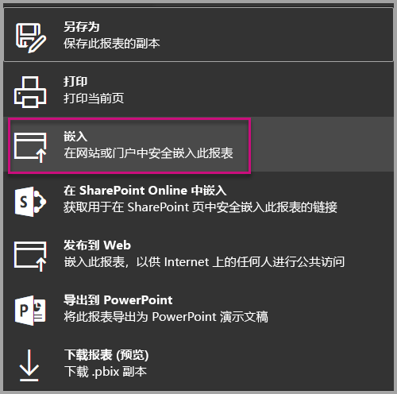
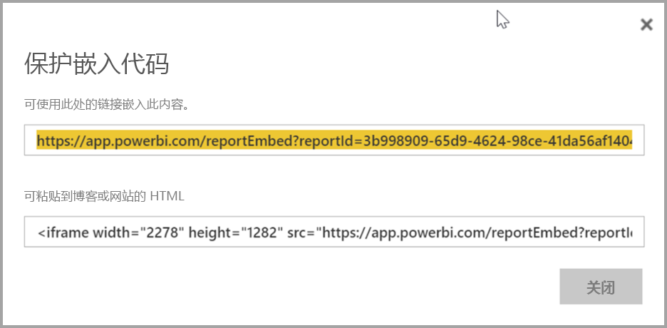
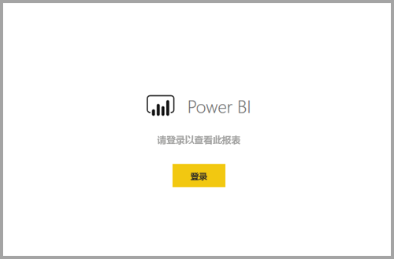
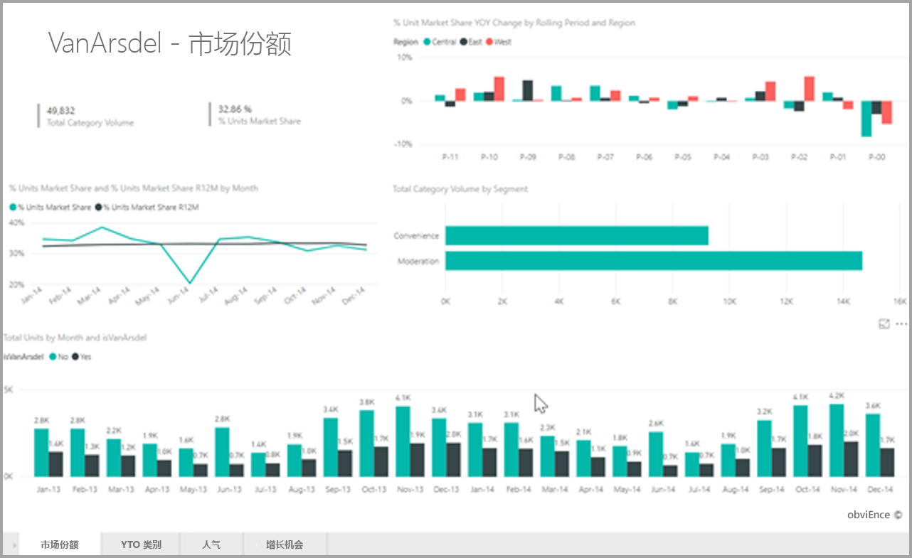

# <a name="embed-a-report-in-a-secure-portal-or-website"></a>在安全门户或网站中嵌入报表

使用 Power BI 中报表的新安全“嵌入”选项，用户可以轻松且安全地在内部 Web 门户中嵌入报表，无论是基于云的，还是托管在本地的，例如 SharePoint 2019。 以这种方式嵌入的报表通过行级别安全性 (RLS) 尊重所有项目权限和数据安全性。 该功能旨在允许无代码嵌入到任何接受 URL 或 iFrame 嵌入的门户中。

“嵌入”选项还支持 [URL 筛选器](service-url-filters.md)和 URL 设置。 通过“嵌入”选项，可以使用只需要基本 HTML 和 JavaScript 知识的低代码方法来与门户集成。

## <a name="how-to-embed-power-bi-reports-into-portals"></a>如何将 Power BI 报表嵌入门户

1. 在 Power BI 服务中报表的“文件”菜单上提供新的“嵌入”选项。

    

2. 选择“嵌入”选项可打开一个对话框，该对话框提供一个链接和一个用于安全嵌入报表的 iFrame。

    

3. 将 URL 嵌入 Web 门户后，或者如果直接打开 URL，用户将在可以访问报表之前先进行身份验证。 在下面的示例中，用户尚未在浏览器会话中登录 Power BI。 当他们按“登录”时，可能需要打开新的浏览器窗口或选项卡。 如果未提示进行登录，请检查弹出窗口阻止程序。

    

4. 用户登录后，将打开报表，显示数据并允许用户在页面之间导航和设置筛选器。 仅向有权在 Power BI 中查看报表的用户显示此报表。 此外，还应用了所有行级别安全性 (RLS) 规则。 最后，用户需要获得正确许可，要么需要 Power BI Pro 许可证，要么报表必须位于处于 Power BI Premium 容量范围内的工作区中。 用户每次打开新的浏览器窗口时都需要进行登录，但是在登录一次后，就会自动加载其他报表。

    

5. 使用 iFrame 选项时，最好编辑提供的 HTML，指定所需的高度和宽度以适合门户网页。

    

## <a name="granting-access-to-reports"></a>授予报表访问权限

“嵌入”选项不会自动允许用户查看报表。 需要在 Power BI 服务中设置报表查看权限。

要在 Power BI 服务中提供对报表的访问，可以与需要访问嵌入报表的用户共享该报表。 如果使用的是 Office 365 组，请在 Power BI 服务中将用户列为应用工作区的成员。 有关详细信息，请参阅如何[管理应用工作区](service-manage-app-workspace-in-power-bi-and-office-365.md)。

## <a name="licensing"></a>许可

查看嵌入报表的用户需要具有 Power BI Pro 许可证，或该内容需要位于处于 [Power BI Premium 容量（EM 或 P SKU）](service-admin-premium-purchase.md)范围内的工作区中。

## <a name="customize-your-embed-experience-using-url-settings"></a>使用 URL 设置自定义嵌入体验

嵌入 URL 支持多种输入设置，可帮助你自定义用户体验。 如果使用的是提供的 iFrame，请确保在 iFrame 的 src 设置中更新该 URL。

| 属性  | 说明  |  |  |  |
|--------------|-----------------------------------------------------------------------------------------------------------------------------------------------------------------------------------------------------------------------|---|---|---|
| pageName  | 可以使用 pageName 查询字符串参数来设置要打开的报表页面。 在 Power BI 服务中查看报表时，pageName 值对应于报表 URL 的末尾，如下所示。 |  |  |  |
| URL 筛选器  | 可以在从 Power BI UI 接收到的嵌入 URL 中使用 [URL 筛选器](service-url-filters.md)来筛选嵌入的内容。 借助这种方式，可以通过基本 HTML 和 JavaScript 体验生成低代码集成。  |  |  |  |

## <a name="set-which-page-opens-when-the-report-is-embedded"></a>设置嵌入报表时打开的页面

pageName 设置中提供的值对应于在 Power BI 服务中查看报表时报表 URL 的末尾。

1. 从 Web 浏览器中的 Power BI 服务打开报表，然后从地址栏复制该 URL。

    

2. 将 pageName 设置追加到此 URL。

    

## <a name="filter-report-content-using-url-filters"></a>使用 URL 筛选器筛选报表内容

对于某些高级功能，可以通过 [URL 筛选器](service-url-filters.md)来使用报表生成更多体验。 例如，下面的 URL 筛选报表以显示能源行业的数据。

将 pageName 和 [URL 筛选器](service-url-filters.md)结合使用的功能非常强大。 可以使用基本 HTML 和 JavaScript 生成体验。

例如，以下是如何向 HTML 页添加按钮：

```html
<button class="textLarge" onclick='show("ReportSection", "Energy");' style="display: inline-block;">Show Energy</button>
```

按下按钮时，该按钮会调用一个函数以使用更新的 URL 来更新 iFrame，其中包括能源行业的筛选器。

```javascript
function show(pageName, filterValue)

{

var newUrl = baseUrl + "&pageName=" + pageName;

if(null != filterValue && "" != filterValue)

{

newUrl += "&$filter=Industries/Industry eq '" + filterValue + "'";

}

//Assumes there’s an iFrame on the page with id=”iFrame”

var report = document.getElementById("iFrame")

report.src = newUrl;

}
```


可以根据需要添加任意数量的按钮，以创建低代码自定义体验。 

## <a name="considerations-and-limitations"></a>注意事项和限制

* 不支持外部来宾用户访问 Azure 企业到企业 (B2B)。

* 安全嵌入适用于发布到 Power BI 服务的报表。

* 用户需要在每次打开新浏览器窗口时进行登录才能查看报表。

* 某些浏览器要求用户在登录后刷新页面，尤其是在使用 InPrivate 或 Incognito 模式的情况下。

* 要实现单一登录体验，请使用“在 SharePoint Online 中嵌入”选项，或使用[用户拥有数据](developer/embed-sample-for-your-organization.md)方法生成自定义集成。 了解有关[用户拥有数据](developer/embed-sample-for-your-organization.md)的详细信息。

* 随“嵌入”选项提供的自动身份验证功能不适用于 Power BI JavaScript API。 对于 Power BI JavaScript API，请使用[用户拥有数据](developer/embed-sample-for-your-organization.md)方法进行嵌入。 了解有关[用户拥有数据](developer/embed-sample-for-your-organization.md)的详细信息。

## <a name="next-steps"></a>后续步骤

* [工作共享方式](service-how-to-collaborate-distribute-dashboards-reports.md)

* [URL 筛选器](service-url-filters.md)

* [SharePoint Online 报表 Web 部件](service-embed-report-spo.md)

* [发布到 Web](service-publish-to-web.md)