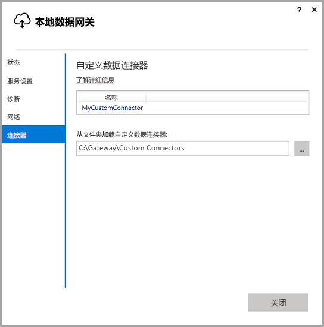
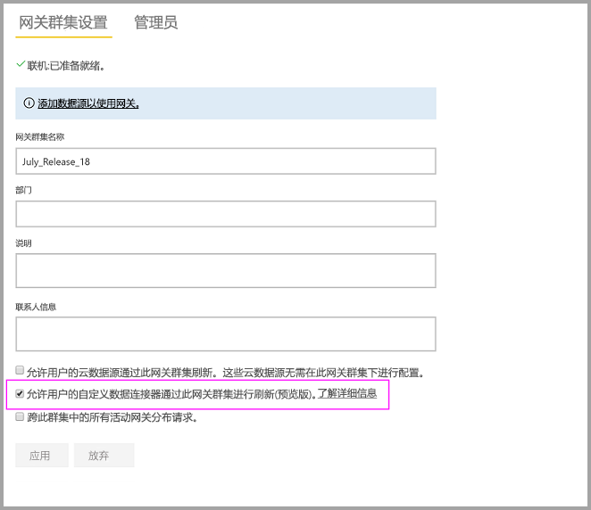
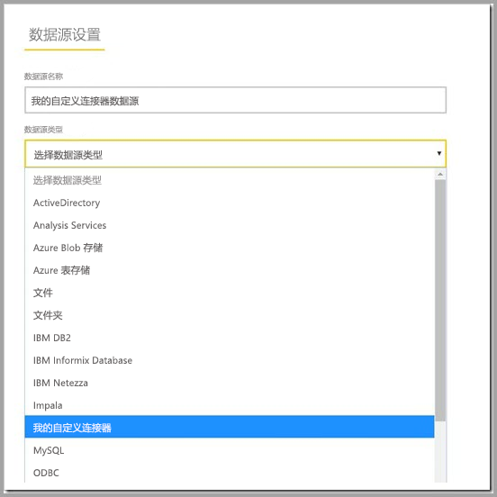

# 通过本地数据网关使用自定义数据连接器

通过适用于 Power BI 的数据连接器，可以连接到应用程序、服务或数据源中的数据并访问这些数据。 可以开发自定义数据连接器并将其用于 Power BI Desktop 中。

若要了解有关如何开发适用于 Power BI 的自定义数据连接器的详细信息，请在[此处](http://aka.ms/dataconnectors)查看相关文档。

如果在使用自定义数据连接器的 Power BI Desktop 中生成报表，可以使用本地数据网关刷新 Power BI 服务中的这些报表。

## 下面是有关如何启用和使用此功能的指南

如果安装本地数据网关 2018 年 7 月版本或更高版本，可在配置器中看到“连接器”选项卡，可通过其中包含的一个选项选择要从其中加载自定义连接器的文件。 确保选取运行网关服务的用户可访问的文件夹（默认为“NT SERVICE\PBIEgwService”）。 网关可自动加载位于该文件夹中的自定义连接器文件，你应可在数据连接器列表中看到它们。

如果使用个人版本地数据网关，此时应能够将 Power BI 报表上传到 Power BI 服务并使用网关进行刷新。

对于企业版网关，仍需创建用于自定义连接器的数据源。 在 Power BI 服务的网关设置页中，在选择网关群集时应看到一个新选项，用于允许对此群集使用自定义连接器。 请确保群集中的所有网关均为 2018 年 7 月更新版本或更高版本，以便此选项可用。 现在选择该选项，以允许对此群集使用自定义连接器。

启用此选项后，现在将看到自定义连接器作为可在此网关群集下创建的可用数据源。 使用新的自定义连接器创建数据源后，现在可以在 Power BI 服务中使用该自定义连接器刷新 Power BI 报表。

## 注意事项和限制

* 请确保所创建的文件夹可供后台网关服务访问。 通常情况下，无法访问用户的 Windows 文件夹或系统文件夹下的文件夹。 如果文件夹不可访问，网关配置器将显示一条消息（这不适用于个人版网关）
* 若要配合使用自定义连接器和本地数据网关，需要在自定义连接器的代码中实现“TestConnection”部分。 如果将自定义连接器用于 Power BI Desktop，则无需实现此要求。 可以将自定义连接器用于 Desktop，但不可因此将其用于网关。 请参阅[本文档](https://github.com/Microsoft/DataConnectors/blob/master/docs/m-extensions.md#implementing-testconnection-for-gateway-support)了解如何实现 TestConnection 部分。

## 后续步骤

* [管理数据源 - Analysis Services](service-gateway-enterprise-manage-ssas.md)  
* [管理数据源 - SAP HANA](service-gateway-enterprise-manage-sap.md)  
* [管理数据源 - SQL Server](service-gateway-enterprise-manage-sql.md)  
* [管理数据源 - Oracle](service-gateway-onprem-manage-oracle.md)  
* [管理数据源 - 导入/计划刷新](service-gateway-enterprise-manage-scheduled-refresh.md)  
* [深入了解本地数据网关](service-gateway-onprem-indepth.md)  
* [本地数据网关（个人模式）](service-gateway-personal-mode.md)
* [为本地数据网关配置代理设置](service-gateway-proxy.md)  
* [使用 Kerberos 进行从 Power BI 到本地数据源的 SSO（单一登录）](service-gateway-kerberos-for-sso-pbi-to-on-premises-data.md)  

更多问题？ [尝试参与 Power BI 社区](http://community.powerbi.com/)
