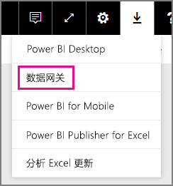

# <a name="manage-your-data-source---oracle"></a>管理数据源 - Oracle
安装本地数据网关之后，需要添加可与该网关结合使用的数据源。 本文将探讨如何使用网关和数据源。 你可以使用 Oracle 数据源进行计划刷新或 DirectQuery。

## <a name="download-and-install-the-gateway"></a>下载和安装网关
你可以从 Power BI 服务中下载网关。 选择“下载” > “数据网关”，或转到[网关下载页](https://go.microsoft.com/fwlink/?LinkId=698861)。



> [!WARNING]
> 为了使网关能够连接到你的 Oracle 服务器，需要安装和配置 .NET 的 Oracle 数据提供程序 (ODP.NET)。 这是 Oracle 数据访问组件 (ODAC) 的一部分。 有关如何下载 Oracle 提供程序的详细信息，请参阅 [安装 Oracle 客户端](#installing-the-oracle-client)。
> 
> 

## <a name="installing-the-oracle-client"></a>安装 Oracle 客户端
对于 **32 位**版本的 Power BI Desktop，请使用以下链接来下载并安装 **32 位** Oracle 客户端：

* [32 位 Oracle Data Access Components (ODAC) 和 Oracle Developer Tools for Visual Studio (12.1.0.2.4)](http://www.oracle.com/technetwork/topics/dotnet/utilsoft-086879.html)

有关 64 位版本的 Power BI Desktop 或本地数据网关，请使用以下链接下载并安装 64 位 Oracle 客户端：

* [适用于 Windows x64 的 64 位 ODAC 12.2c Release 1 (12.2.0.1.0)](http://www.oracle.com/technetwork/database/windows/downloads/index-090165.html)

安装后，将需要使用正确的信息对你的数据库配置 tnsnames.ora 文件。 Power BI Desktop 和网关会从 tnsnames.ora 文件中定义的 net_service_name 脱离。 如果未对其配置，则不能进行连接。 tnsnames.ora 的默认路径如下：`[Oracle Home Directory]\Network\Admin\tnsnames.ora`。 有关如何配置 tnsnames.ora 文件的详细信息，请参阅 [Oracle：本地命名参数 (tnsnames.ora)](https://docs.oracle.com/cd/B28359_01/network.111/b28317/tnsnames.htm)。

### <a name="example-tnsnamesora-file-entry"></a>示例 tnsnames.ora 文件条目
tnsname.ora 中条目的基本格式如下。

```
net_service_name=
 (DESCRIPTION=
   (ADDRESS=(protocol_address_information))
   (CONNECT_DATA=
     (SERVICE_NAME=service_name)))
```

此处是服务器和端口信息填充的一个示例。

```
CONTOSO =
  (DESCRIPTION =
    (ADDRESS = (PROTOCOL = TCP)(HOST = oracleserver.contoso.com)(PORT = 1521))
    (CONNECT_DATA =
      (SERVER = DEDICATED)
      (SERVICE_NAME = CONTOSO)
    )
  )
```

## <a name="add-a-gateway"></a>添加网关
若要添加网关，只需[下载](https://go.microsoft.com/fwlink/?LinkId=698861)并在你的环境中的服务器上安装该网关即可。 安装网关后，该网关将显示在**管理网关**下的网关列表中。

> [!NOTE]
> 除非你至少是一个网关的管理员，否则“**管理网关**”将不会显示。 作为管理员添加网关或安装和配置网关时就会出现这种情况。
> 
> 

## <a name="remove-a-gateway"></a>删除网关
删除网关也将删除该网关下的所有数据源。  此外，还会中断任何仪表板和依赖于这些数据源的报表。

1. 选择右上角的齿轮图标  > **管理网关**。
2. “网关”> **删除**
   
   

## <a name="add-a-data-source"></a>添加数据源
可以通过选择某个网关，然后单击**添加数据源**，或者转到“网关”> **添加数据源**来添加数据源。


然后，你可以从列表中选择**数据源类型**。


然后需要填写数据源（包括**服务器**和**数据库**）的信息。  

你还需要选择**身份验证方法**。  可能是 **Windows** 或**基本**。  如果你打算使用在 Oracle 内创建的帐户而非 Windows 身份验证，则会想要选择“**基本**”。 然后输入将用于此数据源的凭据。

> [!NOTE]
> 将使用这些凭据运行对数据源的所有查询。 有关详细信息，请参阅主要本地数据网关文章，详细了解如何存储[凭据](service-gateway-onprem.md#credentials)。
> 
> 


所有内容填写完毕之后，可以单击**添加**。  现在可以使用此数据源对本地 Oracle 服务器进行计划刷新或 DirectQuery。 如果成功，则会看到*连接成功*。


### <a name="advanced-settings"></a>高级设置
可以为你的数据源配置隐私级别。 以便控制数据的混搭方式。 这仅适用于计划刷新。 它不适用于 DirectQuery。 [了解详细信息](https://support.office.com/article/Privacy-levels-Power-Query-CC3EDE4D-359E-4B28-BC72-9BEE7900B540)


## <a name="remove-a-data-source"></a>删除数据源
删除数据源将中断依赖于给定的数据源的所有仪表板或报表。  

若要删除数据源，请转到“数据源”> **删除**。


## <a name="manage-administrators"></a>管理管理员
在网关的“管理员”选项卡上，可以添加和删除能够管理网关的用户（或安全组）。


## <a name="manage-users"></a>管理用户
在数据源的“用户”选项卡上，可以添加和删除可使用此数据源的用户或安全组。

> [!NOTE]
> 用户列表仅控制允许发布报表的人员。 报表所有者可以创建仪表板（或内容包），并与其他用户共享它们。 使用报表或仪表板的用户无需位于用户列表中。
> 
> 


## <a name="using-the-data-source"></a>使用数据源
创建数据源后，可通过 DirectQuery 连接或通过计划刷新使用该数据源。

> [!WARNING]
> Power BI Desktop 和本地数据网关内的数据源之间的服务器名称和数据库名称必须匹配！
> 
> 

数据集和网关内的数据源之间的链接取决于服务器名称和数据库名称。 这些名称必须匹配！ 例如，如果提供了一个服务器名称的 IP 地址，则在 Power BI Desktop 中，你将需要使用网关配置中的数据源 IP 地址。 此名称也必须与 tnsnames.ora 文件内定义的别名匹配。 有关 tnsnames.ora 文件的详细信息，请参阅 [安装 Oracle 客户端](#installing-the-oracle-client)。

此示例适用于 DirectQuery 和计划刷新这两种情况。

### <a name="using-the-data-source-with-directquery-connections"></a>通过 DirectQuery 连接使用数据源
你需要确保 Power BI Desktop 和为网关配置的数据源之间的服务器名称和数据库名称相互匹配。 还需要确保你的用户列在数据源的**用户**选项卡中，以便发布 DirectQuery 数据集。 首次导入数据时，需要在 Power BI Desktop 中选择 DirectQuery。 [了解详细信息](desktop-use-directquery.md)

发布之后，应从 Power BI Desktop 或**获取数据**启动报表。 在网关中创建数据源之后，可能会花费几分钟时间连接才可用。

### <a name="using-the-data-source-with-scheduled-refresh"></a>通过计划刷新使用数据源
如果你被列于网关内配置的数据源的“用户”选项卡中，并且服务器和数据库名称匹配，则你可将网关视为用于计划刷新的一个选项。


## <a name="troubleshooting"></a>故障排除
命名语法不正确或未正确配置时，可能会遇到来自 Oracle 的多种错误。

* ORA-12154：TNS：无法解析指定的连接标识符  
* ORA-12514：TNS 侦听器目前不知道连接描述符所需的服务  
* ORA-12541：TNS：无侦听器  
* ORA-12170：TNS：发生连接超时  
* ORA-12504：TNS 侦听器未给定 SERVICE_NAME in CONNECT_DATA  

如果 Oracle 客户端未安装或未正确配置，则会出现这些错误。 如果 Oracle 客户端已安装，你将会想要验证是否已对 tnsnames.ora 文件进行了正确配置并正在使用正确的 net_service_name。 还需确保使用 Power BI Desktop 的计算机和运行网关的计算机之间的 net_service_name 是相同的。 有关详细信息，请参阅 [安装 Oracle 客户端](#installing-the-oracle-client)。

> [!NOTE]
> 你也可能会遇到 Oracle 服务器版本和 Oracle 客户端版本间的兼容性问题。 通常，你希望它们是匹配的。
> 
> 

有关与网关相关的其他疑难解答信息，请参阅[本地数据网关疑难解答](service-gateway-onprem-tshoot.md)。

## <a name="next-steps"></a>后续步骤
[本地数据网关](service-gateway-onprem.md)  
[本地数据网关 - 深入了解](service-gateway-onprem-indepth.md)  
[本地数据网关故障排除](service-gateway-onprem-tshoot.md)  
[Power BI Premium](service-premium.md)

更多问题？ [尝试咨询 Power BI 社区](http://community.powerbi.com/)

