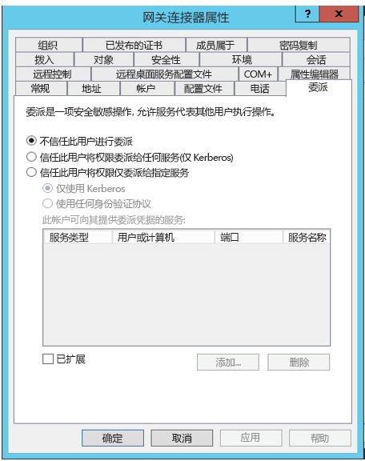
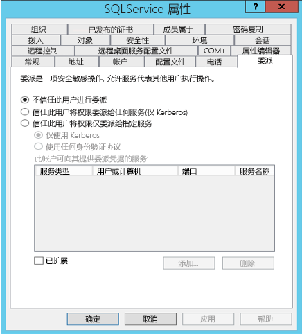
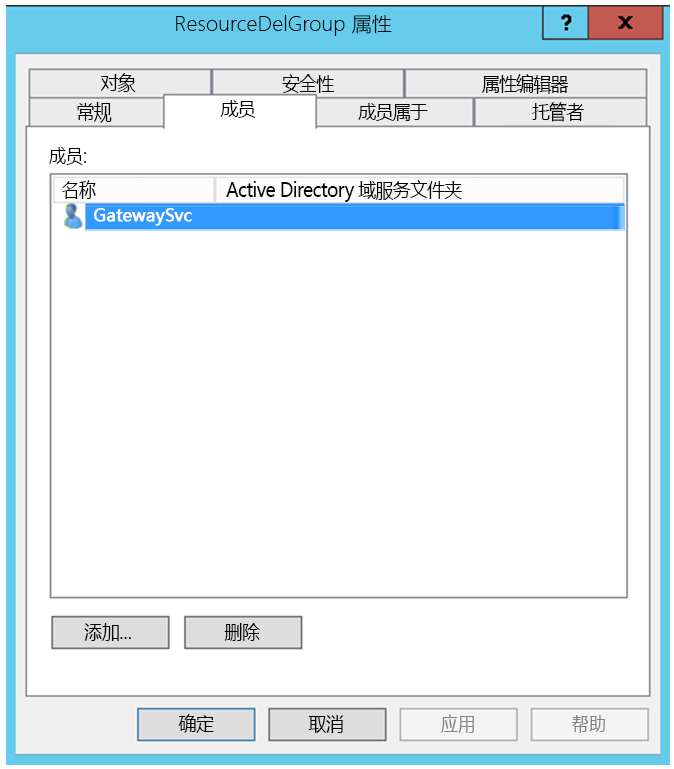
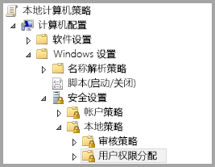
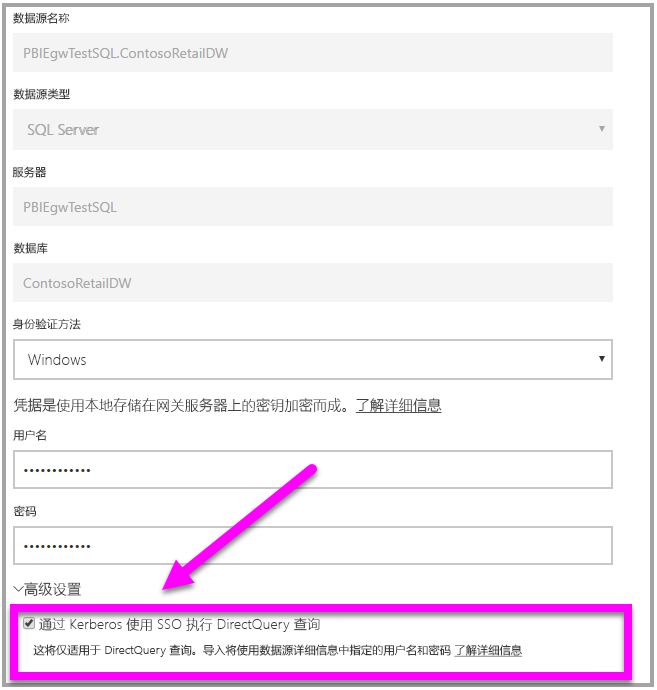

# <a name="use-resource-based-kerberos-for-single-sign-on-sso-from-power-bi-to-on-premises-data-sources"></a>使用基于资源的 Kerberos 进行从 Power BI 到本地数据源的单一登录 (SSO)

使用[基于资源的 Kerberos 约束委派](/windows-server/security/kerberos/kerberos-constrained-delegation-overview)可实现 Windows Server 2012 及更高版本的单一登录连接，且允许前端和后端服务位于不同的域。 若要实现此目的，后端服务域需要信任前端服务域。

## <a name="preparing-for-resource-based-kerberos-constrained-delegation"></a>准备基于资源的 Kerberos 约束委派

必须配置多个项才能使 Kerberos 约束委派正常工作，其中包括服务主体名称 (SPN) 和服务帐户上的委派设置。

### <a name="prerequisite-1-operating-system-requirements"></a>先决条件 1：操作系统要求

基于资源的约束委派只能在运行 Windows Server 2012 R2、Windows Server 2012 或更高版本的域控制器上配置。

### <a name="prerequisite-2-install-and-configure-the-on-premises-data-gateway"></a>先决条件 2：安装并配置本地数据网关

此版本的本地数据网关支持就地升级，以及现有网关的设置接管。

### <a name="prerequisite-3-run-the-gateway-windows-service-as-a-domain-account"></a>先决条件 3：将网关 Windows 服务作为域帐户运行

在标准安装中，网关作为计算机本地服务帐户（具体而言，NT Service\PBIEgwService）运行，如下图所示：


若要启用 Kerberos 约束委派**，网关必须作为域帐户运行，除非 Azure AD 已与本地 Active Directory 同步（使用 Azure AD DirSync/Connect）。 如果需要将帐户切换到域帐户，请参阅[将网关切换到域帐户](service-gateway-sso-kerberos.md)。

如果配置了 Azure AD DirSync / Connect 并且用户帐户已同步，则网关服务不需要在运行时执行本地 AD 查找。 可以将本地服务 SID（而不是请求域帐户）用于网关服务。 本文所述的 Kerberos 约束委派配置步骤与该配置相同（它们仅应用于 Active Directory 中的网关计算机对象，而不是域帐户）。

### <a name="prerequisite-4-have-domain-admin-rights-to-configure-spns-setspn-and-kerberos-constrained-delegation-settings"></a>先决条件 4：具有域管理员权限才能配置 SPN (SetSPN) 和 Kerberos 约束委派设置

虽然从技术上讲域管理员可以暂时或永久地允许其他人配置 SPN 和 Kerberos 委派，且无需域管理员权限，但不建议采用此方法。 下一节将详细介绍先决条件 3 所需的配置步骤。

## <a name="configuring-kerberos-constrained-delegation-for-the-gateway-and-data-source"></a>为网关和数据源配置 Kerberos 约束委派

若要正确配置系统，我们需要配置或验证以下两项：

1. 如果需要，为网关服务域帐户配置 SPN。

1. 在网关服务域帐户上配置委派设置。

请注意，你必须是域管理员才能执行这两个配置步骤。

下列各节将依次介绍这些步骤。

### <a name="configure-an-spn-for-the-gateway-service-account"></a>为网关服务帐户配置 SPN

首先，确定是否已经为用作网关服务帐户的域帐户创建了 SPN，请执行以下步骤：

1. 以域管理员身份启动“Active Directory 用户和计算机”。

1. 右键单击该域，选择“查找”，然后输入网关服务帐户的帐户名

1. 在搜索结果中，右键单击网关服务帐户，然后选择“属性”。

1. 如果 “委派” 选项卡在 “属性” 对话框中可见，则表明已创建 SPN，并且可以跳到有关配置委派设置的下一小节。

    如果“属性”对话框中没有“委派”选项卡，则可以在添加“委派”选项卡的帐户上手动创建一个 SPN（这是配置委派设置的最简单的方法）。 创建 SPN 可以使用 Windows 附带的 [setspn 工具](https://technet.microsoft.com/library/cc731241.aspx)来完成（需要域管理员权限才能创建 SPN）。

    例如，假设网关服务帐户为“PBIEgwTest\GatewaySvc”，并且运行网关服务的计算机名为 Machine1。 若要为本示例中计算机的网关服务帐户设置 SPN，可以运行以下命令：

      

    完成该步骤后，我们可以继续配置委派设置。

### <a name="configure-delegation-settings"></a>配置委派设置

在以下步骤中，我们假设本地环境中有两台位于不同域的计算机：网关计算机和运行 SQL Server 的数据库服务器。 针对本示例，我们还假设以下设置和名称：

- 网关计算机名：PBIEgwTestGW
- 网关服务帐户：（帐户显示名称：网关连接器）
- SQL Server 数据源计算机名：PBIEgwTestSQL
- SQL Server 数据源服务帐户：PBIEgwTestBackEnd\SQLService

给定这些示例名和设置，使用下面的步骤进行配置：

1. 使用 PBIEgwTestFront-end 域的域控制器上的“Active Directory 用户和计算机”（这是一个 Microsoft 管理控制台 (MMC) 管理单元），确保未为网关服务帐户应用任何委派设置。

    

1. 使用 PBIEgwTestBack-end 域的域控制器上的“Active Directory 用户和计算机”，确保未为后端服务帐户应用任何委派设置。 此外，确保未设置此帐户的“msDS-AllowedToActOnBehalfOfOtherIdentity”属性。 可在“属性编辑器”中找到此属性，如下图中所示：

    

1. 在 PBIEgwTestBack-end 域的域控制器上的“Active Directory 用户和计算机”中创建组。 将网关服务帐户添加到此组，如下图所示。 此图显示了名称为“ResourceDelGroup”的新建组，以及添加到此组的网关服务帐户“GatewaySvc”。

    

1. 在 PBIEgwTestBack-end 域的域控制器中打开命令提示符，并运行下面的命令，来更新后端服务帐户的 msDS-AllowedToActOnBehalfOfOtherIdentity 属性：

    ```powershell
    $c=get-adgroupResourceDelGroup
    set-aduser **SQLService** -principalsAllowedToDelegateToAccount$c
    ```

1. 可以验证“Active Directory 用户和计算机”中的后端服务帐户属性的“属性编辑器”选项卡中是否反映此更新。

最后，必须在运行网关服务（在示例中为 PBIEgwTestGW）的计算机上授予网关服务帐户本地策略“身份验证后模拟客户端”。 可以使用本地组策略编辑器 (gpedit) 执行/验证此操作。

1. 在网关计算机上运行：gpedit.msc。

1. 依次导航到“本地计算机策略 > 计算机配置 > Windows 设置 > 安全设置 > 本地策略 > 用户权限分配”，如下图所示。

    

1. 从“用户权限分配”下的策略列表中，选择“身份验证后模拟客户端”。

    

1. 右键单击并打开“身份验证后模拟客户端”的“属性”，并检查帐户列表。 其中必须包括网关服务帐户 (PBIEgwTestFront-end\GatewaySvc)。

1. 从“用户权限分配”下的策略列表中，选择“以操作系统方式执行”(SeTcbPrivilege)。 确保网关服务帐户也包括在帐户列表中。

1. 重启“本地数据网关”服务进程。

## <a name="running-a-power-bi-report"></a>运行 Power BI 报表

完成本文前述的所有配置步骤后，可以使用 Power BI 中的“管理网关”页配置数据源。 然后在其“高级设置”下启用 SSO，并发布绑定到该数据源的报表和数据集。



此配置将在大多数情况下有效。 但是，使用 Kerberos 时，根据你的环境可以有不同的配置。 如果报表仍无法加载，则需要联系你的域管理员进一步调查。

## <a name="next-steps"></a>后续步骤

有关“本地数据网关”和 DirectQuery 的详细信息，请查看以下资源：

- [本地数据网关](service-gateway-onprem.md)
- [Power BI 中的 DirectQuery](desktop-directquery-about.md)
- [DirectQuery 支持的数据源](desktop-directquery-data-sources.md)
- [DirectQuery 和 SAP BW](desktop-directquery-sap-bw.md)
- [DirectQuery 和 SAP HANA](desktop-directquery-sap-hana.md)